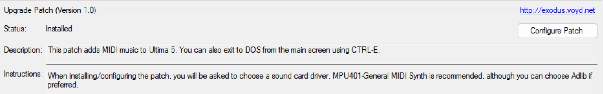

# Best way to play Ultima 5

## Introduction


Ultima V \- The Warriors of Destiny is one of my favorite RPGs of all time. Despite its  dated graphics and sound, the game has a unique take of taking on a sequel. The concept of taking previous save files from the previous game and using it in the next game is not new, even during that time but what made it unique is how it lunges you back in to Britannia after the events of Ultima IV.

If Ultima IV was about becoming the Avatar, focusing in the betterment of oneself, Ultima V  is about being the Avatar. There it questions the virtues that you so cling to in the previous game and materializes it in such a way that to this day is still a unique experience.

That being said, because the game has dated graphics and a bit of an old school interface, playing it vanilla is not for everyone. So here are some ways to play Ultima V in a more modern way.

The guide is written with the assumption that you bought the game from GOG.com. If you have the original disks, you can still follow the guide but your steps may differ greatly. In addition to that, the guide is written for Windows users. If you are using a Mac or Linux, you can still follow the guide but your steps may differ greatly. Specifically the tool that I will be introducing which is Ultimapper 5\.

## GOG

Ultima V is available on GOG.com. The game is already pre\-configured to run on modern systems in the vanilla experience possible. You will need to install the game via the GOG Galaxy client.

You can buy the game [here](https://www.gog.com/game/ultima_456).

## Playnite

Playnite is a free open source video game library manager and launcher with support for 3rd party libraries like Steam, GOG, Origin, Battle.net and Uplay. In our case we will be using it to launch Ultima V.

You can download Playnite [here](https://playnite.link/).

## Ultima Patcher

Ultima Patcher is a popular tool to patch Ultima games offering several improvements. For example on DOS (the copy GOG provides) does not offer music. Ultima Patcher adds MIDI music to the game. We will be using this to add music to the game.

You can download Ultima Patcher [here](https://github.com/Fenyx4/UltimaPatcher/releases).

## Ultimapper 5

Ultimapper 5 is a tool that provides detailed maps of the game. It is a great tool to have if you are stuck in the game. It is also a great tool to have if you want to explore the game in a more detailed way.

You can download Ultimapper 5 [here](http://u5.zorbus.net/).

## Backup Links

[Here](https://www.richardorilla.website/xtras/Ultima5-patches.7z) you can download the tools mentioned in the guide in one file in any case the original links are down. It should be noted that this backup contains the latest version of the tools at the moment of writing this guide. I do not guarantee that the tools are up to date on this backup.

## Installation Steps

You will need to configure Playnite later but for now, let's install and apply the following patches for Ultima V. The steps are as follows:

1. Install GOG Galaxy
2. Install Ultima V from GOG Galaxy
3. Install Playnite
4. It will ask for integrations, select GOG integration and check import installed games
5. Download the Ultima Patcher and Ultimapper 5
6. Extract the Ultima Patcher and Ultimapper 5
7. Run Ultima Patcher and select Ultima 5
8. Atleast install the patch that indicates it will add MIDI music to the game
9. If the patch is successful, it will open DOSBox and then ask you which soundcard to use.
 use MPU401\-General\-MIDI, which the patcher also recommends

- [ ]  [](images/u5-patcher.png)
- [ ] Figure 1. The option in the Ultima patcher you are gonna be looking for

 You can stop here and play Ultima V on GOG Galaxy. But the problem here is that you 
 will be manually starting Ultimapper 5\. Although Ultimapper 5 attaches itself automatically
 when it detects Ultima V running via DOSBox 7\.4, this additional step can be automated via 
 Playnite.

## Playnite recognition

Playnite can automatically recognize games installed via GOG Galaxy. The only thing needed here if you followed everything including GOG Galaxy and installing the game from there is adding scripts for it, specifically running Ultimapper 5 as Ultima 5 is running via DOSBox.

To do this, click on Ultima 5 on Playnite, press F3 (or right click and select edit) and then click on the scripts tab. Add the following script:

*Execute the script after the game has started:*

```powershell
Start-Process -FilePath "C:\Ultimapper5\Ultimapper_5.exe"
```

Where C:\\Ultimapper5 is the path to the extracted Ultimapper 5 in my end, it may differ in  your end. Then add this afterwards:

*Execute the script after exiting the game:*
```powershell
Stop-Process -Name "Ultimapper_5"
```

This is how it looks like in my end:

- [ ]  [](images/playnite-script.png)
- [ ] Figure 2. The script I added in Playnite

## Conclusion

And that's it! You can now play Ultima V in a more modern way. I hope this guide helps you in playing Ultima V. If you have any questions, feel free to ask via email [here](mailto:richardorilla@pm.me)

- [ ] [](images/u5.png)
- [ ] Figure 3. Ultima V - The Warriors of Destiny