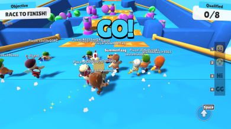

# Browser\-based games in the modern internet

## Introduction

Browser\-based games had such a unique evolution. Started out as games with no visual update on the game
world; if you wish to get updates on what is happening in the game, you have to manually refresh the page or
interact within the game so that the page refreshes on some sort.

- [ ] [](images/basic-browser-horz.png)
- [ ] Figure 1. Sigmastore and Kingdom of Loathing. Browser based games that follows the old browser formula.

Examples of these designs are still present in several modern browser games, such as Kingdom of Loathing and Sigmastorm, as seen in the figures above. In the Kingdom of Loathing, it shows iframes to separate different
UI elements. You interact with game elements using hyperlinks where each link corresponds to a user action (of
course, they are neatly hidden in images to make them presentable).

Once the interaction is made, the page refreshes. This is also similar to Sigmastorm, but instead of the
interactable elements be done on game objects wrapped on a hyperlink. The game is represented in a grid instead; if you want to move, you click on the arrows in the map; if you're going to interact with what that current tile has to offer, you click on the links available in the location details.

Each action will refresh the page in some way, shape, or form. Sometimes it does not have to be the entire page,
just like in Kingdom of Loathing's case, where iframes are instead updated. It is a pretty interesting trick, but such designs are limiting for game designers.

In contrast, non\-browser games are usually detailed and offer live visual updates on what is happening in the game world without user interaction. The closest one you can have with such a design is to install an auto page refresher on your browser.

Then here comes browser plugins such as Flash Player, Shockwave, Java applets, etc. These plugins offered something that browsers normally do not. It extended the features of what the browser can do with the
requirement that these plugins must be installed to make these pages work.

Shortly, games like Club Penguin, Habbo Hotel, Runescape, and Drakensang started popping out of nowhere,
offering the same experience downloaded MMOs have but right before your browser. Of course, they are not as
detailed as their downloaded counterparts because of space and internet bandwidth issues, but the fact that
they can be accessed as long as the plugin is installed was good enough to spread gaming to the masses.

- [ ] [](images/aqw.png)
- [ ] Figure 2. Adventure Quest Worlds - One of the popular browser MMORPGs out there powered by Flash player

However, a paradigm shift from browser plugins started around 2013\-2014\. The movement began when Steve Jobs
initially rejected Flash player on iPhone in 2011\. The tech sector has been working aggressively after that
to replace Flash player with something more native and built\-in within the browser.

As browser\-plugin applications started to die out in favor of the native ones available within a browser, so did the browser plugins themselves. But browser games were mainly still developed in Flash as it was the most dominant platform to create games until the death of Flash was finally settled around January 12, 2021, when
most browsers stopped using plugins.

With such a long introduction, the question now is. With the evolution of browser games from native to
plugin back to native. How far has it come? Did the shift away from plugins do good for browser\-based gaming? Or did it cause a significant hit to the browser\-based ecosystem? Let us discuss.

## Death of Flash player

The death of Flash was long announced. Before its announcement, everyone in the tech sector had witnessed
the evolution of HTML as it slowly replaced and acquired the unique features of these browser plugins. It was already speculated that sooner or later, plugin support would cease to exist for the browsers, and thus, it was discouraged from creating applications relying on the browser plugins.

Browser\-based applications that relied on those plugins have already planned to move out from them in favor
of either utilizing HTML's current new features or becoming a downloadable application. In the former's case, one example is Habbo Hotel which offered both a downloadable client and an HTML5 client, while the latter is Runescape, which went into a standalone client.

Other good examples of games that transitioned away from Flash player to HTML5 are Facebook games such as Candycrush, TetrisBattle, and Farmville. Initially, these versions used to be powered by Flash player but slowly transitioned to HTML5\.

## The new era of browser games

Now that HTML5 is the only way moving forward to play browser games. It did pave the way to things that were
not imagined before, such as Web assembly. Web assembly introduced speeds on web\-based applications that were not available there back. A good example is two MMORPG browser\-based MMORPGs, Flyff Universe and Genfanad.

- [ ] [](images/flyff.png)
- [ ] Figure 3. Flyff Universe \- an HTML5 port of the same MMO game released in 2004

Flyff Universe is an HTML5 port of an old MMORPG named Flyff. But this one was ported via web assembly, and
assets are downloaded and cached on the fly. Flyff Universe is basically an improved version of the
original. It even introduces graphical techniques not in the original, such as Render\-scaling, advanced shader effects,
and longer render distance. The performance of Flyff Universe is very impressive. Even a 2015 Macbook Air can
play this game without issues.

The performance of Flyff Universe is very impressive. Even a 2015 Macbook Air can play this game without issues.

- [ ] [](images/genfanad.png)
- [ ] Figure 4. Genfanad - a new browser based game from an indie company

On the other hand, is Genfanad. It is a new browser MMORPG inspired heavily by the first version of
Runescape, Runescape Classic. It features 2d sprites for characters and NPCs and a 3d environment. A hybrid 2d and 3d. This one is written purely using JavaScript.

Although the graphics are not as complex as Flyff, the same MacBook Air struggles to play the game in even 20fps. I only get 15 fps, even in a noncrowded area. This goes to show how great web assembly is in terms of performance. Game developers wishing to create complex scenery can rely on web assembly to speed up their process.

What is great about web assembly is you do not need to learn web assembly. You can use an existing language such as C/C\+\+ or Rust and use their compiler to compile it to wasm code. Thanks to this, HTML5 ports of games such as SuperTux2, FreeCiv, Doom, and even Ragnarok Online are possible with minimal effort (no need to rewrite an
engine from scratch).

Actually, you don't even have to go that far. Unreal Engine and Unity, for example, can output game projects to wasm. The former relies on plugins, while the latter is built\-in.

- [ ] [](images/speed_racing_pro.png)
- [ ] Figure 5. Night City Racing - a HTML5 racing game that was developed in Unity and exported to Unity Web

As the figure above shows, game developers can develop graphically sophisticated games from a well\-known
game engine and export them easily to HTML. Really impressive how far we have come in game development. Allowing us to deliver games on a variety of platforms.

## List of my recommended browser based games

There are tons of browser\-based games out there. So take this list as my recommended picks instead of being like the absolute best browser games out there. I mainly play downloaded games, with a few notable exceptions. So I may have missed some great browser games that I am not aware of that exists.

Additionally, these lists are mainly multiplayer ones. So if you are looking for a single\-player browser\-based game, this list is not for you. Mind you, some of these games may have an offline/play with AI feature, but they're mainly multiplayer games.

I also omit browser\-based games not officially ported or endorsed by their intellectual property owner.

Note: This table is rendered in Javascript; you can expand the row and read the description by clicking on the \[\+] plus button or the game's name.

```table:js
{
	"image_preview_column": "Preview",
	"table_type": "enhanced",
	"table_json": {
		"paging": true,
        "order": [[1, "asc"]],
        "colReorder": true,
        "responsive": true,
        "rowCallback": function (row, data, index) {
            var that = row;
            if (!$(row).attr('role') || $(row).attr('role') != 'row' || $(row).hasClass('parent')) {
                return;
            }
            $(row).addClass('parent');
        }
	},
	"preview_image_anchor_on_hover": true
}
```


| Game name       | Genre      | Link                                                                                                | Description                                                                                                                                                                                                                                                                                                                                                                                                                                                                                                            | Preview                                                                                 |
|-----------------|------------|-----------------------------------------------------------------------------------------------------|------------------------------------------------------------------------------------------------------------------------------------------------------------------------------------------------------------------------------------------------------------------------------------------------------------------------------------------------------------------------------------------------------------------------------------------------------------------------------------------------------------------------|-----------------------------------------------------------------------------------------|
| Flyff Universe  | MMORPG     | [https://universe.flyff.com](https://universe.flyff.com/)                                           | Flyff Universe is a fantasy MMORPG where you control an avatar, partake in quests, acquire items, and defeat monsters. What is interesting about Flyff is that it is one of the few MMORPGs out there that allows players to fly and explore what the content offers. Once you reach level 20, you can purchase a broom (or use premium mounts from the premium shop) and fly across the different contents in Madrigal.                                                                                               | [](images/flyffuiverse.png)                            |
| Hordes.io       | MMORPG     | [https://hordes.io](https://hordes.io/)                                                             | Hordes.io is a 3D MMORPG where you control an avatar, partake in quests, acquire items, and defeat monsters. It is a MMORPG that revolves mostly around combat where players form parties to defeat groups of monsters.                                                                                                                                                                                                                                                                                                | [](images/hordes_io.png)                                   |
| Tetr.io         | Casual     | [https://tetr.io](https://tetr.io/)                                                                 | Tetrio is a very popular Tetris client. It caters to ranked 1vs1, 100\-player elimination round, 40 lines, etc. It does not offer any sort of story, just your typical Tetris game.                                                                                                                                                                                                                                                                                                                                    | [](images/tetr_io.png)                                       |
| Bemuse          | Casual     | [https://bemuse.ninja](https://bemuse.ninja/)                                                       | Bemuse is an online web\-based rhythm game for casual rhythm enthusiasts. It offers 5 keys and 7 keys with a variety of songs completely free. Some of its songs have animated backgrounds too, which is dope.                                                                                                                                                                                                                                                                                                         | [](images/be_muse.png)                                        |
| Stumbleguys     | Platformer | [https://www.stumbleguys.com/](https://www.stumbleguys.com)                                         | A multiplayer platformer battle royale heavily inspired by Fall guys. Similar to Fall guys players are pitted against each other in a series of mini\-games. The last player standing wins.                                                                                                                                                                                                                                                                                                                            | [](images/stumble_guys.png)                             |
| Assault Bots    | Shooter    | [https://www.crazygames.com/game/bot\-machines](https://www.crazygames.com/game/bot-machines)       | Assault Bots is a multiplayer shooter game where you control a robot and choose from two factions. The team that acquires the most points wins. Just like Forward Assault, the game also has an offline mode where you can play against AI.                                                                                                                                                                                                                                                                            | [](images/assault_bots.png)                             |
| Forward Assault | Shooter    | [https://www.crazygames.com/game/forward\-assault](https://www.crazygames.com/game/forward-assault) | Forward assault is one of the popular counter\-strike alternatives you can play on the web. It offers similar mechanics to counter\-strike while also giving detailed graphics. Forward Assault is mainly a multiplayer game but has single\-player AI, rank matches, and public lobbies                                                                                                                                                                                                                               | [](images/forward_assault_crazygames.png) |
| Battle Dudes    | Shooter    | <https://battledudes.io/>                                                                           | Battle Dudes is a unique shooter where instead of giving you a 3rd person view, it instead gives you a top down view. Also, unlike Forward assault which is greatly inspired by counter\-strike, Battle Dudes gives you access to bazooka launchers, vehicles, and tanks.                                                                                                                                                                                                                                              | [](images/battle_dudes.png)                             |
| Tzared          | Strategy   | [https://tza.red](https://tza.red/)                                                                 | Tzar: Burden of Crown was one of the popular medieval RTS games back in the day. Similar league to Age of Empires. Tzared is an HTML5 port of the same game. The HTML5 port however only offers skirmish battles against the AI or head\-to\-head multiplayer battles. If you wish to play the campaigns, then you have to buy the game from GoG or Steam.                                                                                                                                                             | [](images/tza_red.png)                                       |
| Lichess         | Strategy   | [https://lichess.org](https://lichess.org/)                                                         | Lichess is one of the popular chess servers out there. Although FICs is the established chess server if you want to play chess for free for years now, what sets Lichess apart is that it bundles the chess client as a web app. In addition, Lichess offers several features such as different chess modes, rated, non\-rated, correspondence (where you invite a friend and play there \[even if said friend doesnt have a lichess account]), tutorials, puzzles and even a free chess engine analysis. All for free | [](images/lichess.png)                                       |

## Ending notes

As you can see, you can get entertained even in the new era of browser\-based games. Certainly, the shift of
these games away from plugins paved the way for unique implementations that were not possible before.

For example, Flash may have been a dominant platform for developing browser\-based games, but it was limited
in what it could do. Although later in Flash's life, it could render in 3D. There were better platforms to create 3D games on.

I remember that even if Flash could do 3D rendering, the hardware acceleration aspect was unavailable across
all operating systems. This means certain games are not playable when played on Mac or Linux. Not to mention the availability of the plugin it needs as well.

Of course, it was Flash, Adobe Shockwave, and Oracle Java. Shockwave was superior in 3D games but was less
well known because of management decisions. Frankly, it was true that Shockwave games were mostly slow to load
because it packed more assets for players back then to download, but it could push more stuff than Flash.

On the other hand, Java applets are in the same competition league as Shockwave but are more popular. And by
I mean the same league, was able to pack sophisticated 3d graphics right in your browser. Part of the reason
people do not remember Shockwave is because of poor leadership reasons. However, based on experience, Shockwave was far more popular than Java applets for games.

So imagine, if you want to play a couple of browser games back then, you not only have to install Flash
player, but also possibly Shockwave and Java too. Not to mention these plugins had limitations. Like Flash player
being limited in what it can do with 3d, Shockwave being locked down to Windows only, or Java being difficult to
program games with in general because if you want to appeal to a larger set of userbase, you have to optimize
the game. This is why Runescape originally had to load in regions, where when a player reaches the edge of a
region, it loads the next closest region and unloads the currently loaded one.

The creation of WebGL and Webassembly paved the way for possibilities that were not there before. Being able to port full pledge games right in front of your browser. This is an interesting thing to consider as these technologies allow the distribution of games regardless of Operating System.

So what can I say? The shift away from plugins certainly did good for browser gaming in general. Although it
was sad to see a lot of these great games go. There have been [archiving
projects <sup>\[1]</sup>](https://bluemaxima.org/flashpoint/) that aim to restore these plugin\-based games to a playable state, and for that, I am
grateful.

Especially some of these games that were restored have had their micro\-transaction shop revived with
everything free in it. Which I find very, very cool.

## Update: February 11, 2024

I have removed Genfanad from the list because the game has been taken down in favor of revamping the game's combat and turning it into a card game.

However I did add three new games to the list. They are Hordes.io, Astodud and Assault Bots. They are a MMORPG, a platformer and a shooter game respectively.

## Update: May 4, 2024

I have replaced AstroDud with Stumbleguys. Stumbleguys is cross platform but has an HTML5 version which I find not only cool but better. You play against more players while offering more content
