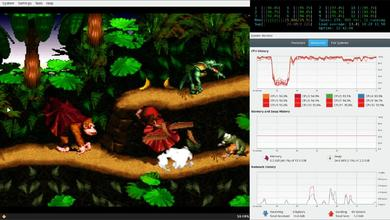
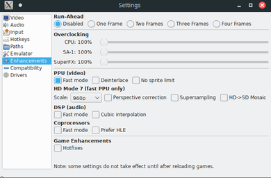
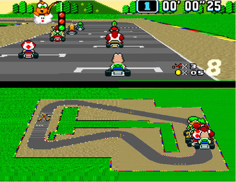

# Using BSNES as a fun way to stress test your machine

## Introduction

[BSNES\[1]](https://github.com/bsnes-emu/bsnes) is a popular SNES emulator that is well known for
 being the most accurate emulator out there. Meaning its
 the best emulator that you can use if you have an SNES
 game that doesn't work properly on your daily emulator.
 However such feat comes with a cost, specifically it requires
 a powerful machine inorder to run the games on this 
 emulator at a 60hz speeds.
 

 CPU Stress testing is the act of purposely running your
 computer at very high loads *(almost at 100%)*
 to test for hardware defects for newly purchase machines.
 

 Normally you run [prime95\[2]](https://www.mersenne.org/download/) or [something similar\[3]](https://www.ocbase.com/) for an hour
 and leave your computer there and come back and check if
 your computer is doing fine. *(If it restarted, turned off 
 or the program crashed is a good indicator something is
 wrong with your hardware and if its newly bought item
 you can probably return it to the manufacturer)*

## Making sense of things

 BSNES at it default settings can run on a decent mid\-range
 computer now. Originally it needs a CPU that has 3ghz speed
 but with the optimizations made throughout time, it can run
 on something like a Macbook Air (2015\).
 

Figure 1\. BSNES performance on a core\-i7 processor consuming almost 100% of all the CPU cores

 By default BSNES runs and consumes pretty much average of your CPU cores.
 This entirely depends too on how fast your CPU processor is. For example,
 Intel core i9 9900k will be at 10% CPU Usage at its default accurate setting
 but a Macbook Air (2015\) will be running it at 70%\-90% CPU Usage.
 

Figure 2\. BSNES configuration for HD\-Mode7 \- Also having in a side\-effect of consuming 100% of all the CPU cores

 Now if we change the settings a bit, lets say under Enhancements, we toggle
 Fast mode in PPU and restart BSNES. This is a necessary step as toggling fast
 PPU will now let BSNES chug all of the CPU cores as much as possible. As a bonus
 since we have fast PPU mode turned on, we also have access to HD mode 7\. This is
 nice because it gives us graphical improvements.
 

 In my case since I have a powerful CPU, I can afford going for 960p scale. I could
 probably go a bit higher too but since I'm on a 1080p screen. Going farther wouldn't
 make sense for me.
 

 It should be noted that the higher the scaling, the more CPU intensive it is. Although
 in my opinion, if your computer can do it, you should go for the highest possible. I mean
 look at the screenshot below where the left side is the standard mode7 (appearing blurry)
 and the right side is the HD mode7 (scaled to 960p).
 

Figure 3\. HD mode7 being compare with regular mode7 (Left regular mode7, right is HD mode7\)

 It looks way clearer way clearer allowing you to determine the corners much accurately
 and also make it easier for you to determine the obstacles in the game.
 

## The Setup

 Since we now understand why BSNES acts the way it does and in a way it makes sense
 without digging to much into the technical details. We will now go with what we will
 be having to do CPU stress test upon.
 

 I said that a Macbook Air (2015\) can run BSNES fine and this is absolutely true. Running
 games in there can go as 95% as average. But we will not be going to that route. Instead
 I will be using my main PC that has a Intel core i9 9900k @ 3\.6GHZ. On this test I capped
 turbo boost to be only until 4Ghz because for temperature control reasons.
 

 For the emulator ROMs, I have an SNES Mini, so I [decided to get my ROMS from there](https://github.com/TeamShinkansen/Hakchi2-CE) but
 you can just search over the internet for Free SNES ROMs dumps and that should work fine
 as well too.
 

 Now that I have the games set, I will be stress testing my unit for an hour. With that in mind
 I will be playing the following games.
 1. Super Mario Kart (With Mode 7 support it, there's no problem)
2. Super Mario World
3. Super Mario World 2: Yoshi's Island
4. Donkey\-kong Country

## The results and practical use

 Unfortunately, I ended up way more than an hour for test due to being too much entertained to care.
 No problems where found and the system was infact very stable running at 63c during its peak CPU usage.
 That being said its not really suprising since I have built this main PC for quite some time now so
 it should've passed already the test (and not to mention, it has been stressed test before too)
 

 Now the question comes in mind that why would I ever use this when there is SNES9X or Retroarch BSNES
 performance core? I'll throw that question back by asking the opposite. "Why not"? Any unused CPU core
 is to be honest a waste. It's not also like that you're overclocking the system for it to decrease its lifespan.
 You're just using your computer at its best for the sake of emulation accuracy.
 

 Practically speaking, you may want to use this knowledge and bring yourself a set of ROMs and BSNES packed in a USB drive
 and probably a USB gamepad (I recommend 8Bitdo SF30\) when buying a new prebuilt computer or laptop and ask if you can test 
 the machine. Ofcourse a harmless SNES emulator shouldn't really cause a flag on them and it is always nice to see the defect 
 while you're on the store rather than bringing it home and doing this only to find out something is wrong with it.
 

