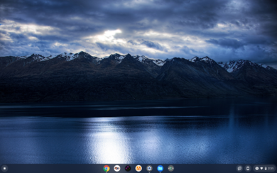
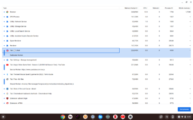
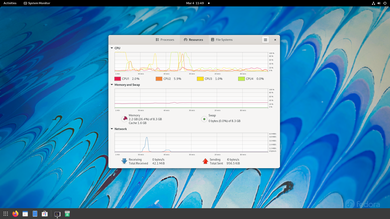
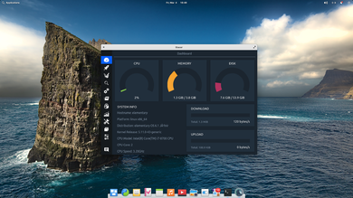
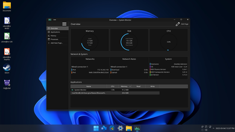
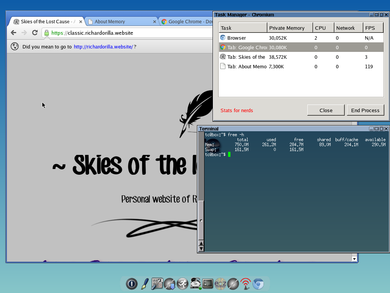
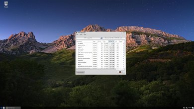
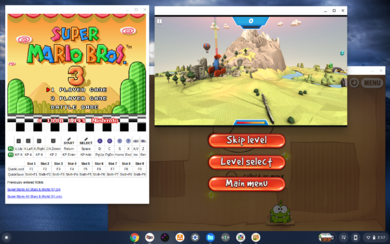
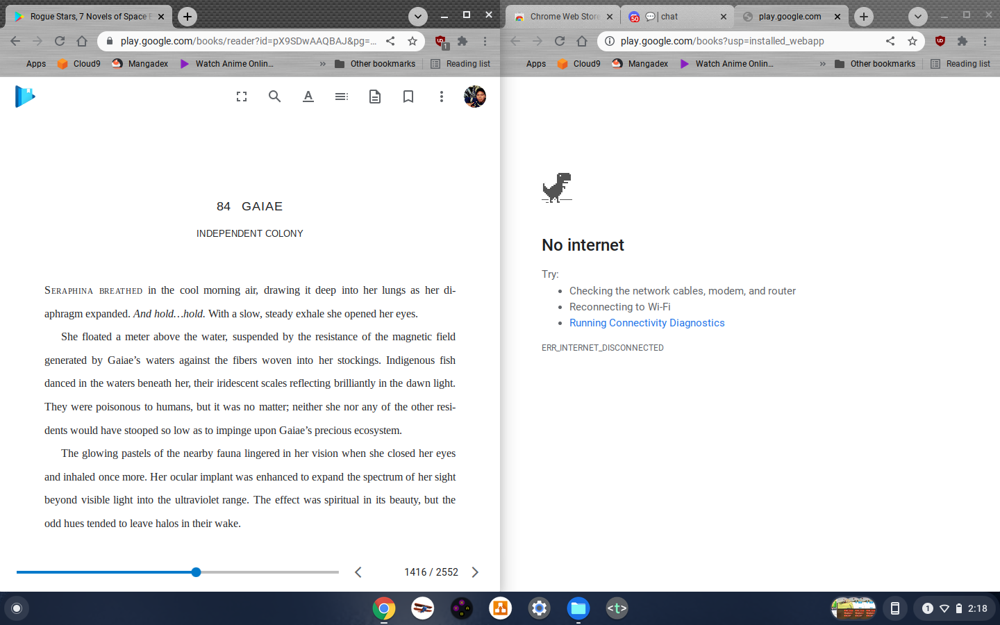

# My opinions about Chrome OS Flex

## Introduction

Figure 1\. How Chrome OS desktop looks like

Chrome OS is a Linux\-based operating system that primarily revolves around Chrome. From the user
 interface
 down to its core, it is mainly built using the Chrome ecosystem technology stack, which takes a
 different
 route to the typical Linux distro that revolves around the GNU ecosystem.

Initially started as an operating system designed mainly to rely on internet technologies (cloud\-first
 operating system). It grew to have a set of features that made it worthwhile to use; this includes
 bundling
 Android emulation runtime (to allow running Android apps on the system) and Linux runtime (to enable the
 running of Linux
 apps).
 

These features, although are nice, are only supported on later iterations of the Chromebook; thus, older
 versions are left hanging, outdated, and a security risk.

Although ChromeOS Flex is not really designed to be a replacement for those oudated and old devices but
 majority have reported that it works but some later models are at a disadvantage because they lose some
 of the functionality they use to enjoy.

In addition to that, outside of the Chromebook area, ChromeOS is not an easy to access operating system
 compared to other Linux distros.
 This
 is because, officially, you can only install ChromeOS on Chromebook devices.

There are [some ways to install ChromeOS on
 non\-Chromebooks\[1]](https://github.com/sebanc/brunch), but it is not straightforward and requires tinkering before
 working
 properly and not to mention requires a specific set of hardware

However, Google is planning to change that with ChromeOS Flex. Google's intentions are to make ChromeOS
 more
 dominant and accessible to non\-Chromebook devices and a means for old Chromebooks to get the latest
 versions
 of Chrome that it deserves.

## Difference between ChromeOS and ChromeOS Flex

ChromeOS flex and ChromeOS share the same technology stack. The only major difference between the two is the
 ability to run Android apps. Chrome OS Flex does not support running Android apps at this writing.

The other missing features are more into security and device management (for companies planning to mass adopt
 Flex) related where Flex does not support verified boot, firmware updating, TPM encryption and device
 enrollment.

## Sentiments about Chrome OS in general

Below are some of my opinions about Chrome OS in general by experience in both Chrome OS and CloudReady.

It
 should be noted that most of my sentiments in here are for when using ChromeOS on a low powered device where
 in this scenario we are talking about a device with relatively low powered CPU and 2GB of RAM

### ChromeOS is lightweight and intended for people who mainly use the web.

Figure 2\. Chrome OS task manager

ChromeOS is catered towards internet heavy oriented activities. Your computer isn't really doing anything aside from running Chrome, and since by design, from user
 interface down to its core, it's all Chrome, no system processes are competing with Chrome.

So your computer can all focus its power on just one thing, and that is ensuring Chrome runs at its best.
 This is the reason why even computers with low RAM runs Chrome smoothly. Since ChromeOS will use all of
 the
 RAM by default for Chrome. If you have 8GB of RAM on your device, it will utilize all 8GB of that RAM
 solely
 for Chrome.

### Losing the lightweight magic

If you decide to install any Android application or even the Linux runtime, ChromeOS will split that RAM
 usage accordingly. If the Android game running on Chrome OS will require 3GB of RAM to run, ChromeOS
 will adjust itself so that the Android subsystem has 3GB of dedicated RAM (similar to the concept of virtual machines).

It is all good as long as it has enough resources to handle it, but if the use\-case applies to low\-end
 hardware, then you are not gonna have a good time. There are scenarios where ChromeOS runs Android or
 Linux
 apps poorly on devices with small RAM (2Gb devices) as there is not enough memory for everything.

Security perspective this is really great, because each app ecosystem are containerize on their own
 sandbox.
 However my point here is that ChromeOS is not really lightweight. It feels that way on
 certain usecases because it is cheating by embedding the most commonly used application as part of its
 core.
 

It is no different than Internet Explorer back in the day consuming less resources than other browser
 simply
 because Internet explorer is using Windows core components instead of using a third party one that needs
 to
 be initialized.

### Compared to installing GNU Linux environment

Most Linux distros (Ubuntu 21\.10, KDE Neon, Fedora 34, ElementaryOS) have idle usages of more than 1GB,
 as
 seen in the figure below. This is not good for low\-end devices.

| Linux distribution name | Idle RAM consumption | Cached data | Actual used (Idle \- Cached) |
| Ubuntu 21\.10 | 1\.7GB | 1\.3GB | 400MB |
| Fedora 34 | 2\.2GB | 1\.6GB | 600MB |
| Elementary OS Jólnire | 1\.3GB | 700MB | 600MB |
| KDE Neon 5\.24 | 1\.7GB | 1\.1GB | 600MB |
| Tinycore Linux | 25MB | N/A | N/A |
| Trisquel Mini | 369MB | N/A | N/A |

Figure 3\. Resource Usage comparison

Figure 4\. Ubuntu 21\.20 resource consumption

Figure 5\. Fedora 34 resource consumption

Figure 6\. Elementary OS Jólnir resource consumption

Figure 7\. KDE Neon 5\.24 resource consumption

However, there are distros out there catered towards these low\-end devices. For example, the figure below
 shows TinyCore Linux running Chromium on a 768MB RAM machine.

Figure 8\. Tinycore Linux resource consumption

Figure 9\. Trisquel Mini Linux resource consumption

Admittedly, TinyCore Linux is not for your casual Linux users and is on the extreme edge case; however,
 there
 are other Linux distros such as [PuppyLinux\[2]](https://puppylinux.com/download.html),
 [Trisquel Mini\[3]](https://trisquel.info/en/download), [Absolute Linux\[4]](https://www.absolutelinux.org/download.html) and [Bodhi Linux\[5]](https://www.bodhilinux.com/).
 

The beauty of installing GNU Linux instead of ChromeOS is that no intermediator decides how much RAM a
 specific environment requires. Chrome, your native Office application, and games can all be running in
 harmony.

Although if all you want is a glorified Chrome device, then nothing can beat ChromeOS. That also implies
 that
 your device is good as useless when there is no internet connection since your options are limited as it
 is
 on a low\-end device.

## ChromeOS Web apps

ChromeOS Web apps are the staple of ChromeOS. Before having Android and Linux runtimes, ChromeOS early
 versions initially shipped with just web apps alone, similar to the earlier version of iPhone, trying to
 bet
 on HTML5 apps.

Figure 10\. Gaming on ChromeOS

They do work, and most work great, and most can even work offline. As you can see here, where I was
 running
 three games, a SNES emulator running Super Mario Brothers All\-Stars, Cut the Rope, and Swoop are all
 running
 while there is no wifi connection available.

Figure 11\. ChromeOS Google books

However, some do not work at all. Like there is no offline mode for Google books (which is like a
 bummer),
 there is also a challenge trying to make files available for offline use (because mainly, there is lack of apps to use from).

In terms of entertainment, you can, in fact, download VLC on it (there is an official Chrome web app
 version
 of it), but the ChromeOS version is lacking in a lot of aspects, but it can play videos fine [(as long as it is under the
 supported
 format)\[6]](https://support.google.com/chromebook/answer/183093?hl=en).

### Abysmal App Ecosystem

Window's dominance is mainly because of its humongous app ecosystem. Apple has a few killer apps here and
 there, Linux mainly is a preference of some because of its extreme customizability due to most apps
 being FOSS.

ChromeOS doesn't really offer anything that you can say a 'killer app'. Since the apps in ChromeOS are
 mostly webapps which means any OS that has a web browser (specifically Chrome or Chromium based
 browsers) will be able to run these apps as well.

However, one major convenience is the native integration of Android apps. This however is no longer unique to
 ChromeOS because Windows 11 now has ASL (Android Subsystem for Linux) and GNU/Linux has Waydroid. It should be
 noted that
 both of these features are still on alpha/beta and may still have bugs to iron out at the moment of this
 writing.
 

### Overall reliance of Google

 This is more like a sub topic for App ecosystem but I decided to discuss this as a seperate portion instead. The problem with ChromeOS is that part of the core apps that you rely on is on Google's end. What do I mean by this, you may ask.
 

 For example you want to open an office file (docx). Let us say on this scenario the file is shared by your workmate through an email. You shouldn't worry right? because Google docs can operate offline and is bundled in by default right? Well false, because if you want to open it. In order to open the document, you have to upload it to Google drive first, then from there you tell Google drive to convert such file from docx to Google doc's file format and then you will be able to open it. Alot of steps are needed and sometimes you will probably have scenarios where you downloaded the file and forgot to convert it.
 

 Google drive too is also part of the problem because it is the only online storage that has native integration to the OS itself. In my end I use mega, but I cannot take advantage of integrated sync because its not available. If I want that I have to use Google drive (and part of the reason why I use mega instead of Google drive is because Google actually reads the data you upload to their service, so its a big minus in the privacy aspect whereas Mega revolves around e2ee (end to end encryption)).
 

## Conclusion

In my opinion, installing ChromeOS Flex isn't worth it in general, even if Google adds the Android
 subsystem
 for ChromeOS. For me, it is much better to just install a GNU Linux distro as you get more out of it
 (performance\-wise). While yes, it is true that you can install Linux for ChromeOS and run your Linux
 apps in
 it, ChromeOS now has to split its resource between itself and the Linux. It is just not fun when you are
 under Google's walled garden now.

Figure 12\. ChromeOS streaming

There is nothing unique given to the web experience as well. My experience with ChromeOS is similar to
 how I
 was browsing the web with Chrome running on Linux.

For example, Prime video still is not happy that I am using a browser and operating system that doesn't
 use
 the "better" DRM, thus serving me 720p videos at best.

But I can understand the appeal, so even though I do not think it is worth it in general, if all you want
 to
 do is just browse the web in general, then you should give ChromeOS a try, although one problem here is
 that
 its hardware support is not as profound as GNU/Linux does, like there is no support for Nvidia cards so
 it
 will not boot at all, requiring a little bit of experimentation if your hardware is compatible with the
 operating system itself.

