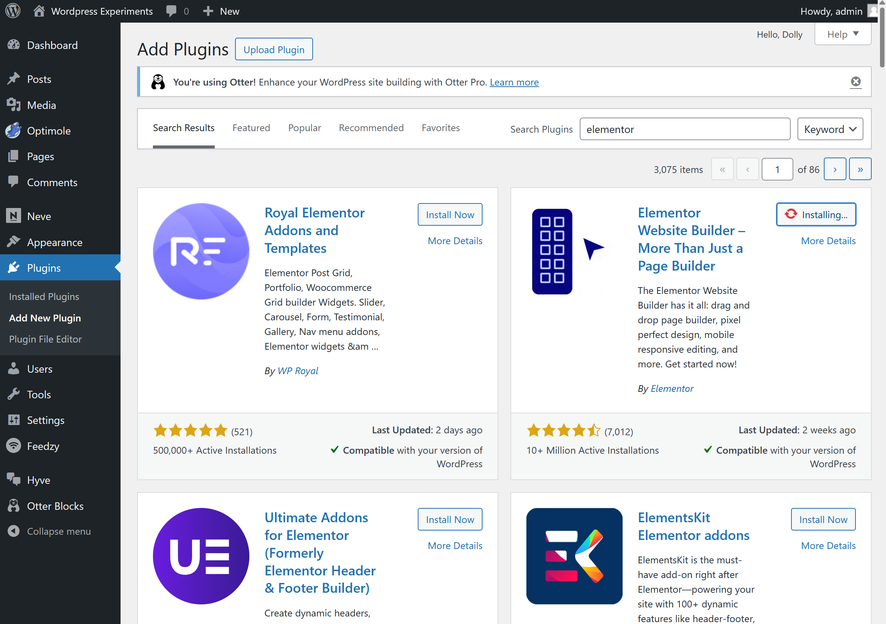
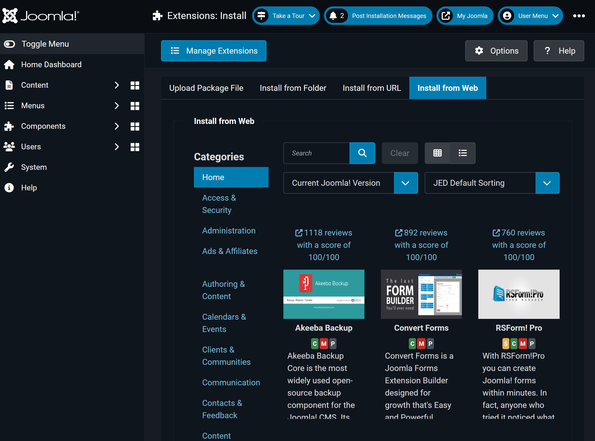

# Website Creation: The Battle of Approaches

## Introduction

When Matt Mullenweg, WordPress's co-founder, [launched that bombshell attack on WP Engine back[1]](https://web.archive.org/web/20241003212942/https://arstechnica.com/tech-policy/2024/10/automattic-demanded-web-host-pay-32m-annually-for-using-wordpress-trademark/) in October 2024, it sent ripples through the web development community. I watched from the sidelines, curious but not devastated like some of my colleagues who've built their entire careers on WordPress.

Truth is, while I've used WordPress to knock out some quick projects and bring in some side income, it's never been my primary development platform. Still, the controversy got me thinking about the broader website creation landscape and the choices we make as developers.

In this article, I'm unpacking the full spectrum of web development approaches—from getting your hands dirty with raw HTML and CSS to working with static site generators, testing various drag-and-drop builders (both cloud-based and desktop software), and, of course, implementing traditional CMS platforms when they make sense. 

I'll break down the technical pros and cons of each method based on my experience jumping between these different tools, and help you determine which approach aligns with your specific project requirements, technical comfort level, and long-term maintenance plans.

## Static Website Building

If you're building a personal site, going the static website route is a solid and often more affordable choice compared to online website builders like [Wix[2]](https://www.wix.com/) or [Squarespace[3]](https://www.squarespace.com/). This is because not only that it requires a less powerful server (often times a CDN doing the heavy work) but requires less from you such as no need for a SQL server to host your data. Mind you there are free static website hosting services such as [Neocities[4]](https://neocities.org/) or even via [Github[5]](https://pages.github.com/)

Many people assume that building a static website is a cumbersome process. The idea of having to plan the layout from scratch, code CSS by hand, and ensure responsiveness can seem daunting. While these concerns are valid (I built this website from scratch, after all), there are plenty of tools and frameworks available that make the process much easier.

For example, in the CSS department, there's [Bootstrap[6]](https://getbootstrap.com/), which comes with **prebuilt CSS classes** that you can use right away. It's designed for rapid development but is also highly customizable and themeable. Then there's [Tailwind CSS[7]](https://tailwindcss.com/), a more utility-first framework that offers prebuilt classes to help structure a layout. Unlike Bootstrap, Tailwind isn't packed with ready-made components, but it provides an incredibly flexible way to create highly customized designs.

Beyond CSS frameworks, there are also static site generators like [Hugo[8]](https://gohugo.io/), which converts Markdown files into fully functional websites. Hugo offers a wide range of themes out of the box, making it easy to get started. If you'd rather use a visual tool, options like [Pingendo[9]](https://pingendo.com/) and [Mobirise[10]](https://mobirise.com/) offer WYSIWYG (What You See Is What You Get) editing, allowing you to design static websites without touching much code. Unlike Hugo, which is code-based, Pingendo and Mobirise are standalone desktop applications that generate and update static sites visually.

These tools are generally free to try, though they often come with limited themes or functionalities and may include watermarks. If you have some basic HTML knowledge, removing those watermarks or tweaking the output to fit your needs is usually straightforward.

## Online Website Building

I've already mentioned Wix and Squarespace, but there are many other options, including domain sellers like [Namecheap[11]](https://www.namecheap.com/) and [GoDaddy[12]](https://www.godaddy.com/). These services provide online site builders and handle hosting for you, often offering a free version that runs on their subdomain. Many of them also come with unique features—for instance, both Wix and Squarespace include AI-powered website builders to help you get started, while [Google Sites[13]](https://sites.google.com/) integrates directly with Google Drive and Docs.

These platforms often come with built-in functionality such as online stores, interactive sections (like comment sections or forums), easy custom domain linking, and even direct site customization options.

However, this convenience comes at a cost. Online website builders are significantly more expensive, and, more importantly, the existence of your site is entirely dependent on the platform you choose.

For example, I pay my hosting provider **$150 for three years** of hosting. While it's not the absolute cheapest option, I like that I can host multiple websites under that plan. In contrast, the cheapest Wix subscription starts at **$9 per month**, which adds up to **$324 over three years** (assuming no price hikes). Squarespace is even pricier, starting at **$16 per month** for their most basic plan.

Thankfully, **Google Sites** usually offers its services for free (with the subdomain caveat). However, if you want to use a custom domain, you'll need to be part of **Google Workspace**, with the cheapest plan starting at **$7 per user per month**.

As you can see, all of these options are significantly more expensive compared to my hosting plan and that's without even searching for the most reliable and cost-effective hosting solutions.

## Content Management Systems

Content Management Systems (**CMS**) are prebuilt platforms designed to make publishing content online easier. While the configuration process varies depending on the system, most allow you to set up a website quickly and start publishing content with minimal effort.

Some CMS platforms offer **pre-hosted versions**, either through their own websites or via third-party hosting providers. These function similarly to online website builders but often come at competitive prices. For example, **WordPress.com** offers a personal plan for as low as **$4 per month**.

In my experiment, I tested three CMS platforms: **WordPress, Joomla, and Drupal**. Here's my take on each.

### WordPress

WordPress is the most popular CMS and for good reason. It offers one of the most accessible and easy-to-configure platforms available. Every WordPress installation, whether self-hosted, hosted on a shared hosting provider or hosted through **WordPress.com**, connects to **WordPress.org** (which is different from WordPress.com). This connection gives users access to a vast library of **ready-to-install themes, plugins, and extensions** effectively having a ready to use third party store for themes, plugins and extensions.

Of course, WordPress also allows you to develop and install your own themes and plugins manually, but the built-in store makes customization incredibly convenient. Many developers have even turned this into a business model, selling premium plugins and themes through WordPress.org while offering free versions to attract users.

- [ ] 
- [ ] Figure 1. How the WordPress third party store Looks like

This ease of customization makes WordPress an especially attractive option for non-technical users. If someone lacks the coding skills to build a feature from scratch, chances are they can find a plugin that does exactly what they need with just a few clicks.

Granted that it does not beat the same customizability as an online website builder having a WYSIWYG editor but extensions such as [Elementor[14]](https://elementor.com/) and [Otter Blocks[15]](https://wordpress.org/plugins/otter-blocks/) exists to help even the gap.

I remember back in **2013** when having an online image gallery on a website was considered a big deal. Personally, I never really understood the hype since you could build one using plain JavaScript. I even created my own version back then:  [First attempt **-archive-**[16]](http://archive.richardorilla.website/gallery.html)  and then an [Updated version **-current site-**[17]](https://www.richardorilla.website/gallery.html) . Of course such features are available on your typical WYSIWYG editor (including Elementor).

This time around, I prefer my approach because I managed to build the gallery without relying on a server-side preprocessor like **ASP or PHP**, and it supports both JavaScript and **no-JavaScript** environments.

Finally if you are interested in the output of my Wordpress experiment, you can find my hosted site [here[18]](https://wordpress.richardorilla.website/).

### Joomla

When someone talks about a **WordPress alternative** in a forum of freelance web developers, **Joomla** is almost always mentioned. Often considered the **second-best CMS option**, Joomla offers similar functionality to WordPress, including an **extension store** where you can install third-party plugins or even develop and manually install your own.

- [ ]  
- [ ] Figure 2. Joomla third-party extension store interface.

Despite its strengths, Joomla is often a second choice because, while it provides **strong backend features** out of the box such as **passkey authentication** and **multilanguage support** I found its customization process to be more complex compared to WordPress.

For example, when I wanted to create a **landing page**, I discovered that Joomla does not have a built-in option for this. I turned to the extension store to find a **site builder or landing page maker**, and while I did come across some promising extensions, many were not directly installable via the store. Instead, I had to **visit the developers' websites** manually to download and install them, and the best ones were **paid options**.

Unlike WordPress, Joomla does not have an official **theme store**, but I did find some third-party websites offering **free Joomla themes** for manual installation.

Unfortunately, I was unable to install any landing page extensions since most of the ones I found required payment. Additionally, I couldn’t find any **free themes** that suited my needs. In the end, I decided to **create a single article view** and used that article to serve as my homepage.

As for themes, I modified the **Cassiopeia template** that comes preinstalled with Joomla to create a custom look.

Overall I was **somehow satisfied** with the outcome of my experiment for Joomla and if you are interested in the output of my Joomla experiment, you can find my hosted site [here[19]](https://joomla.richardorilla.website/).

Lastly what I have experienced strengthens how Joomla is often perceive by many. That is it is often good enough that you can stand on its own without having the need to install plugins or extensions.

### Drupal

If WordPress is known for its user-friendliness and Joomla for its balance of power and usability, **Drupal** stands as the **developer’s CMS**—a platform built for those who love structure, flexibility, and security but don’t mind a steeper learning curve.

Out of the three CMS platforms I tested, Drupal felt the most **developer-centric**. Unlike WordPress, where you can get started quickly with prebuilt themes and plugins, or Joomla where you have everything you need to get started. Drupal requires a bit more **technical knowledge** right from the get-go. Installation was straightforward, but configuring my site to work the way I wanted took more effort.

Although unlike Joomla, I did like that fact that it feels a bit more what I wanted where each node is just a blank canvas effectively making it possible to create landing pages unlike on Joomla where it feels a bit limiting.

I had to understand the concept of nodes, views and aliases to get started. Then there is the effort of updating Drupal core (as currently updating Drupal core automatically or through click of a button is not yet supported).

Of course just like the previous two CMS, If you are interested in the output of my Drupal experiment, you can find my hosted site [here[20]](http://drupal.richardorilla.website/).

## Common Misconceptions

### Static Websites Cannot Support Dynamic Content

A common argument against hosting **static websites** is that they are too **limited** because they **cannot support dynamic content**. However, this is **not true**—there are plenty of services that allow you to add dynamic functionality with just a **simple code snippet**.

Take, for example, a **comment section**. Traditionally, this would require a **PHP script and a database** to handle form submissions. But instead of setting that up manually, you can simply use **[Commento.io[21]](https://www.commento.io/)** to integrate a comment system effortlessly.

Remember how **[WordPress gained popularity for supporting Mastodon comments[22]](https://wordpress.org/plugins/activitypub/)?** It turns out, you don’t need WordPress to achieve the same functionality—you can implement **Mastodon-based comments** on a static site using just **HTML and JavaScript**, as explained in **[this guide[23]](https://danielpecos.com/2022/12/25/mastodon-as-comment-system-for-your-static-blog/).**

Also one thing to note is that this argument applies to e-commerce as well. You can have an e-commerce to a static websites (lifting most of the backend maintenance away from you).

### Static Websites Are Hard to Update

Unlike traditional **CMS platforms**, where content can be updated through an **admin panel**, many people assume that updating **static websites** requires manual coding. While this can be true **depending on how you manage your site**, there are alternative approaches that make updating static websites much easier.

For example, my website follows a workflow similar to how **Hugo** handles content updates. Instead of manually editing HTML files, I simply **update or create a Markdown file** (following a specific format), then run it through a **[custom generator](https://github.com/Shin-Aska/personal-website-repository/blob/master/publisher.py)**, which processes the content and generates an updated version of the site.

Granted, if you're not able to run the generator directly from your server, you’ll still need to **manually upload the generated content**. However, most of the work **structuring, formatting, and building the site** is handled automatically, making updates much easier than people often assume.

## Conclusion

The landscape of **website creation** is diverse, and no single approach is universally "best." The right choice depends on your **technical expertise, budget, and long-term maintenance needs**.

If you're a **single maintainer**, **static websites** are a great option. They are **cost-effective, fast, and secure**, with minimal server requirements. While they may seem difficult to update at first, tools like **static site generators, headless CMSs, and automated deployment workflows** can simplify the process significantly.

**Online website builders**, such as **Wix, Squarespace, and Google Sites**, also cater well to solo users, providing **drag-and-drop simplicity** with built-in hosting. However, they come at a cost—what starts as a convenient, affordable solution can become **expensive in the long run**, especially when compared to self-hosting a static site or a CMS.

If your project requires **multiple maintainers or content publishers**, then a **CMS** is the way to go. **WordPress** remains the most user-friendly option, offering an extensive ecosystem of themes and plugins. **Joomla** provides a more structured backend with built-in multilingual support, while **Drupal** excels for developers who need **granular control and strong security**.

Ultimately, **website development is about trade-offs**. Do you prefer **control and affordability**, or do you need **ease of use and scalability**?  

Personally, I've been the sole maintainer of my website for over a decade now. I started with a site builder theme on Freewebs, but as my need for more granular control over design grew, I transitioned to static web pages and I've stuck with them ever since. 

While I've moved between different hosting providers, the static approach continues to offer me the flexibility and performance I need without the overhead of a CMS.  
