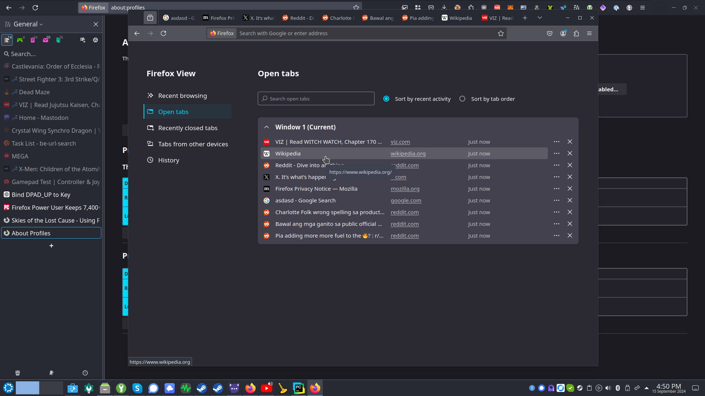
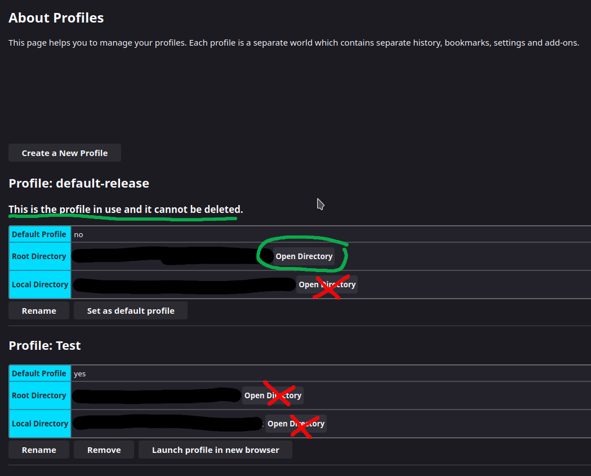
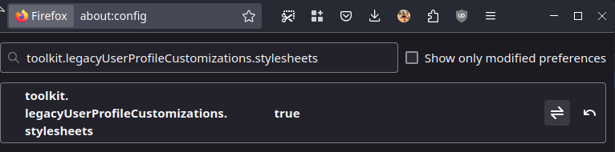
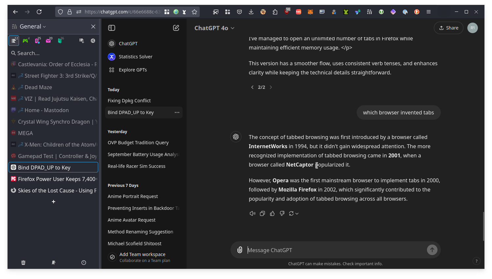
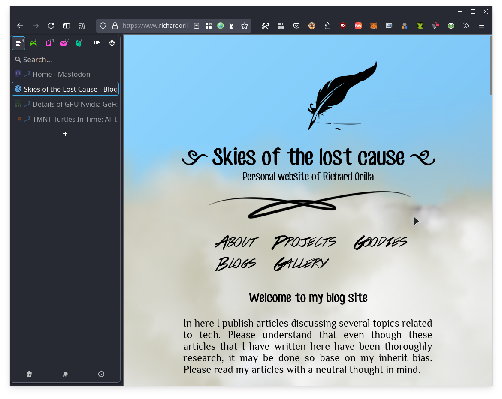

# Handling unlimited number of tabs with Firefox


## Introduction

One of the most common problems that I see with my colleagues from time to time is tab management. Specifically, the majority of them love to open a lot of tabs and keep them open for a long time.

Tabs where introduced originally to organize the browsing experience and to make it easier to switch between different pages because originally browsers only supported one page per windows making it hard to switch between different pages when it is shared with other open applications

However, the problem is that most browsers are not designed to handle a large number of tabs. Not really the technology per se but the user interface. The user interface is designed to show a limited number of tabs and when the number of tabs exceeds the limit, the browser will start to shrink the tabs to fit the screen. This is a problem because the user will not be able to see the title of the tabs and will not be able to switch between tabs easily.

They end up either scrolling through the tabs just to figure out which tab they want to switch to. Thankfully major browsers have a feature now to easily list the open tabs and search between through them. For example in Firefox, we have now Firefox view allowing us to peruse through the tabs easily but also allow us to see our recent activities and such.

- [ ] [](images/ff-tab-picker.png)
- [ ] Figure 1\. Firefox View


Now what if we expand this concept of Firefox view, list down all the tabs and allow us to search through them instead of the default tab setup. This is what we are going to do in this article.


## Firefox Extension \- Sidebery


[Sidebery<sup>[1]</sup>](https://addons.mozilla.org/en-US/firefox/addon/sidebery/) is a Firefox extension that allows you to list down all the tabs that you have open and search through them. You can also group the tabs and save them for later. This is a great extension for those who love to open a lot of tabs and keep them open for a long time.


We will use Sidebery to essentially blur the lines between the tabs and the bookmarks. There is also another one called Tree Style Tab but Sidebery is more flexible and has more features.


Once you have installed Sidebery, you will notice that it will appear on the left side of the browser. You can also notice that the default tab bar is still there making it redundant. We will hide it later as the last step.


## Auto Tab Discard


Another problem with having a lot of tabs open is that it consumes a lot of memory. This is because each tab is essentially a separate process and each process consumes memory. This is where [Auto Tab Discard<sup>[2]</sup>](https://addons.mozilla.org/en-US/firefox/addon/auto-tab-discard/) comes in.


Auto Tab Discard is a Firefox extension that automatically discards tabs that you have not used for a certain amount of time. This will be a key extension to use in conjunction with Sidebery as it will help us manage an unlimited number of tabs without consuming too much memory.


## Remove the default tab bar


Now that we have Sidebery and Auto Tab Discard installed, we can now remove the default tab bar. This is because the default tab bar is redundant, and we will not be using it anymore. To do this we will be using a userChrome.css


To do this, open the Firefox profile folder by typing **\<about:profiles>** in the address bar. Find the part that says "This is the profile in use and it cannot be deleted." and then click on the "Open Folder" button under the "Root Directory" section. This will open the profile folder in your file manager.


- [ ] [](images/ff-about-profiles.png)
- [ ] Figure 2\. Firefox Profile Folders

Inside the profile folder, create a folder called "chrome" if it does not exist. Inside the "chrome" folder, create a file called "userChrome.css" and then open it with a text editor. Add the following code to the file:


```css
#tabbrowser-tabs {
	visibility: collapse;
}
#navigator-toolbox {
	display: flex;
	flex-flow: row wrap;
}
#titlebar {
	order: 1;
	max-width: 146px;
}
#titlebar #TabsToolbar {
	background-color: var(--toolbar-bgcolor);
	background-image: var(--toolbar-bgimage)
}
#titlebar #TabsToolbar .titlebar-spacer {
	background-color: rgba(0,0,0,0.05);
	margin: 3px;
	border-radius: 25%;
	cursor: grab;
}
#titlebar #TabsToolbar .titlebar-spacer[type="pre-tabs"] {
	display: none;
}
#nav-bar {
	order: 0;
	width: calc(100% - 146px);
}
#PersonalToolbar {
	order: 2;
}
/*

	Update - Hides the new Firefox home + tab dropdown. If you want
	to keep/customize those buttons. remove the CSS below and adjust
	the widths above to get everything fitting in one line

*/
#TabsToolbar .toolbar-items {
  display: none;
}
```

After adding the code, save the file. Then next is to go to **about:config** (to access this page, follow the same step as about:profiles), click on "Accept the risks and continue" blue button and then there will be a search bar at the top, type **toolkit.legacyUserProfileCustomizations.stylesheets** and make sure it is enabled to true as seen in the figure below:

- [ ] [](images/ff-unlimited.png)
- [ ] Figure 3. Enable **toolkit.legacyUserProfileCustomizations.stylesheets**


Restart Firefox and the default tab bar should now be hidden and you should only see Sidebery on the left side of the browser. Similar to the image below:

- [ ] [](images/ff-unlimited.png)
- [ ] Figure 4\. My Firefox Setup

## November 24, 2024 Update: UserChromeCSS no longer necessary


There is no longer need to use the step above. This is because the new upcoming vertical tabs on Firefox is already available on Firefox stable but is hidden in the **about:config** setting (type about:config in the browser's address bar)

Then inside the **about:config**, type **sidebar**. (yes with the dot) and enable or set **sidebar.revamp**, **sidebar.verticalTabs** to <u>true</u>. This way you can hide the tabs from the top and just either use the default vertical tabs that will be available on the public in the future or just use Sidebery along with it.

Additionally if you wish to hide the tabs and just use Sidebery as before, you may opt to hide the sidebar then click Sidebery. To do this, either go to customize sidebar and choose **Show and hide sidebar** instead of **Expand and collapse sidebar** then click sidebar so the sidebar remains hidden, the click Sidebery so it becomes visible.

- [ ] [](images/ff-new-vertical.png)
- [ ] Figure 5\. The new Sidebar setup (Notice lesser padding and more space)

## December 1, 2024 Update: Firefox 133 update - UserChromeCSS is once again necessary

The Firefox 133 update has made the sidebar required to show if a sidebar panel is visible. This becomes a problem because the sidebar items kinda consumes space and can be bothersome to look at.

To fix this, either you disable the new sidebar for now and follow the old guide or you re-enable userChrome.css (if you happened to disable it after the November 24  article update) and then replace the contents of the userChrome.css to this snippet

```css
/* Source file https://github.com/MrOtherGuy/firefox-csshacks/tree/master/chrome/hide_tabs_toolbar_v2.css made available under Mozilla Public License v. 2.0
See the above repository for updates as well as full license text. */

/* This requires Firefox 133+ to work */

@media (-moz-bool-pref: "sidebar.verticalTabs") {
  #sidebar-main {
    visibility: collapse;
  }
}

@media (-moz-bool-pref: "userchrome.force-window-controls-on-left.enabled") {
  #nav-bar>.titlebar-buttonbox-container {
    order: -1 !important;

    >.titlebar-buttonbox {
      flex-direction: row-reverse;
    }
  }
}

@media not (-moz-bool-pref: "sidebar.verticalTabs") {
  #TabsToolbar {
    visibility: collapse;
  }

  :root[sizemode="fullscreen"] #nav-bar>.titlebar-buttonbox-container {
    display: flex !important;
  }

  :root[tabsintitlebar] #toolbar-menubar:not([autohide="false"])~#nav-bar {
    >.titlebar-buttonbox-container {
      display: flex !important;
    }

    :root[sizemode="normal"] & {
      >.titlebar-spacer {
        display: flex !important;
      }
    }

    :root[sizemode="maximized"] & {
      >.titlebar-spacer[type="post-tabs"] {
        display: flex !important;
      }

      @media (-moz-bool-pref: "userchrome.force-window-controls-on-left.enabled"),
      (-moz-gtk-csd-reversed-placement),
      (-moz-platform: macos) {
        >.titlebar-spacer[type="post-tabs"] {
          display: none !important;
        }

        >.titlebar-spacer[type="pre-tabs"] {
          display: flex !important;
        }
      }
    }
  }
}
```

## Conclusion

There you have it. You can now handle an unlimited number of tabs with Firefox. You can now list down all the tabs that you have open and search through them. You can also group the tabs and save them for later. In addition, one of the key features of Sidebery is that it allows you to group tabs in a panel. In addition, you can program Sidebery to automatically move tabs to a particular panel base on their domain.

If you can see in the screenshot above, I have roughly around 50 tabs open (not counting the PWA apps; I use Firefox PWA) and all in all it consumes around 4GB of memory/ Which is not bad considering that I have a lot of tabs open, alot of extensions installed (15\+), and I am also running a lot of PWA apps, which is counted in the 4GB memory usage.

Feel free to explore both Sidebery and Auto Tab Discard. They have alot of customization options. Such as with Auto Tab Discard, you can program it to not discard pinned tabs or tabs that are playing audio for example. There is plenty of room to customize both extensions to your liking. Even then the default settings are already good enough.


