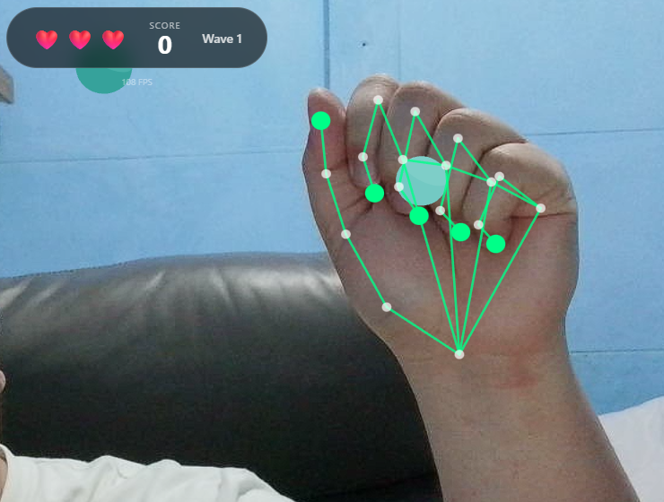

# Building a Hand-Tracking Game: Lessons from the Trenches

## Introduction

What happens when you try to turn a webcam into a game controller? It's harder than it looks, and almost none of the hard parts are about machine learning.

I built a browser-based game where you use your actual hands, tracked via webcam, to grab falling shapes and drag them into matching color zones. Along the way I kept running into the same uncomfortable truth: the gap between "hand tracking works" and "hand tracking feels good" is enormous.

Play the proof of concept (webcam required): **[Launch the game](https://www.richardorilla.website/online-samples/webcam-poc/)**

[](images/hand-tracking.png)
*Figure 1. A gameplay screenshot showing the hand tracking integration.*

---

## The Stack I Chose (and Why)

### React

I know. React for a game. Hear me out.

This isn't a twitch shooter. It's a casual sorting game where most state changes happen on discrete events: you touch something, you deliver something, you lose a life. React's component model fits that pattern surprisingly well. Loading screens, overlays, score popups, all of that is just UI, and React is great at UI.

I wouldn't use it for a 60fps action game where every frame needs tight control. But for this project it saved me from reinventing half a UI framework.

### React Three Fiber + Three.js

I needed a real 3D scene but didn't want to give up React's composition model. React Three Fiber lets you write Three.js scenes as JSX components. It sounds strange until you try it, and then it just feels natural.

The part that sold me: I can pass props down to 3D objects the same way I pass props to buttons. When hand positions update, the scene re-renders. No manual scene graph management.

### React Three Rapier (Physics)

Early prototypes used simple distance checks for detecting when you "touched" objects. It worked, technically, but it felt wrong. Objects clipped through hands, grabs felt imprecise, and tuning collision behavior was a nightmare.

Rapier gave me real physics: colliders, sensors, contact events. Hands became kinematic rigid bodies that actually push things around. Interactions started to have weight. The physics engine also handles edge cases I never would have caught myself.

### MediaPipe Hands

Google's MediaPipe gives you 21 hand landmarks per detected hand, running entirely in the browser. No server, no API calls, no privacy concerns about streaming your webcam feed to the cloud.

Each landmark comes with an x, y, and z coordinate, normalized 0 to 1 for x and y, and relative depth for z. That structure maps naturally onto physics colliders.

[](images/hand-landmarks.png)
*Figure 2. The 21 hand landmarks detected by MediaPipe.*

---

## The Game Concept

The idea is simple enough. Shapes fall from the top of the screen, each with a color. You use your hands via webcam to touch them, activate them, or pinch to grab and drag them. Scoring zones sit at the bottom, each with a matching color. Get the shape to the right zone and you score. Wrong zone is a penalty, and missing entirely costs you a life.

Think of it as a color-matching sorting game where your controller is your actual hands, overlaid on your webcam feed.

Simple concept. The devil is entirely in the implementation.

---

## The Naive Starting Point

The obvious first architecture looked like this:

1. Get webcam feed
2. Run MediaPipe on each frame
3. Map hand landmarks to screen coordinates
4. Check if hands are "near" objects
5. Move objects when grabbed

This worked for about five minutes of testing. Then the problems started.

---

## Challenge 1: The Z-Axis Problem

MediaPipe gives you depth information, the z coordinate of each landmark, but depth from a single webcam is not reliable. The model estimates depth based on hand size and perspective cues. Move your hand toward the camera and z decreases. Move it away and z increases. But the values are noisy, inconsistent, and don't map to any real-world unit.

If you try to use raw z values for 3D positioning, you get chaos. Objects jitter in and out as depth estimates fluctuate. Grabs fail because the hand randomly "moves" in z between frames. The whole experience falls apart.

### The Fix: Flatten the Interaction Plane

I made a deliberate call to ignore depth for gameplay and use it only for subtle visual hints.

```ts
const normalizedDepth = Math.max(-0.5, Math.min(0.5, -landmark.z))
const worldZ = InteractionConfig.INTERACTION_PLANE_Z +
  normalizedDepth * InteractionConfig.INTERACTION_DEPTH
```

`INTERACTION_PLANE_Z` is set to 0, so all gameplay happens on a single plane. Depth only nudges objects slightly forward or back, 0.75 units maximum. When you grab something, it snaps to the interaction plane regardless of where your hand is in z.

This turns an unreliable 3D input into a reliable 2D input with cosmetic depth hints. The game feels responsive because it's not fighting noisy data.

**Lesson:** Sometimes the right solution is to constrain the problem, not solve it perfectly.

---

## Challenge 2: The Jitter Problem

Raw hand landmarks jitter. A lot.

Even when you hold your hand completely still, MediaPipe's estimates bounce around by a few pixels every frame. In a game this shows up as hand colliders that vibrate, making it nearly impossible to precisely touch or grab anything.

### The Fix: Smoothing (With a Cost)

I added lerp-based smoothing to hand collider positions:

```ts
const next = SmoothingService.lerpPosition(
  currentPosition,
  targetPosition,
  HAND_SMOOTHING_FACTOR,
  delta
)
```

Higher smoothing means less jitter but more lag between your real hand and the on-screen collider. It's a direct tradeoff.

I landed on a `HAND_SMOOTHING_FACTOR` of 0.35. Enough to kill visible jitter while keeping lag under around 100ms. Players don't notice the delay because the camera pipeline already introduces some latency anyway. The smoothing just disappears into that existing gap.

---

## Challenge 3: Low FPS (The Surface Pro Problem)

The game ran great on my development machine, a desktop with a dedicated GPU. Then I tested it on a Surface Pro 8.

MediaPipe inference is CPU-heavy. The physics engine needs cycles. WebGL rendering needs cycles. On a power-constrained device, frames dropped hard.

At 15 FPS, the grab system broke completely. Pinch detection flickered because the thumb-to-index distance was crossing the threshold multiple times per second from noise alone. Objects teleported because the hand collider was jumping large distances between frames. And "hold to touch" took longer on slow devices because I had implemented it as "hold for N frames" instead of "hold for N milliseconds."

### The Fixes

**Hysteresis for pinch detection.** Instead of one threshold, I use two:

```ts
const isPinching = wasPinching
  ? distance <= PINCH_END_DISTANCE
  : distance <= PINCH_START_DISTANCE
```

Once you're pinching, you stay pinching until your fingers separate past a higher threshold. This kills the flicker when you're hovering near the boundary.

**Time-based touch detection.** This one was embarrassingly simple to fix:

```ts
const elapsed = nowMs - touchStartTime
if (elapsed >= REQUIRED_TOUCH_DURATION_MS) {
  // Touch registered
}
```

Touch detection now feels identical on a 60 FPS desktop and a 15 FPS tablet.

**Delta-time smoothing.** The smoothing function now accounts for frame time:

```ts
const t = 1 - Math.pow(1 - factor, delta * 60)
return lerp(current, target, t)
```

At low FPS, each step covers more ground. At high FPS, each step is smaller. The effective smoothing rate stays constant regardless of frame rate.

**Fewer colliders.** Instead of physics bodies for all 21 landmarks, I only create them for key points: the five fingertips plus a handful of palm landmarks. Fewer bodies, less CPU.

---

## Challenge 4: The Coordinate Mapping Nightmare

MediaPipe gives normalized 0-to-1 coordinates. The physics engine wants world units. The webcam has one aspect ratio. The game world has another. And the webcam feed is mirrored like a selfie camera, but the coordinate system doesn't know that.

Getting all these spaces to agree took longer than I want to admit.

### The Fix: One Authoritative Mapper

I put all the coordinate math in one place, a `CoordinateMapperService`:

```ts
static toWorld(landmark, videoWidth, videoHeight): WorldPoint {
  // Mirror X (selfie-style)
  const mirroredX = 1 - landmark.x
  
  // Scale to world units based on actual video aspect ratio
  const aspect = videoWidth / videoHeight
  const frustumWidth = WORLD_HEIGHT * aspect
  
  const worldX = (mirroredX - 0.5) * frustumWidth
  const worldY = (0.5 - landmark.y) * WORLD_HEIGHT
  
  // Constrained depth
  const worldZ = INTERACTION_PLANE_Z + clamp(landmark.z) * INTERACTION_DEPTH
  
  return { x: worldX, y: worldY, z: worldZ }
}
```

One function, one source of truth. Every component that needs world coordinates goes through this mapper. When something looked off, I knew exactly where to look.

---

## Challenge 5: Making "Grab" Feel Right

This was the most frustrating part of the whole project.

The naive version: detect pinch, find nearest object, attach it. But as soon as you try it you hit a wall of questions. What counts as "near enough"? Too small a radius and grabs feel pixel-perfect and fussy. Too large and you're grabbing things you didn't intend to. What happens when you pinch at empty space? What if both hands go for the same object? What stops you from immediately re-grabbing something you just released?

### The Fix: Explicit State Machine

The grab system now tracks explicit state per hand: which object it's currently holding, a cooldown timer after each release, and a cursor position.

The cursor position was a subtle but important detail. I originally used the pinch point, the spot between thumb and index finger, as the cursor. But that point moves when you pinch, which caused objects to jump the moment you grabbed them. Switching the cursor to the middle MCP landmark, the base of your middle finger, fixed it. That point stays stable during a pinch, so grabbed objects follow your hand smoothly.

---

## The Part Nobody Talks About: Tuning

After all the architecture work, the last 20% of polish came from adjusting constants in a config file:

```ts
export const InteractionConfig = {
  PINCH_START_DISTANCE: 0.045,
  PINCH_END_DISTANCE: 0.06,
  GRAB_RADIUS: 1.2,
  HAND_SMOOTHING_FACTOR: 0.35,
  REQUIRED_TOUCH_DURATION_MS: 300
}
```

I spent hours on these numbers. Moving the pinch threshold from 0.04 to 0.045 was the difference between the mechanic feeling frustrating and feeling satisfying. That's not an exaggeration.

Good game feel isn't in the architecture. It's in the tuning.

---

## What's Still Not Done

No project is ever finished, only abandoned.

MediaPipe still runs on the main thread, competing directly with rendering on low-end devices. Moving inference to a Web Worker is the obvious next step. Smoothing currently applies uniformly across all joints, but fingertips could probably use more than the wrist. Only pinch is recognized as a gesture; open palm, swipes, and push gestures are all possible but unimplemented. And there's no accessibility work done yet: no colorblind palette, no keyboard fallback, no left-handed mode.

---

## What I Took Away From This

The ML part worked out of the box. MediaPipe is genuinely impressive. I didn't train anything, configure much, or debug model accuracy at all.

The hard part was everything else: mapping noisy coordinates into a stable game world, making interactions feel consistent across wildly different hardware, and tuning a pile of small constants until the whole thing stopped feeling like a prototype.

If you're building something like this, the advice I'd actually give is:

1. Constrain the problem early. Don't fight unreliable data. Simplify it away.
2. Use real physics. Distance checks feel fake. Colliders feel real.
3. Make everything time-based. Frame-based logic will betray you on slow hardware.
4. Put your magic numbers in config files from the start. You will tune them far more than you expect.
5. Test on bad hardware early. Your development machine is lying to you about performance.

Full source is on GitHub if you want to dig in: **[GitHub Repository](https://github.com/Shin-Aska/poc-camera-ml)**

---

*Now if you'll excuse me, I need to go adjust `PINCH_START_DISTANCE` for the 47th time.*