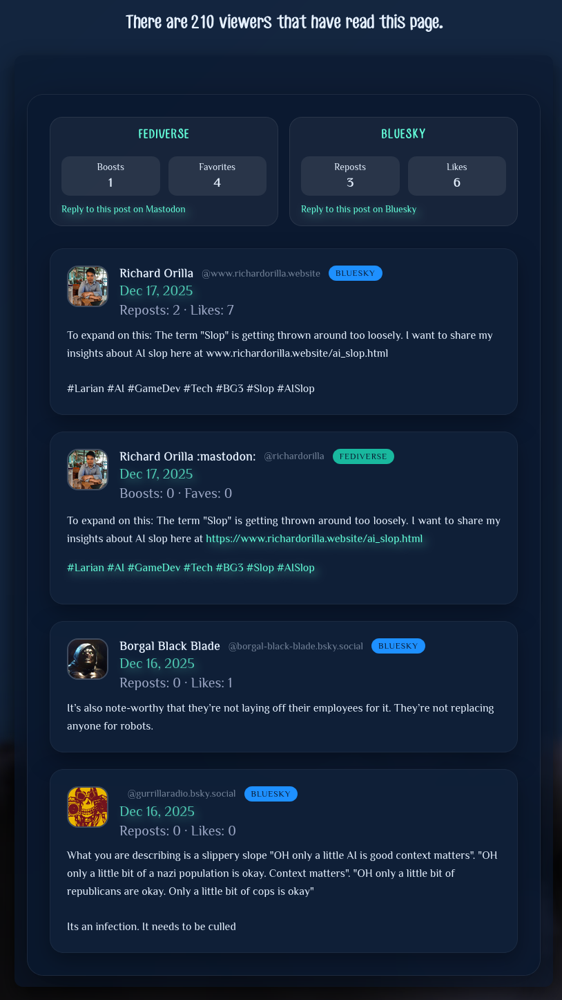

# Integrating Bluesky and Mastodon

## Introduction

As 2025 comes to a close, I want to share one of my personal commitments this year, which has been to unite my website with Mastodon and Bluesky. Originally, I didn’t add a comment backend to my site because I didn’t want the hassle of maintaining it.

I’ve noticed that typical comment engines on websites are often targeted by spammers boosting their SEO. I’m at a disadvantage here since I don’t want to implement something like an AI-based automated review system, which would be expensive to run.

Then I stumbled upon an idea from Daniel Pecos’s article titled [Mastodon as Comment System for Your Static Blog](https://danielpecos.com/2022/12/25/mastodon-as-comment-system-for-your-static-blog/). I thought it was brilliant and decided to implement it on my website.

Later this month, I successfully integrated Mastodon, and just today, December 31st, 2025, I got Bluesky working as well.

The idea is great because it’s simple and doesn’t require a database or backend server. It also doesn’t need any API keys or OAuth tokens. Above all, I’m taking advantage of the moderation on the Fediverse and Bluesky to keep my website free of spam.

On top of that, I believe Mastodon and Bluesky are okay with this setup since they gain engagement too. My implementation links back to my posts on their platforms.

## Structure

The structure of my implementation requires a post as the basis. I need to have a post on both Mastodon and Bluesky that links back to my article. So, I publish an article first, link it in the social media posts, and then update the article to include the social media integration.

It’s a bit of a hassle, but I’ve built an in-house tool to automate most of the work. The trade-offs are worth it, especially considering the moderation benefits I’ve described earlier.

If you read Daniel Pecos’s article, the structure is not so different with the workflow he has described.

## fetching the Comments

I need to setup separate handlers for each platform. I skipped bulky libraries and went for lightweight PHP scripts that grab the data and package it into a consistent comment 'bundle'.

### Mastodon

For Mastodon, the API is pretty straightforward: I hit the `/api/v1/statuses/{id}/context` endpoint to grab the reply thread.

The basic shape is:

- **A small wrapper** that returns HTML for the page.
- **A “bundle” builder** that fetches the API response (with caching), then normalizes it into a consistent format my site can render.

Here’s the rough structure (similar to how I show code in [Firefox Unlimited Tabs Setup](../articles/firefox-unlimited-tabs-setup.md)):

```php
function get_mastodon_comments($post_id, $host = 'mastodon.social', $user = 'your_handle') {
    $bundle = mastodon_comment_bundle($post_id, $host, $user);
    return mastodon_render_comments_bundle($bundle);
}

function mastodon_comment_bundle($post_id, $host = 'mastodon.social', $user = 'your_handle') {
    // ... setup cache ...
    
    $apiUrl = 'https://' . $host . '/api/v1/statuses/' . rawurlencode($post_id) . '/context';
    $response = mastodon_comments_http_get($apiUrl);
    
    // ... parse and normalize data ...
}
```

### Bluesky

Bluesky, built on the AT Protocol, gets a bit trickier. Comments are nested as 'replies' in a thread, so I had to fetch the whole thread using `app.bsky.feed.getPostThread`. One quirky challenge was converting a user’s handle (like @user.bsky.social) into a DID (Decentralized Identifier) before fetching the post data.

In practice, the flow looks like this: parse the URL, resolve the handle to a DID (if needed), build an `at://` URI, then fetch and flatten the thread replies.

```php
function bluesky_comment_bundle($post_url) {
    // ... parse URL ...

    // Resolve Handle -> DID
    $did = $handleOrDid;
    if (strpos($handleOrDid, 'did:') !== 0) {
        $did = bluesky_resolve_handle($handleOrDid, $cacheDir);
    }

    // Build AT URI
    $atUri = "at://$did/app.bsky.feed.post/$rkey";

    // Fetch Thread
    $apiUrl = "https://public.api.bsky.app/xrpc/app.bsky.feed.getPostThread?uri=" . urlencode($atUri);
    
    // ... flatten nested replies ...
}
```

## Solving the Image Security Issue

When you pull in user avatars from external sites, you’re asking for trouble with privacy and security. Browsers can block these images, or the platforms might not allow direct linking.

To get around that, I use a simple image proxy: the server fetches the image, caches it locally, and then the browser loads the cached copy from my domain.

These scripts fetch the image on the server side, cache it locally, and serve it to the user. This ensures that:
1.  **Privacy**: The user's IP isn't leaked to the social platform just by viewing my blog.
2.  **Performance**: Images are cached locally.
3.  **Security**: I can enforce `Content-Type` headers and prevent malicious files.

Here is the core logic from the Bluesky proxy:

```php
$url = isset($_GET['url']) ? trim((string)$_GET['url']) : '';

// Basic SSRF protection
$ips = @gethostbynamel($host);
foreach ($ips as $ip) {
    if (filter_var($ip, FILTER_VALIDATE_IP, FILTER_FLAG_NO_PRIV_RANGE) === false) {
        http_response_code(403);
        exit;
    }
}

// ... Fetch and Cache ...
```

## The Factory Pattern: Putting It All Together

With the data fetching and image issues sorted, the last hurdle was combining everything. I didn’t want two clunky comment sections stacked awkwardly. I wanted one unified stream.

So I merge the 'bundles' from Mastodon and Bluesky into a single array, then sort by timestamp so the newest comments show up first.

```php
function comment_factory_merge(array $bundles) {
    $merged = [
        'sources' => [],
        'comments' => [],
        'hasComments' => false,
    ];

    foreach ($bundles as $bundle) {
        // ... Normalize platform data ...
        
        foreach ($bundle['comments'] ?? [] as $comment) {
            $comment['platform'] = $platform;
            $merged['comments'][] = $comment;
        }
    }

    // Sort by timestamp
    usort($merged['comments'], function ($a, $b) {
        $timeA = (int)($a['timestamp'] ?? 0);
        $timeB = (int)($b['timestamp'] ?? 0);
        return $timeB <=> $timeA;
    });

    return $merged;
}
```

## Conclusion

This setup has been a game-changer for my site. Readers can comment on whichever platform they’re comfortable with—Fediverse or Bluesky—and the conversation still lives right here on my blog.

By hiding the messy stuff behind proxies and a factory pattern, the system feels solid and secure. Plus, it’s flexible enough that I could add another platform down the line (maybe Threads?) without much hassle.

- [ ] [](images/comment_integration.png)
- [ ] Figure 1. The final result showing mixed comments from both platforms

If you’re curious about the specifics of my implementation, you can check out the code on GitHub:

- [Comment Factory](https://github.com/Shin-Aska/personal-website-repository/blob/master/default/comment-factory.php) - Combines multiple comment “bundles” into one feed, sorts by timestamp, and renders the unified comment stream.
- [Bluesky Comments](https://github.com/Shin-Aska/personal-website-repository/blob/master/default/bluesky_comments.php) - Parses the Bluesky post URL, resolves handle -> DID, fetches the thread, flattens replies, and normalizes them into the bundle format.
- [Bluesky Image Proxy](https://github.com/Shin-Aska/personal-website-repository/blob/master/default/bluesky_image_proxy.php) - Server-side image fetch + cache with basic SSRF protection, used for avatars.
- [Mastodon Comments](https://github.com/Shin-Aska/personal-website-repository/blob/master/default/mastodon_comments.php) - Fetches the Mastodon context thread, filters/normalizes replies, and produces the bundle + HTML.
- [Mastodon Image Proxy](https://github.com/Shin-Aska/personal-website-repository/blob/master/default/mastodon_image_proxy.php) - Same proxy idea as Bluesky, but for Mastodon avatar URLs.
