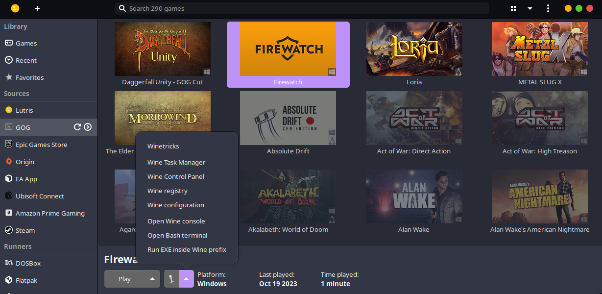
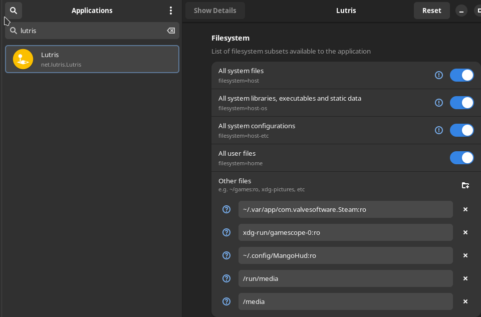
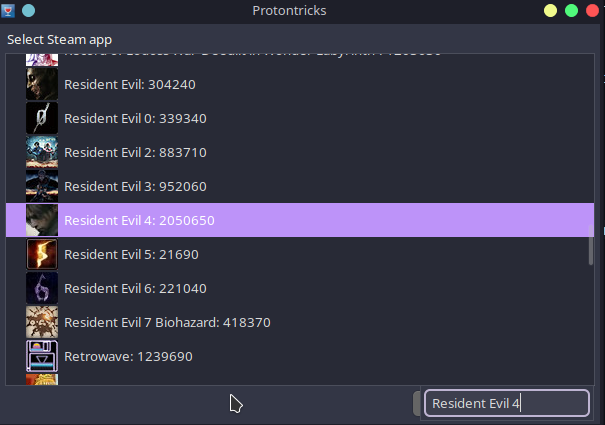
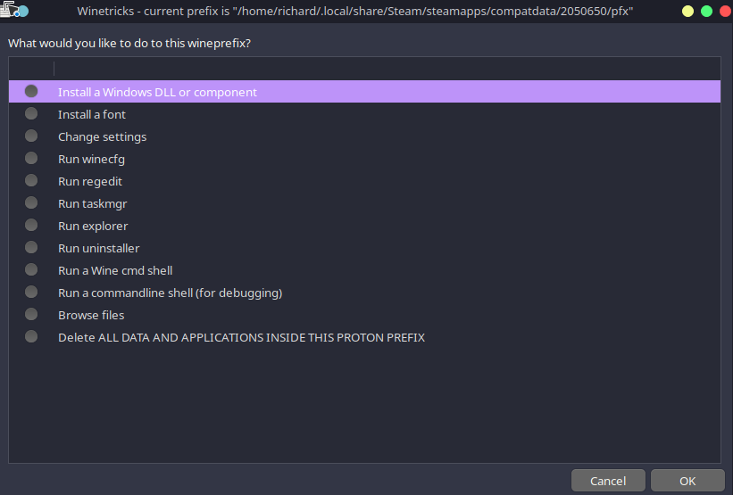
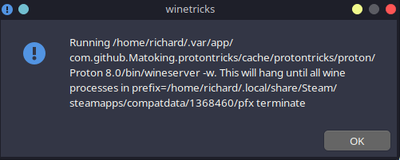
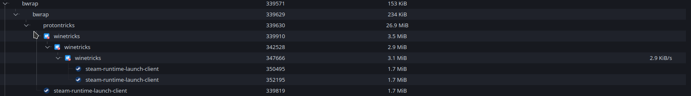
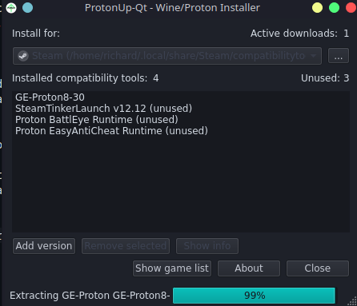

# Getting started with gaming on Linux

## Introduction

You wanted to try out gaming on Linux but struggle to get started? You already managed to install a Linux distro and probably followed some guide on how to play games on Linux yet when you tried to play some game that was suppose to work but it didn't? Then you asked for help on a forum or an IRC then got linked here?

Welcome, you have come to the right place. This article discusses what you already know with Linux and guide and explain deeper so that you can correctly make the right decisions when gaming on Linux

Just a disclaimer that this article is not a guide on how to install Linux. This article assumes that you already have a Linux distribution. You already know how to install software on your distribution and you have somewhat of a knowledge on using the terminal. You already know how to search for help on common problems such as "How to install Flatpak on Ubuntu". I wrote this article mainly to assist people on the Libera IRC in mind.

Where they have a working knowledge on how to use Linux but not yet experienced enough to dive with the intricacies and solve common Linux gaming  problems. I do understand that I can over explain things and because of that, at the end part of a section of an article. I will provide a TL;DR paragraph wherever applicable.

## The choice of distribution

- [ ] 
- [ ] Figure 1\. Arch, Fedora and Ubuntu: Examples of Linux distros that are popular

When it comes to gaming, as long as you choose a distribution that is within the top 10 of the most popular distributions, you should be fine. The reason for this is that choosing among the popular means higher chance of people helping you out.

For example, even if the popular go\-to Linux distribution for beginners is Linux Mint, picking Ubuntu is not also a bad choice considering  that alot of people use Ubuntu and therefore a lot of people can help you out in solving the common edge cases.

However one thing you should need to understand is the release model a distribution follows. For example, Ubuntu offers two release models. The first one  is called regular releases which means that every 6 months, a new version of Ubuntu is released. They also offer a longer version of that is called Long Term Support (LTS) release.

In the Linux world, the word "stable" means the software versions are not updated frequently. This is important because when you are gaming, there are cases where you wish to have the latest version of a library in order to play games properly. This is much true when playing native Linux games because some of these games are built with the latest libraries in mind and may not work properly with older versions of the library.

So that means, let us say you are going to pick Ubuntu 22\.04\. Even though this version is supported until 2027, if you do not know what you are doing, it is ill advised to use this version because the software versions are not updated frequently. Bare in mind that any updates you receive in a release model prior to a major version are usually security updates and bug fixes.

The other side of the coin is the rolling release model. This is where the software versions are updated frequently. This is the model that Arch Linux follows. Meaning the moment you install Arch Linux, you are already using the latest version of the software.

Now that doesnt mean that you should use Arch Linux because you get the latest updates, because the rolling release model is not for everyone.

Rolling release model tends to break things more often than the regular release model. This is because the software versions are updated frequently and sometimes the updates are not tested properly or even if they are, the updates may not work properly with the other software you have installed.

Fedora for example is a distribution that follows the regular release model but tends to use the latest version of the software. So striking the right balance for you is important. Like for example, I tend to go with an LTS model because I do not want to update my system frequently. I understand that there are risks involved. Such as currently Ubuntu 22\.04 cannot run gamescope because the version of the library it uses is too old to support gamescope.

That being said, I strongly suggest you do not use Arch Linux as your first distribution. I can guarantee you that you will break your system and you will not know how to fix it. Ofcourse Arch enthusiasts will say that because there is a wiki. But the wiki is not for beginners. The wiki is for people who already know what they are doing and just need a reference (and coincidentally, a good reference for people that like to tinker with their system).

I would also try to avoid Debian too as Debian is too old which means you need alot of work to be done before you are able to play games properly on Debian, even in the testing branch. I would also recommend avoiding LTS versions of Ubuntu as well.

Instead go with something like Fedora as Fedora utilizes Flatpak by default and usually has the latest version of the software. If you want a preconfigured Fedora, you can use Nobara as well (Nobara is not within the Top 10 Linux distributions but since its based on Fedora, it is still good)

## TL;DR version

Just install Fedora because it has Flatpak by default. If you must use another distro, try to use the ones where you can easily install Flatpak.

## Using Flatpak for gaming

Because of the complexity of picking the right balance is not for everyone. For beginners I recommend they install Steam or Wine using Flatpak. This is because Flatpak is a package manager that is designed to work on any distribution while also allowing different versions of the same library to be installed at the same time. So even though let us say, I am using Ubuntu 22\.04, I can still enjoy the latest version of an application despite the distribution's software versions being outdated.

If you already installed Steam but do not know if it is from your distribution's repository or from Flatpak, you can check by running the following command: "whereis steam". If the output is empty (where it is just "steam":), then it is highly likely that you installed Steam using Flatpak. To ensure that is the case, you can run the command "flatpak list \| grep valve". If returns an output, then you have installed Steam using Flatpak. 

One more thing, if there "whereis" command did return something that contains the word "snap" (Example: /snap/bin/steam), then you are using the snap version of Steam. In my experience, the snap version of Steam is not as good as the Flatpak version of Steam. This is because snap has alot of bugs [which caused alot of problems\[1]](https://www.gamingonlinux.com/2024/01/valve-seeing-increasing-bug-reports-due-to-steam-snap-other-methods-recommended/)
 to end users.

- [ ] 
- [ ] Figure 2\. Lutris \- Main user interface with other options bundled in such as Winetricks

Wine is not currently offered as a standalone on Flatpak. It is often bundled as part of a launcher. For example, Lutris is a game launcher that uses Wine to run Windows games on Linux. I recommend Lutris for non steam bounded games such as games bought from GoG because it is the one that offers the closest experience to Steam's Proton. Where there are community made scripts that allows you to play games using Wine with little to less configuration on your end.

## TL;DR version

Try to use Flatpak wherever possible. I highly recommend Flatpak because it solves alot of potential problems that you may encounter because of the sheer variety and different configurations of each Linux Distro.

## Flatseal

Flatseal is a graphical application that allows you to manage the permissions of Flatpak applications. This is important because Flatpak applications are sandboxed. Meaning they are isolated  from the rest of the system. This is good in a security perspective but can be annoying when you want to access a file that is not in the default directories that Flatpak applications can access.

With that in mind, use Flatseal and add Steam and Lutris to access the Host's Filesystem. Specifically Enable all system files and user files to ensure that these applications can access the files that are in your home directory.

- [ ] 
- [ ] Figure 3\. The file system options on Lutris via Flatseal

## Wine vs Native

Certain games offer a native Linux version. I recommend you try out the native version first and see if it works. If it does, then you are good to go. If it doesn't, then you can try using Wine.

Performance wise, it varies. Some games run better on Wine than on the native version. Some games run better on the native version than on Wine. So it is hard to say to go all native or not. However; base on my experience, I often have better luck with Wine than the native version. 

## Protontricks / Winetricks

- [ ] 
- [ ] Figure 4\. Protontricks \- Winetricks fork meant exclusively for Steam Proton

Protontricks and Winetricks are tools that allows you to install Windows libraries on Wine. This is important because some games require certain libraries to be installed in order to run properly. For example, if you are trying to play a game that requires DirectX 9, you can install it using Protontricks.

- [ ] 
- [ ] Figure 5\. Winetricks \- The main options available on Winetricks after selecting a prefix

Although I try to ask beginners to avoid this tool (sometimes a different Proton version such as GE has a fix incorporated so no need to do anything) but if there is a need, I recommend you use the Flatpak versions of these tools. Protontricks is available as a seperate Flatpak application. Winetricks is usually bundled to other applications such as Lutris or Bottles.

It should be noted that using the Protontricks provided via Flatpak means you will be limited to using the UI instead of being able to interact with it directly via the terminal. However commands such as "protontricks 1154840 \-q corefonts gdiplus" can easily be translated to the UI by following these steps:

1. Select the steam game you wish to install libraries from (You don't need to know the code and you can easily search by typing the name of the game while the window is focused on Protontricks)
2. Make sure the option "select the default wineprefix"
3. For the gdiplus, choose the "Install a Windows DLL or component" then find gdiplus from there (You can search using the same approach as you did when finding the game)
4. For the corefonts, choose the "Install a font" then find corefonts from there

### Warnings

* It should be noted that depending on what you installed on Proton/Winetricks, endless popups will appear. This is normal. Just keep clicking OK until it goes back to the last Proton/Winetricks menu you are from
* Sometimes an installer gets stuck, so just to be sure, check your task manager and see if there are any .exe, .msi applications running around or had been stuck for awhile, then end them manually
* While these tools are doing their own thing. It is important not to run the applications you are tinkering with as it may pollute the installation

- [ ] 
- [ ] Figure 6\. Common popup encountered when installing a component or font via Winetricks UI (THIS IS NORMAL)

- [ ] 
- [ ] Figure 7\. An example of how an application tree looks like on Winetricks when something is installed (Notice Zenity)

## Proton GE / Different Steam runtimes

 There are different Steam runtimes available on Steam for Linux aside from Proton and Steam runtime. One example is Proton GE. Proton GE is a custom version of Proton that is designed to  work better with certain games by applying patches and have some components preinstallled that are not yet available on the official Proton.

- [ ] 
- [ ] Figure 8\. ProtonUp\-Qt \- A graphical application that allows you to manage different Steam runtimes

To manage these different runtimes, I suggest using ProtonUp\-Qt. It is available as a Flatpak application and makes updating and managing different runtime versions so much easier.

It even offers runtimes such as Boxtron and Luxtorpeda, which integrates system installed DOSBox and ScummVM respectively to run old classics.

