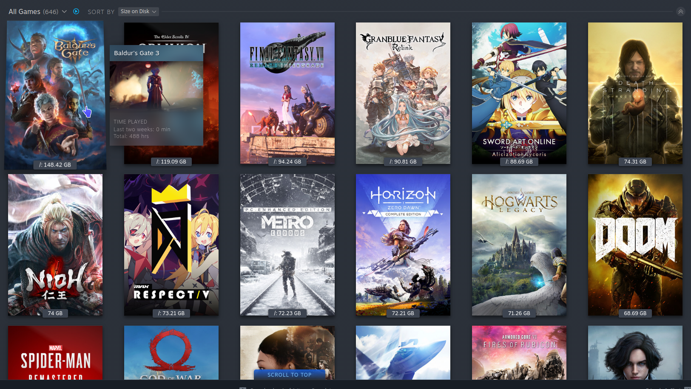
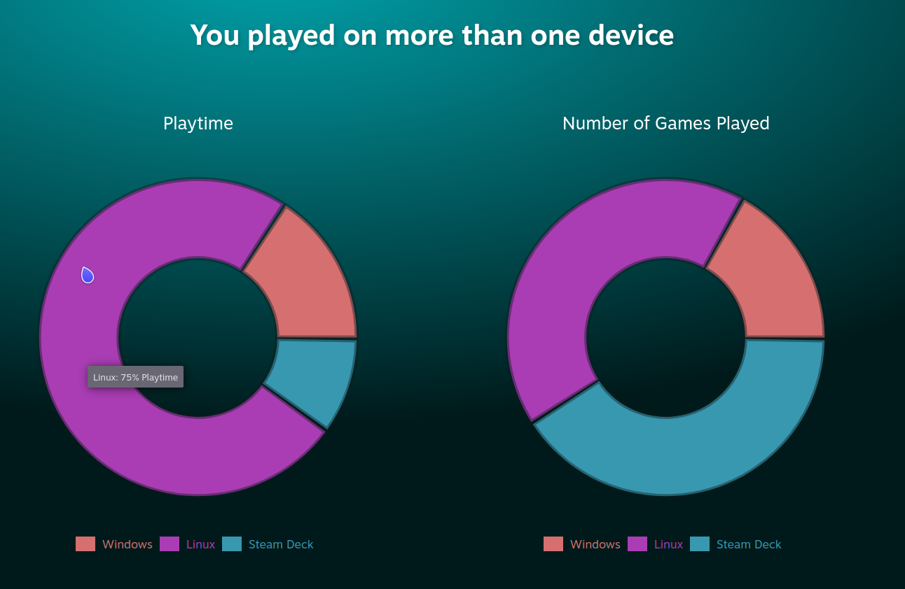

# My Main PC Has Over 600 Installed Games on Steam, All Playable on Linux. Here's What I Can Say About Linux Gaming.

## Introduction

Around 2018, my main PC finally broke down, and I ended up buying a new one. At that time, my main PC was still using Windows 7, as I refused to use Windows 10 despite the upgrades because it forced updates on its users.

At that moment, I had to decide whether to go all-in on Linux or finally use Windows 10 as my daily driver. Mind you, this happened months before Proton was released, so I had to keep different copies of Steam: one was the native Linux version with native Linux games installed, and the others were installed via Wine in different versions, depending on game compatibility.

The situation now, compared to what it was seven years ago, is completely different. Today, Proton's game compatibility is way better than it was before (including the standalone Wine). Games that were impossible to play at first, such as *Street Fighter V*, are now playable (and even its sequel, *Street Fighter VI*).

If you read my previous [article [1]](state-of-linux-gaming.html#update_july_5_2021), some games are even playable on their release day, which was unimaginable back then. Now, going back to the title of this article, my library has grown over the years. Believe it or not, my main PC now has 646 games installed, all of which are playable on Linux.

- [ ] 
- [ ] Figure 1. My top 10 games, sorted by disk size, installed on my main Linux PC. All are playable on Linux with no issues.

## What You Need to Expect

In my 1400+ game library, I admit not all games are playable on Linux. My most recent example is an FMV game named [Time Space Rebuild[2]](https://store.steampowered.com/app/3292340/Time_Space_Rebuild/), which has black screen issues that make the game completely unplayable.

I find this funny because most of the FMV games I own work; for example, [Gem of Fate 2[3]](https://store.steampowered.com/app/3218600/Game_of_Fate_2_A_Centurys_Promise/), which is the game shown in Figure 1 below the *Metro Exodus* cover art.

That being said, some games are playable but have issues that are either ignorable or, at times, annoying. Sometimes these get fixed in a new Proton version, but some issues are impossible to resolve because of anti-cheat.

In other words, if you mainly play single-player games, you might be able to switch to Linux with little to no problems. However, if you mainly play multiplayer games, double-check if the games you play are playable on Linux.

This is mainly due to developers explicitly blocking Linux users from playing the game. You must understand that not all games with anti-cheat are unplayable on Linux. *DJMax Respect V* (found in Figure 1), for example, has anti-cheat but works great on Linux.

Unfortunately, the same game also suffers from issues where certain patches break it, so you may end up taking a break for a while. You might have to wait for either the community to issue a fix (usually, a later ProtonGE version resolves the problem) or for Neowiz to release a patch addressing it.

The experience varies by developer. For a game that is constantly updated, expect occasional breakage. In a worst-case scenario, it might become completely unplayable on Linux, such as when Riot Games integrated Vanguard into *League of Legends*, which effectively killed its Linux community.

This can also happen with single-player games, but the chances are slimmer. Usually, these types of games receive a set of patches before the developers move on. In my seven years of experience, this has only happened a dozen times. For instance, when *Grand Theft Auto V* changed its anti-cheat, it effectively broke the game for Proton users. Eventually, workarounds allowed Linux players to access the single-player content but barred them from playing online.

## What Do I Get for Switching?

Windows is not free, but it is widely accessible. Most computers sold today have Windows bundled and pre-installed, so you don't have much incentive to switch out of the box. Furthermore, you run the risk of encountering hardware incompatibility issues, such as black screens, freezes, or other problems.

So why take the risk? What do you get for switching? First, you get total control over your hardware. You can squeeze more performance out of your rig by switching to Linux because Windows has become so bloated over the years that you, the end-user, pay the price for it.

I have a friend who plays the remastered version of *The Elder Scrolls IV: Oblivion*, and he was getting FPS problems despite having better hardware than I do. I was using a GTX 1660S, while my friend has a laptop with an RTX 3060 Ti, yet I get better FPS than he does when it should, in fact, be the opposite.

Of course, it's well known that the *Oblivion* remaster is an unoptimized mess, but I get a consistent 60fps while my friend averages 30fps and suffers from bad stuttering. The fact remains that on my Linux system, I have no problems running the game.

Second is long-term stability and reliability. In Linux, once you set it up, it just works. I have previously written an [article[4]](virtualmachines-vs-wine-vs-seamless-integration.html) bout how I convinced my mother to use Linux. In that article, I described the effort to set up her machine with a well-configured Ubuntu installation, including all the necessary drivers for her hardware and printer. To this day, she still uses it and has no problems (though I do have an issue with her not updating from time to time).

In Linux, you rarely experience updates that break the system. This, of course, excludes bleeding-edge distros such as Arch. But on an Ubuntu system, for example, which prioritizes stability over features, you will have little to no problems once everything has been set up.

If you're asking for my recommendation, I suggest Fedora, specifically the Silverblue version. For more details, I wrote a [guide[5]](linux-gaming-getting-started.html) for the #LiberaLinux channel on IRC to help semi-beginners decide which distro is best for them.

Lastly, there's privacy. Linux distributions rarely include telemetry in their OS, and those that do mostly offer it as an optional, opt-out feature. This is in stark contrast to Windows's increasingly aggressive and privacy-invasive practices. The fact that the latest versions of Windows now require a Microsoft account to even use your PC is a crazy situation.

I will not even forget to mention that Onedrive is being pushed in your face for every opportunity Microsoft gets and does not even consider if you are using a different storage provider.

So in other words, once you get Linux working and either you don't have games that are not playable on Linux or forgoe stop playing it, you get a peace of mind. The same peace of mind I use to get when I use to use Windows 7.

## Why am I writing this?

I am writing this article to spread the word that the feasibility of playing games on Linux is greater than ever. Thanks to Valve's ongoing efforts, I don't see this progress stopping anytime soon. In fact, I can certainly see room for more casual users to switch, especially in an age where most people do their work inside a web browser.

There are even videos on YouTube showing how much more battery life Linux provides on handhelds. This is something that Windows-based handheld PCs struggle with to this day, to the point that some Windows users blame the x86 architecture itself rather than the fact that Windows is bloated.

Long story short, I own over 1,400 games. I have played most of them, and the majority are playable on Linux. While I mentioned having over 600 games installed on my main PC, that number doesn't even include my Steam Deck, which has hundreds more installed across several SD cards.

So, give Linux a shot. Maybe it will work well with your hardware, and you'll end up happy with the switch. I certainly hope to see more Linux users, as a larger user base would get us more serious attention from software companies, leading to more native applications and better support overall.

- [ ] 
- [ ] Figure 2. My steam replay stats as of 2024. I have 187 games played on Linux, 181 games played on Steamdeck and 75 games played on Windows.
