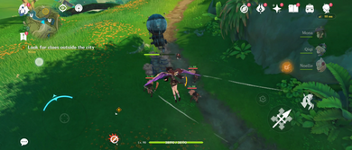
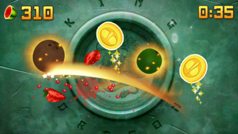
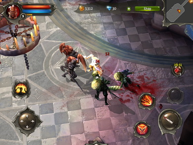
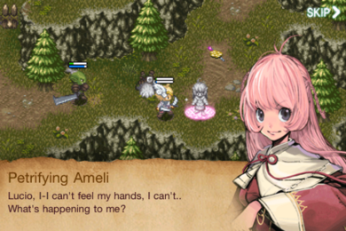
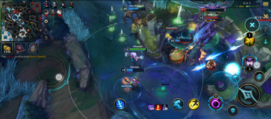
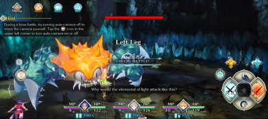
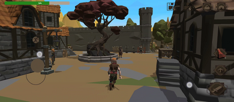
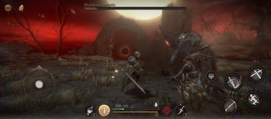
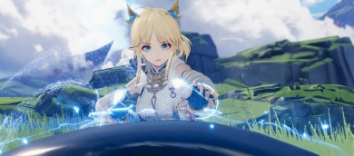

# The missed opportunity of mobile gaming

## Introduction

Recently I bought an ASUS ROG Phone 7, which is one of the top of the line android mobile phones meant for gaming. While I was perusing the Play Store, I notice that most of the games in there are already playable on my old Oppo Reno 6z which got me thinking what was the point of me buying this top of the line phone.

Obviously my old phone is powered by a mid ranged processor and unlike my new one, can only play even the most demanding mobile games at around 30\-40 fps at best, which is not totally bad but not great either. One good thing my new Phone can do however is dabble on emulation of consoles that require beefier hardware to run such as PS2 and even Switch.

- [ ] 
- [ ] Figure 1\. Genshin Impact, one of the most popular mobile games of all time on the mobile platform.

I could also enjoy playing games such as Genshin Impact and PUBG at very high refresh rates but that got me thinking whether what I bought was worth it. I mean, I could have just bought something like a Steam Deck at the same price range and get me access to a wider library of games that are not available on mobile.

As I peruse the play store, I do notice that there are some titles here that are available on PC and Handhelds, some were older games that were ported to mobile and some were newer ones that was just recently released as recent as 2 years ago. Admittedly, I did find some good games that are originally made for mobile, so there is that.

Despite spotting good games out there, I still feel that the mobile gaming market is still not reaching its full potential. I mean, the hardware is there, the software is there, the market is there, but the games are not there. Most mobile games are free to play live service games, which is not a bad thing but one key thing that live service lacks or is weak at is offline play. It truly is sad to see how bland the mobile gaming market is and a missed potential it has.

## The Early Days of Mobile Gaming

- [ ] 
- [ ] Figure 2\. Fruit Ninja, one of the most popular mobile games of all time on the mobile platform.

The early days of mobile gaming were promising. The iOS enjoyed a variety of very good titles that also received Android ports such as Angry Birds, Cut the Rope, and Fruit Ninja. It even had an original RTS game called Red Alert which takes event between Red Alert 2 and 3\.

The Android on the other hand were playing catch up. It was not until the release of the Samsung Galaxy S2 that the Android market started to pick up. The Galaxy S2 was the first Android phone to have a dual core processor and a GPU that can handle 3D games. This was the time when the Android market started to get good games such as the original Dead Trigger, Shadowgun.

- [ ] 
- [ ] Figure 3\. Dungeon Hunter 4, one of the popular free to play RPGs on the Android platform back in the day

Earlier than that, the Android market was filled mostly with 2D games that probably were meant for the Java platform. but still, mobile gaming was promising. As each generation of phones got better, better graphical capabilities, more memory, and more storage, the potential of mobile gaming was getting bigger and bigger.

- [ ] 
- [ ] Figure 4\. Inotia 3, one of the popular free to play RPGs on the Android platform back in the day when mobile phones were still not powerful enough to handle 3D games.

Then out of the blue, some of the console games received mobile ports. Such as Chrono Trigger, Final Fantasy, and even Grand Theft Auto. The future of mobile gaming was looking bright and was not surprising that many were expecting that mobile was the next new thing annd will be the replacement for handhelds.

## The Turning Point

As the years went by, the mobile gaming market started to change. The games that were once good were now being replaced by live service games. The games that were once paid are now free to play with microtransactions. The games that were once offline are now online only.

One of the biggest turning points of mobile gaming was the realization of game companies that live service games were making more money than premium games. Clash of Clans and Candy Crush are two of the biggest examples of this. These games were making millions despite being free\-to\-play and are casual games.

This started a trend of the rise of MMORPGs aiming to lure in the casual market. Games such as Order and Chaos, and Avabel Online are good examples of this. These games were free to play and were making money through ads and microtransactions.

## The Impact

The impact of the rise of live service games was huge. The mobile gaming market are now filled with games that are free to play and are making money through ads and microtransactions. Now that being said premium games are still being made but are now few and far between.

- [ ] 
- [ ] Figure 5\. League of Legends: Wild Rift, a mobile port of the popular PC game League of Legends.

Not to mention that most of these games are optimized for the mid\-range phones. Which is why even though I have a very high end phone, I cannot play Trials of Mana beyond 60 fps. There is no option to increase the rendering resolution, the mobile port is totally limited. I cannot even play the game with a controller natively despite the fact that the game was originally made for consoles (However there is a way).

- [ ] 
- [ ] Figure 6\. Trials of Mana, a mobile port of the popular console game Trials of Mana.

To be fair, you can blame the game developers for this. They just went with the quick port and dump method. Which is a shame because the platform has the potential to even grow bigger but unfortunately the money is not there and thus game developers are not willing to invest.

## Subscriptions

Currently, there is a new trend in the mobile gaming market. The game store subscriptions. Apple Arcade and Google Play Pass are two of the biggest examples of this. These services are offering premium games for a monthly fee. This is a good thing because it is a way to bring back premium games to the market in a much more affordable way.

For example, I would only need to pay ₱139 a month to play games such as Monster Hunter Stories and Final Fantasy VII. Which costs ₱1,050 and ₱799 respectively. It is a one time cost of ₱1,849 but if you compare to a ₱1,688 yearly from Google Play Pass, I can play these games  along with others. Not to mention that some games that have microtransactions under these services provide the microtransactions for free in addition offering discounts to a few selected live service games.

However, the downside of this is that the games are not permanent. If I stop paying the subscription, I will lose access to the games. Not to mention if this ever picks up mainstream, the game store now has a say on what games gets popular and what games gets buried.

## Conclusions

Currently, the mobile gaming market is at its phase of enjoying the live service model. There are efforts to expand beyond the live service model but currently such efforts are still at its infancy. Will this change how the mobile gaming market will be in the future? Only time will tell

- [ ] 
- [ ] Figure 7\. PAIGN, an original action RPG game that was made for the mobile platform.

- [ ] 
- [ ] Figure 8\. Pascal's Wager, a souls\-like game that was made for the mobile platform.

Thankfully, there are still some good games that are made for the mobile platform. Games such as Pascal's Wager, and PAIGN are good examples of this. These games are made for the mobile platform and are not just quick ports of console games. They are designed to be played on the mobile platform and are optimized for the mobile platform.

It is just a shame because as we get bigger and better phones, we should get bigger and better games. While emulation may be a good option as a resort to access these types of games I just hope it will change as because it currently stands, the mobile gaming market is a missed potential.

## May 4 2024 Update: New Android exclusive premium games

- [ ] 
- [ ] Figure 9\. Ex Astris \- a new premium mobile only exclusive game by Gyrphline

I am quite surprised and amazed that a game went under my radar. Ex Astris is a new game that was released for mobile only just recently and it offers Genshin like navigation and turned based combat similar to Trails of Cold Steel combat. It is playable offline and does not even have microtransactions while the price is pretty cheap compare to other premium games. It is just amazing!

So far I have spent close to 5 hours of playtime and from what I have heard it offers 15\-20 hours of content. So I am pretty much  just scratching the surface. I hope there are more games like this in the future which is very high quality, voice acted, good graphics playable offline, no microtransactions and just a one time payment.