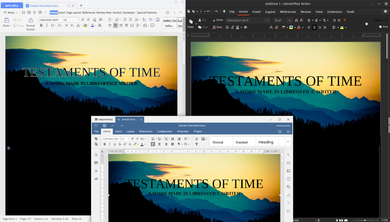
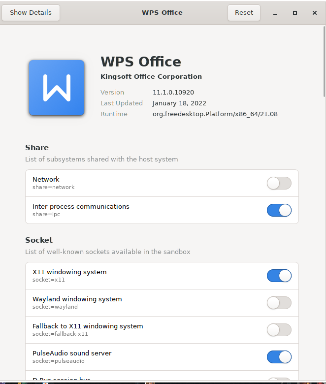
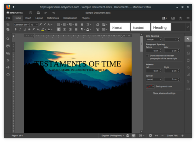
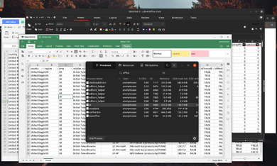
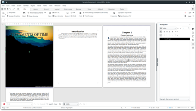
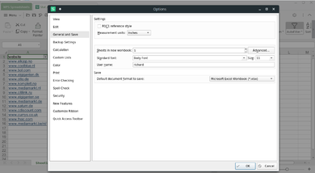
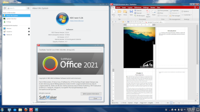

# Which office suite should I use on Linux?

## Introduction

The list of office suites available on Linux is far more versatile than it once was a few decades ago. Aside from cloud\-based applications such as Google Docs, Zoho, and Office 365 Online, we now have decent desktop\-based options such as LibreOffice, OnlyOffice, WPS, Caligra Office, Softmaker, and a few others.

This decent set of options is great because this allows us more room for competition, which is always good for end\-users.

The default office suite bundled on most distributions is LibreOffice. However, there are notable distributions that have a different default option. Such as Manjaro, which decided to bundle Softmaker Freeoffice, or Ubuntu Kylin, which uses WPS by default.

Often wise like any other Linux thing, having too many options can confuse many. On Windows, for example, the dominant choice is Microsoft Office, so the majority that wishes to have an office suite will often go with Microsoft Office.

Microsoft Office has become so dominant that even MacOS users have also started to use Office instead of using the free office suite bundled on MacOS.

Of course, many also wish to have the Microsoft Office option on Linux. Although, Wine has made strides to make even the latest Office 365 desktop application run. There are so many things that do not work that even today, in 2022, the other Linux native office suites are still better than Wine \+ Office 365 combination.

We will discuss the top 3 popular Linux native office suites available for use.

## LibreOffice

When Oracle bought Sun Microsystems, the documentation foundation became worried about the acquisition and decided to fork OpenOffice and name it LibreOffice.

In many ways, LibreOffice can be considered the spiritual successor of OpenOffice since Oracle pretty much abandoned OpenOffice around 2011, leaving it to the dust.

LibreOffice continued what is left off on OpenOffice with more decent support with the new Office format and added new features such as a better and more customizable user interface.

If you just want an office suite for personal use, such as making letters or casual presentations. LibreOffice is a great software for that.

## WPS Office

WPS Office has been around for a long time, predating the 1980's era as China wanted to have a decent Office suite alternative to Microsoft Office. It only became popular during the Android 2\.X era back when people wanted to have a decent document, spreadsheet, and powerpoint viewer.

Microsoft Office was not available on Android yet; during that time, WPS became the gap\-filler of such need and ended up rising to its popularity today.

WPS Office, however, is proprietary software, which is a turn\-off for many in the Linux world.

Despite that, WPS Office still has huge traction of users because its UI presentation is much more fluid and user\-friendly compared to its other competitors.

It should be noted that despite WPS Office being a proprietary software, it is free for personal use.

## OnlyOffice

The new kid on the block. OnlyOffice rose to popularity because of LibreOffice's problems with OOXML compatibility (where there are minor rendering issues encountered when LibreOffice tries to open DOCX, XLSX, and PPTX files).

It quickly gain traction because of its decent OOXML compatibility and FOSS. The whole suite is originally designed to be a cloud\-based suite that can be self\-hosted; it then had desktop\-offline versions, which became one of the default go\-to of other Linux users.

## Usecases

I have categorized a typical Linux user into three use\-cases that each one of you may have once you start venturing into the Linux office suite. We will be discussing them one by one and which office suite is best for you under that particular use case.

It should be noted that I did not include the use\-cases related to businesses, as, among the three, only one has a slight support over it but pales in comparison to Microsoft Office's implementation.

### Maximize OOXML compatibility

- [ ] 
- [ ] Figure 1\. WPSOffice the only one supporting text\-outline effect so far.

If you are a Linux user who mainly works with people who use Microsoft Office and do not want to do something drastic like installing a Windows virtual machine or you tried Wine \+ Office365, it didn't work out for you.

Then I suggest you give WPS Office a try as, among the three, WPS Office has the best compatibility with OOXML files (DOCX, XLSX, and PPTX). 

- [ ] 
- [ ] Figure 2\. Disabling networking on WPS Office via Flatseal

For those who are paranoid about WPS Office being a Chinese spyware, there is a Flatpak version of WPS. You can use that version instead and use Flatseal to modify the configurations and restrict WPS Office from any network connectivity.

The only real downside with WPS Office is its lack of support outside Microsoft Office files. But then again, if your use\-case is to have maximum Microsoft Office support, then I do not see it as a problem, but a nice have.

### Consistent User Experience

- [ ] 
- [ ] Figure 3\. OnlyOffice cloud personal running on Firefox

If you wish to have decent OOXML support and want a consistent user\-interface experience regardless of whether you are running the cloud version (either self\-hosted or using an external service provider) or the desktop version.

Then OnlyOffice is the only one among the three built from the ground up to be a cloud application and has other versions such as offline desktop mode.

What makes OnlyOffice a decent choice is that it is one of the few that provides an AppImage file as its distribution medium, which you can just download, store in a USB Flash storage and just run it from there without installing the said application.

- [ ] 
- [ ] Figure 4\. Opening an 8MB Excel (XLSX) file, Onlyoffice (DesktopEditors \+ editors\_helper) consumes the most memory 558\.8MB of ram, while LibreOffice (oosplash \+ SOffice.bin) is around 440\.6MB while WPS (wpsoffice \+ et) 247\.7 MB of ram

The only downside of OnlyOffice is that it is powered by Electron. Thus it is heavier than its counterparts, but hey, at least among the three, it is the most portable one.

### The default user

Most casual users want to just use the software that has already been preinstalled on their machine. Since most Linux distributions bundle LibreOffice by default, these users have grown accustomed to what LibreOffice offers.

- [ ] 
- [ ] Figure 5\. Default LibreOffice interface on KDE Neon

LibreOffice is by far not a bad choice to use as it supports a variety of file formats (from OOXML to OpenDocument); it also has a variety of offline templates and clipart preinstalled.

It does great on what it does: to provide the basic functionalities of an office suite for free while also having additional features here and there.

The default user can never go wrong with LibreOffice (or whatever is preinstalled on their machine). Yes, this also implies that the three are mature projects that you can use.

- [ ] 
- [ ] Figure 6\. Side\-by\-side using LibreOffice Impress and WPS Presentation

## My thoughts, opinions, and conclusions

Personally, I have used all three for an extensive period of time. I originally used LibreOffice for the most part and use OnlyOffice whenever I want to format or do something that LibreOffice cannot properly do. Then to guarantee that it will look exactly how I designed it to be. I use the export to PDF function.

I couldn't go all\-in with OnlyOffice as I had performance issues with it; specifically, whenever I open huge spreadsheet documents (like a spreadsheet file having 80MB\+ disk space), it ends up eating a lot of RAM (probably due to its web\-related nature)

Last year, 2021, I got tired of creating documents then exporting them as PDF, and then whenever there is a need to edit, I edit the master copy and re\-export the PDF, so I went ahead with WPS now as I realize that most people I work with use the Microsoft Office suite and it is my best interest to give them files and copies that can also work and is editable for them.

Then finally, if I need to create a document that relies on later features that the three don't have (such as Excel JSON Datasource fetch via an API), I have a Windows VM with the latest Office installed for that.

Now to end this article, what I can say is there is no true way to replace Microsoft Office on Linux, a lot of Linux users wish to have Microsoft Office support for Linux, but I bet it wouldn't be in fruition yet as there's only less market share for such a cause.

That being said, for non\-business use\-cases, as long as you belong to at least one of the use\-cases I categorize, I believe one of the three I have suggested can work well with your

## February 11 Update: R1C1 default on WPS Spreadsheet Flatpak

I have received feedback that they have tried out my suggestion to use WPS via Flatpak and Flatseal to restrict network access. However, they found out that WPS Spreadsheet is a bit 'weird' in a sense, that is, instead of the A1 reference style that everyone is accustomed to right now, what they saw is R1C1 instead.

The R1C1 being the default, is a flatpak version thing. If you installed the system\-installed version (via DEB or RPM installer) defaults to the A1 referencing style.

Microsoft developed the R1C1 in the past to address referencing issues across sheet to sheet computations. However Microsoft later revised the A1 reference to add the $ symbol as a means to lock a particular row and cell when cross referencing cells.

That being said, it can easily be set back to A1 reference by opening an empty spreadsheet, click on Menu, then Options. Once it opens the Options Window, go to the General and Save section and uncheck the R1C1 reference style

- [ ] 
- [ ] Figure 7\. WPS Spreadsheet R1C1 option

## December 20 Update: What about Softmaker Office

A week back, a friend of mine claimed that Softmaker Office is probably the best alternative outside of Microsoft Office as it has the most compatibility with Microsoft Documents

- [ ] 
- [ ] Figure 8\. Softmaker Office rendering

Although I am very impressed with Softmaker Office in general and I actually would recommend it as being the best office suite with regards to trying to be compatible with both Microsoft Office standard and Open Document format

- [ ] 
- [ ] Figure 9\. WPS Windows ink rendering

Unfortunately I will have to keep my recommendation to WPS still as I went ahead and modified my sample document to have a Microsoft Ink signature and only WPS got it correctly while Softmaker Textmaker got it, but it is rendered incorrectly

That being said, I may update this article in the future to include FreeOffice / Softmaker Office. As right now I am only trying this out in a 30 day trial. I am considering on buying the license and actively use it althroughout next year to get a proper perspective on this office suite.

## June 11 2023 Update: Softmaker update

After my December 20 update, I ultimately decided to purchase Softmaker 2021 to give it a fairer evaluation.

I ended up using Softmaker Office from January to June and base on my 5 months experience with the software, I could therefore say it is decent but in terms of rankings with Microsoft Office alternatives it is below if not equal to LibreOffice.

Here are the list of "deal\-breakers" for me with regards to the Softmaker Office.

#### General (Applies to all)

* Not being able to copy table from one softmaker application to another softmaker application (example: copying a table from presentation to textmaker)
* No equation editor (math type) on Linux
* Equation editor (Windows only) is lacking in variety of features

#### Planmaker (Excel/Spreadsheet)

* Not being able to import data to a spreadsheet file

#### Presentation (Powerpoint)

* Cannot duplicate tables properly
* Math type formulas do not appear properly on Microsoft Office

As you can see, these deal breakers are not necessarily a bad thing as there are work arounds for these issues and you can definitely live with it

Especially for me where I use Equations, importing of Data and projecting graphs and tables on presentations

I will however go back to Microsoft Office on Windows but will retain to Softmaker Office on Linux for the forseeable future.

Although I have alot of gripes with Softmaker I do like the User Interface alot which is enough for me to keep on using it

To set the record straight, overall, I am a happy customer on purchasing Softmaker Office