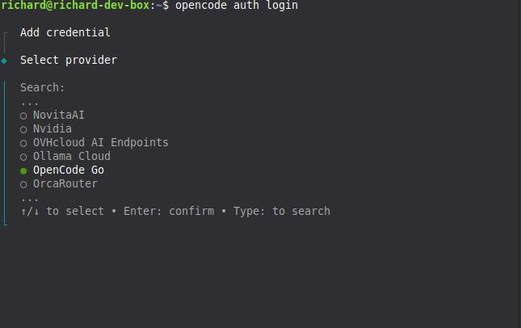
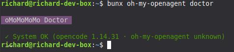
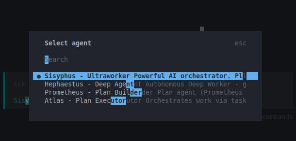
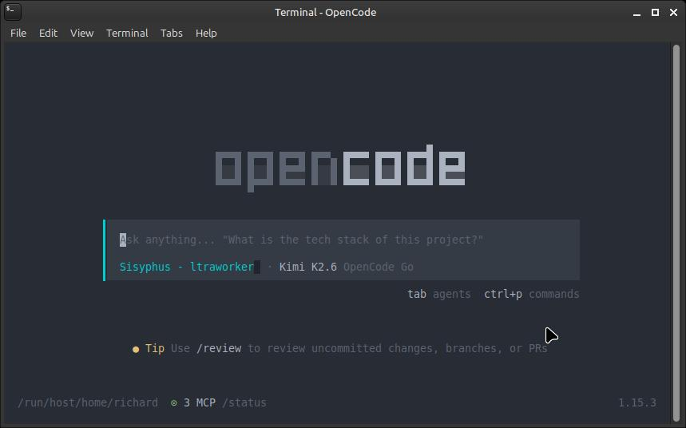
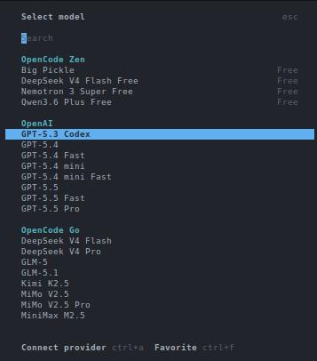

# Setting up Opencode

## Introduction to Opencode

Opencode is an open source AI coding agent that you can use from a terminal interface, a desktop app, or an IDE extension. If you like staying in the shell, the terminal UI is the main attraction. If you want something a bit more point and click, the desktop app exists too.

The project lives at [github.com/anomalyco/opencode](https://github.com/anomalyco/opencode), has more than 160,000 GitHub stars, and is released under the MIT license. That matters to me because it means I am not locked into some opaque hosted tool with mystery behavior.

Out of the box, Opencode ships with two built in agents:

- **build**, the default agent with full access for actually doing work
- **plan**, a read only agent for analysis and planning

On the model side, Opencode supports more than 75 LLM providers through [models.dev](https://models.dev), including local models if you prefer to run things on your own hardware. Privacy is also a big selling point here. Opencode advertises a zero retention policy, which is a lot easier to live with than blindly pasting code into random web chatboxes.

## Openweight Models

One of the more interesting parts of the Opencode ecosystem is how well it fits openweight models. That means you are not limited to the usual closed model lineup. You can use strong coding focused models from labs that publish openweight or more openly available model families, while still getting a polished agent workflow on top.

This matters because a lot of the newer coding friendly models people care about right now come from that world. Think DeepSeek, Kimi, GLM, Qwen, and MiniMax. If you have been hopping between providers just to try those models, Opencode gives you one interface for all of it.

These models are also available through OpenCode Go, which gives you reliable access without juggling a pile of separate accounts.

### OpenCode Go

OpenCode Go is a low cost subscription for reliable access to popular open coding models. It costs $5 for the first month, then $10 per month after that. For a lot of people, that is the sweet spot between paying enterprise API prices and depending on flaky free endpoints.

The current OpenCode Go lineup includes:

- DeepSeek V4 Pro and DeepSeek V4 Flash
- Kimi K2.5 and Kimi K2.6
- GLM-5 and GLM-5.1
- Qwen3.5 Plus and Qwen3.6 Plus
- MiniMax M2.5 and MiniMax M2.7
- MiMo-V2.5 and MiMo Pro

Pricing is simple:

- $5 for the first month
- $10 per month after

There are also soft limits, which are currently listed at roughly:

- about $12 per 5 hours
- about $30 per week
- about $60 per month

OpenCode Go is designed with international users in mind, with models hosted in the US, EU, and Singapore. Another useful detail is that it uses the same API key as OpenCode Zen and shares the same console at [opencode.ai/auth](https://opencode.ai/auth). So you are not managing two separate identities here.

When you reference a Go model inside Opencode, the model ID format looks like this:

```text
opencode-go/<model-id>
```

For example:

```text
opencode-go/kimi-k2.6
```

## Installation of Opencode

### Windows

If you are on Windows, my strong recommendation is to use WSL, Windows Subsystem for Linux. Opencode feels much more natural in a Linux shell, and you avoid a lot of the weird edge cases that come from forcing terminal heavy tooling into native Windows workflows.

First, open PowerShell as Administrator and install WSL:

```powershell
wsl --install
```

Once WSL is installed and you are inside your Linux terminal, run:

```bash
curl -fsSL https://opencode.ai/install | bash
```

If you want alternative install methods, these are available too:

```powershell
# If you use Chocolatey
choco install opencode

# If you use Scoop
scoop install opencode

# If you use npm
npm install -g opencode-ai

# If you use Bun
bun add -g opencode-ai
```

There is also a desktop app in beta available from [opencode.ai/download](https://opencode.ai/download).

### Linux

On Linux, the quickest install, and the one I would recommend first, is:

```bash
curl -fsSL https://opencode.ai/install | bash
```

If you prefer npm, that works too:

```bash
npm install -g opencode-ai
```

You can also install it with other JavaScript package managers such as bun, pnpm, or yarn.

Homebrew is supported:

```bash
brew install anomalyco/tap/opencode
```

On Arch Linux:

```bash
sudo pacman -S opencode
```

Other install paths exist as well, including Docker, Mise, and Nix.

If you use the install script, the binary install directory priority is:

```text
$OPENCODE_INSTALL_DIR
$XDG_BIN_DIR
$HOME/bin
$HOME/.opencode/bin
```

## Post Setup

After installation, the next command you should care about is:

```bash
opencode auth login
```



That starts an interactive prompt where you choose a provider and enter the API key for it. Opencode stores those credentials in:

```text
~/.local/share/opencode/auth.json
```

If you are setting up both OpenCode Zen and OpenCode Go, you should run the auth flow twice.

First, log into OpenCode Zen:

```bash
opencode auth login --provider zen
```

Or, if you prefer the interactive prompt, just pick Zen there. Then go to [https://opencode.ai/auth](https://opencode.ai/auth), sign in, and copy your API key.

Second, log into OpenCode Go:

```bash
opencode auth login --provider opencode
```

Again, you can also choose OpenCode Go from the interactive prompt. This uses the same API key from the same Zen console, because Go is a subscription add on inside Zen rather than a completely separate account.

If you are already inside the TUI, you can also use:

```text
/connect
```

To verify what providers are currently configured, run:

```bash
opencode auth list
```

## Configuring Opencode (using Oh My OpenAgent)

If you want a much more specialized agent setup than the default Build and Plan pair, install **[Oh My OpenAgent](https://github.com/code-yeongyu/oh-my-openagent)**. It is a plugin for Opencode that replaces the default agents with a larger roster of purpose built agents such as Sisyphus, Hephaestus, Prometheus, Atlas, Oracle, Librarian, Explore, and others.

Instead of one generic worker and one planner, you get an orchestrated set of agents tuned for different jobs. This works better once your tasks stop being trivial.

Before installing it, make sure you have:

- Opencode 1.4.0 or newer (should be if you followed the earlier steps)
- Bun installed, which is only needed for the installation step (To install bun, go to [https://bun.sh/](https://bun.sh/))

For users who already have Zen and Go set up, this non interactive install command is the recommended path:

```bash
bunx oh-my-openagent install --no-tui --claude=no --openai=no --gemini=no --copilot=no --opencode-zen=yes --opencode-go=yes
```

If you do not have a Claude subscription, Sisyphus may not work as well depending on your setup. The **--opencode-zen=yes** and **--opencode-go=yes** flags are both used because Zen and Go share the same API key and account.

### Installing via Build mode

If you prefer to let Opencode handle the installation for you, start Opencode in the default **build** mode and paste this prompt:

```text
Install and configure oh-my-openagent by following the instructions here: https://raw.githubusercontent.com/code-yeongyu/oh-my-openagent/refs/heads/dev/docs/guide/installation.md
```

The Build agent will fetch the guide, read the steps, and run the appropriate commands on your behalf. Use this if you do not want to copy paste CLI commands manually. You will still need to answer the subscription questions when the installer asks for them.

After the install finishes, verify the setup with:

```bash
bunx oh-my-openagent doctor
```



The main config file for Oh My OpenAgent lives here:

```text
~/.config/opencode/oh-my-openagent.jsonc
```

## Configuring Oh My Open Agent

After installing Oh My OpenAgent, start Opencode from your terminal:

```bash
opencode
```

If everything is wired up correctly, you should see agent names like Sisyphus, Hephaestus, Prometheus, or Atlas instead of only "Build" or "Plan".



Sisyphus is usually the default orchestrator, so you will most likely land there first.



Once you are in Sisyphus mode, open the model selector with:

```text
/models
```



From there, change the active model to:

```text
opencode-go/kimi-k2.6
```

It usually defaults to Claude, so change this right away if you want to follow the roster described here.

After that, give Sisyphus this instruction:

```text
Update the OhMyOpenAgent LLM roster for the agents to what is inside @LLM-Roster.md
```

The roster is a model assignment map. It tells Oh My OpenAgent which model each agent should prefer, what fallback chain to use, and which model families should back broader task categories. That way you are not using the same model for everything when different agents have different strengths.

Here is the openweight-only roster I use. Every primary and fallback is an **opencode-go** model. If you want to run purely on openweight models without any closed providers, you can copy the block below directly into your **~/.config/opencode/oh-my-openagent.jsonc**.

```markdown
# Oh-My-OpenAgent LLM Roster

> Generated on 2026-04-27 from `~/.config/opencode/oh-my-openagent.json`

---

## Agents

| Agent | Role | Primary Model | Variant | Fallback Chain |
|-------|------|---------------|---------|----------------|
| `sisyphus` | Orchestrator (you) | `opencode-go/kimi-k2.6` | medium | `opencode-go/glm-5` (medium) |
| `hephaestus` | Build executor | **`opencode-go/deepseek-v4-pro`** | high | `opencode-go/kimi-k2.6` (medium) |
| `oracle` | High-IQ consultant | `opencode-go/glm-5` | high | `opencode-go/kimi-k2.6` (high) |
| `librarian` | External docs / GitHub | **`opencode-go/deepseek-v4-flash`** | — | `opencode-go/minimax-m2.7-highspeed` → `opencode-go/qwen3.6-plus` |
| `explore` | Codebase pattern search | **`opencode-go/deepseek-v4-flash`** | — | `opencode-go/qwen3.6-plus` → `opencode-go/minimax-m2.7-highspeed` |
| `multimodal-looker` | PDF / image analysis | `opencode-go/kimi-k2.6` | medium | `opencode-go/deepseek-v4-flash` (medium) → `opencode-go/glm-5` |
| `prometheus` | Planner | **`opencode-go/deepseek-v4-pro`** | high | `opencode-go/kimi-k2.6` (high) |
| `metis` | Pre-planning consultant | `opencode-go/kimi-k2.6` | high | `opencode-go/glm-5` (high) |
| `momus` | Plan critic | `opencode-go/deepseek-v4-pro` | xhigh | `opencode-go/glm-5` |
| `atlas` | General-purpose | `opencode-go/kimi-k2.6` | medium | `opencode-go/glm-5` (medium) → `opencode-go/minimax-m2.7` |
| `sisyphus-junior` | Focused executor | **`opencode-go/deepseek-v4-flash`** | medium | `opencode-go/kimi-k2.5` → `opencode-go/glm-5` (medium) → `opencode-go/minimax-m2.7` |

**Bold** = DeepSeek V4 models

### Special Configurations

| Agent | Special Setting |
|-------|-----------------|
| `sisyphus` | **ultrawork**: `opencode-go/kimi-k2.6` (high) with `thinking.budgetTokens: 16000` |

---

## Categories

| Category | Primary Model | Variant | Fallback |
|----------|---------------|---------|----------|
| `visual-engineering` | `opencode-go/kimi-k2.6` | high | `opencode-go/minimax-m2.7` |
| `ultrabrain` | `opencode-go/deepseek-v4-pro` | xhigh | `opencode-go/glm-5` |
| `deep` | `opencode-go/kimi-k2.6` | medium | `opencode-go/glm-5` |
| `quick` | `opencode-go/minimax-m2.7` | — | `opencode-go/deepseek-v4-flash` |
| `unspecified-low` | `opencode-go/kimi-k2.5` | medium | `opencode-go/minimax-m2.7` |
| `unspecified-high` | `opencode-go/kimi-k2.6` | medium | `opencode-go/glm-5` → `opencode-go/minimax-m2.7` |
| `writing` | `opencode-go/kimi-k2.6` | medium | `opencode-go/minimax-m2.7` |
| `artistry` | `opencode-go/deepseek-v4-pro` | xhigh | `opencode-go/glm-5` |

---

## Model Provider Summary

| Provider | Models Used |
|----------|-------------|
| **opencode-go** | `deepseek-v4-pro` (×4), `deepseek-v4-flash` (×4), `kimi-k2.6` (×5), `kimi-k2.5` (×2), `glm-5` (×4), `minimax-m2.7` (×4), `minimax-m2.7-highspeed` (×2), `qwen3.6-plus` (×2) |

---

## DeepSeek Insertions (2026-04-27)

| Agent | Previous Model | New Model | Rationale |
|-------|---------------|-----------|-----------|
| `hephaestus` | `opencode-go/glm-5.1` | `opencode-go/deepseek-v4-pro` | Best-in-class coding (93.5% LiveCodeBench) |
| `prometheus` | `opencode-go/glm-5.1` | `opencode-go/deepseek-v4-pro` | Best planning + coding combo |
| `explore` | `opencode-go/qwen3.6-plus` | `opencode-go/deepseek-v4-flash` | 1M context for codebase-wide search |
| `librarian` | `opencode-go/deepseek-v4-flash` | `opencode-go/deepseek-v4-flash` | 1M context for multi-repo docs |
| `sisyphus-junior` | `opencode-go/kimi-k2.5` | `opencode-go/deepseek-v4-flash` | Faster, cheaper, stronger than K2.5 |
| `oracle` | `opencode-go/glm-5` | `opencode-go/glm-5` | Kept openweight |
| `momus` | `opencode-go/deepseek-v4-pro` | `opencode-go/deepseek-v4-pro` | Kept openweight |

**Kept unchanged**: `metis` (Kimi K2.6 high), `multimodal-looker` (Kimi K2.6 — vision required).
```

Every agent and category runs on **opencode-go** models. If you add another subscription later, you can extend the fallback chains, but this setup works on its own.
