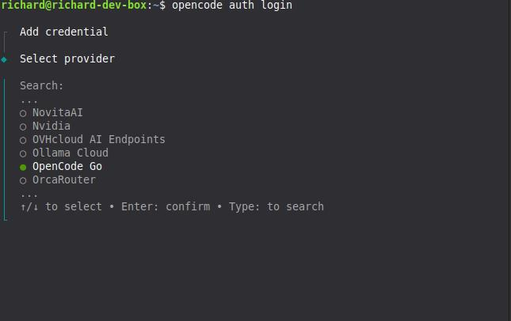
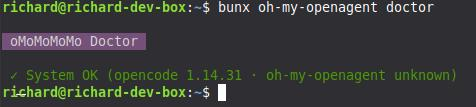
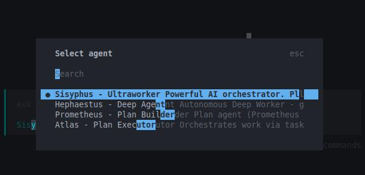
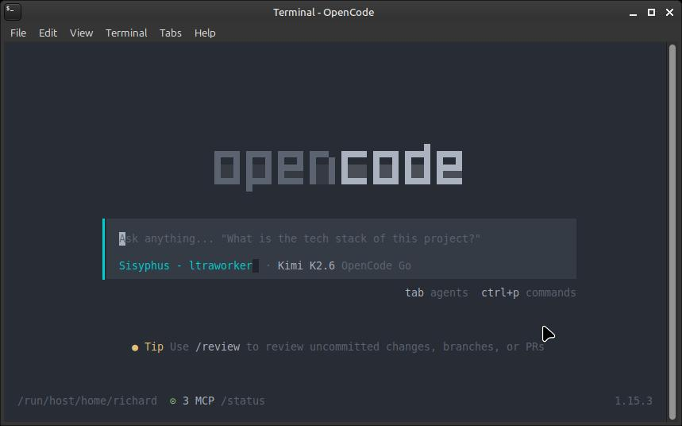
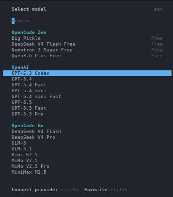
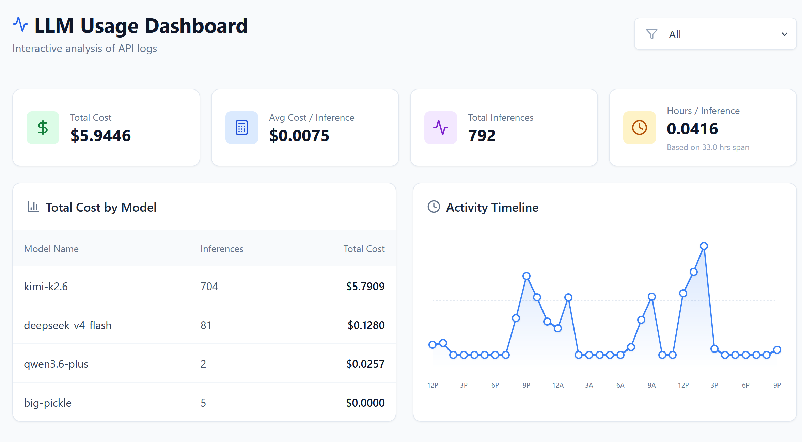

# Setting up Opencode

## Introduction to Opencode

Opencode is an open source AI coding agent that you can use from a terminal interface, a desktop app, or an IDE extension. If you like staying in the shell, the terminal UI is the main attraction. If you want something a bit more point and click, the desktop app exists too.

The project lives at [github.com/anomalyco/opencode](https://github.com/anomalyco/opencode), has more than 160,000 GitHub stars, and is released under the MIT license. That matters to me because it means I am not locked into some opaque hosted tool with mystery behavior.

Out of the box, Opencode ships with two built in agents:

- **build**, the default agent with full access for actually doing work
- **plan**, a read only agent for analysis and planning

On the model side, Opencode supports more than 75 LLM providers through [models.dev](https://models.dev), including local models if you prefer to run things on your own hardware. Privacy is also a big selling point here. Opencode advertises a zero retention policy, which is a lot easier to live with than blindly pasting code into random web chatboxes.

## Openweight & Multi-Provider Models

One of the more interesting parts of the Opencode ecosystem is how well it fits openweight models. That means you are not limited to the usual closed model lineup. You can use strong coding focused models from labs that publish openweight or more openly available model families, while still getting a polished agent workflow on top.

This matters because a lot of the newer coding friendly models people care about right now come from that world. Think DeepSeek, Kimi, GLM, Qwen, and MiniMax. If you have been hopping between providers just to try those models, Opencode gives you one interface for all of it.

These models are available through multiple providers. I personally use a combination of **OpenCode Go**, **Ollama Cloud Pro**, and **ChatGPT Subscription**, which together cost about $50 per month and give me access to every model I need.

### OpenCode Go

OpenCode Go is a low cost subscription for reliable access to popular open coding models. It costs $5 for the first month, then $10 per month after that. For a lot of people, that is the sweet spot between paying enterprise API prices and depending on flaky free endpoints.

The current OpenCode Go lineup includes:

- DeepSeek V4 Pro and DeepSeek V4 Flash
- Kimi K2.6, Kimi K2.7 Code, and Kimi K3
- GLM-5.1 and GLM-5.2
- Qwen3.6 Plus, Qwen3.7 Max, and Qwen3.7 Plus
- Grok 4.5 and HY3
- MiniMax M2.7 and MiniMax M3
- MiMo-V2.5 and MiMo-V2.5 Pro

Pricing is simple:

- $5 for the first month
- $10 per month after

There are also soft limits, which are currently listed at roughly:

- about $12 per 5 hours
- about $30 per week
- about $60 per month

OpenCode Go is designed with international users in mind, with models hosted in the US, EU, and Singapore. Another useful detail is that it uses the same API key as OpenCode Zen and shares the same console at [opencode.ai/auth](https://opencode.ai/auth). So you are not managing two separate identities here.

### Ollama Cloud

[Ollama Cloud](https://ollama.com/pricing) is another provider worth knowing about. It offers many of the same openweight models as OpenCode Go, plus a few extra ones, through a single $20 Pro subscription with generous weekly quotas and no monthly caps.

The current Ollama Cloud lineup includes:

- DeepSeek V4 Pro and DeepSeek V4 Flash
- Kimi K2.5, Kimi K2.6, and Kimi K2.7 Code
- GLM-5.1 and GLM-5.2
- Qwen3.5:397b
- MiniMax M2.5, MiniMax M2.7, and MiniMax M3
- Gemma 4 31B
- GPT-OSS 20B and GPT-OSS 120B
- Mistral Large 3 675B
- Nemotron 3 Nano 30B, Nemotron 3 Super, and Nemotron 3 Ultra

I use the $20 Ollama Cloud Pro plan alongside OpenCode Go. The two complement each other well: Ollama Cloud handles my primary model calls, while OpenCode Go serves as a fallback when I hit Ollama's 3-hour session limits or weekly quotas. Responses on Ollama Cloud can be a bit slower than OpenCode Go, but it is still very usable.

At 46.2% of my weekly quota, I have used 1,503 Kimi K2.7 Code requests, 92 DeepSeek V4 Flash requests, and 84 MiniMax requests, which says a lot about how much room the Pro plan gives you.

### ChatGPT Subscription

For the GPT-native agents in Oh My OpenAgent, I use a ChatGPT Subscription at $20 per month. The deep-agent prompts in Oh My OpenAgent are specifically designed for GPT models and the plugin refuses to run them with non-GPT models. The subscription covers all the GPT-5.6 family models the agents need, including Sol, Terra, and Luna.

You do not need ChatGPT Pro ($100) for this. I do not use any Pro-exclusive models. The standard subscription covers everything the GPT-native agents need.

When you reference a model inside Opencode, the model ID format depends on the provider:

```text
opencode-go/<model-id>
ollama-cloud/<model-id>
openai/<model-id>
```

For example:

```text
ollama-cloud/kimi-k2.7-code
```

## Installation of Opencode

### Windows

If you are on Windows, my strong recommendation is to use WSL, Windows Subsystem for Linux. Opencode feels much more natural in a Linux shell, and you avoid a few platform specific issues that can appear when running terminal heavy tooling natively on Windows.

One specific issue to know about: if you install Oh My OpenAgent directly on Windows (without WSL), the installer can create files named **NUL** in the project directory. **NUL** is a reserved device name on Windows, so these files are difficult to remove with standard tools and can break some file operations. If this happens, you can ask the Build agent inside Opencode to clean them up for you, or you can remove them from WSL if you have it installed.

That said, native Windows works fine for most users. The config and auth paths use XDG conventions even on Windows, so **~/.config/opencode/** and **~/.local/share/opencode/** resolve to **%USERPROFILE%\.config\opencode\** and **%USERPROFILE%\.local\share\opencode\** respectively.

First, open PowerShell as Administrator and install WSL:

```powershell
wsl --install
```

Once WSL is installed and you are inside your Linux terminal, run:

```bash
curl -fsSL https://opencode.ai/install | bash
```

If you want alternative install methods, these are available too:

```powershell
# If you use Chocolatey
choco install opencode

# If you use Scoop
scoop install opencode

# If you use npm
npm install -g opencode-ai

# If you use Bun
bun add -g opencode-ai
```

There is also a desktop app in beta available from [opencode.ai/download](https://opencode.ai/download).

### Linux

On Linux, the quickest install, and the one I would recommend first, is:

```bash
curl -fsSL https://opencode.ai/install | bash
```

If you prefer npm, that works too:

```bash
npm install -g opencode-ai
```

You can also install it with other JavaScript package managers such as bun, pnpm, or yarn.

Homebrew is supported:

```bash
brew install anomalyco/tap/opencode
```

On Arch Linux:

```bash
sudo pacman -S opencode
```

Other install paths exist as well, including Docker, Mise, and Nix.

If you use the install script, the binary install directory priority is:

```text
$OPENCODE_INSTALL_DIR
$XDG_BIN_DIR
$HOME/bin
$HOME/.opencode/bin
```

## Post Setup

After installation, the next command you should care about is:

```bash
opencode auth login
```



That starts an interactive prompt where you choose a provider and enter the API key for it. Opencode stores those credentials in:

```text
~/.local/share/opencode/auth.json
```

On Windows, this maps to:

```text
%USERPROFILE%\.local\share\opencode\auth.json
```

If you are setting up both OpenCode Zen and OpenCode Go, you should run the auth flow twice.

First, log into OpenCode Zen:

```bash
opencode auth login --provider zen
```

Or, if you prefer the interactive prompt, just pick Zen there. Then go to [https://opencode.ai/auth](https://opencode.ai/auth), sign in, and copy your API key.

Second, log into OpenCode Go:

```bash
opencode auth login --provider opencode
```

Again, you can also choose OpenCode Go from the interactive prompt. Both providers use the same web console at [opencode.ai/auth](https://opencode.ai/auth), but they may receive different API keys depending on your account setup. Go is a subscription add on inside Zen, so you manage both from the same place even if the keys differ.

If you are already inside the TUI, you can also use:

```text
/connect
```

To verify what providers are currently configured, run:

```bash
opencode auth list
```

## Configuring Opencode (using Oh My OpenAgent)

If you want a much more specialized agent setup than the default Build and Plan pair, install **[Oh My OpenAgent](https://github.com/code-yeongyu/oh-my-openagent)**. It is a plugin for Opencode that replaces the default agents with a larger roster of purpose built agents such as Sisyphus, Hephaestus, Prometheus, Atlas, Oracle, Librarian, Explore, and others.

Instead of one generic worker and one planner, you get an orchestrated set of agents tuned for different jobs. This works better once your tasks stop being trivial.

Before installing it, make sure you have:

- Opencode 1.4.0 or newer (should be if you followed the earlier steps)
- Bun installed, which is only needed for the installation step (To install bun, go to [https://bun.sh/](https://bun.sh/))

For users who already have Zen and Go set up, this non interactive install command is the recommended path:

```bash
bunx oh-my-openagent install --no-tui --claude=no --openai=yes --gemini=no --copilot=no --opencode-zen=yes --opencode-go=yes
```

The **--openai=yes** flag is included because several agents (Hephaestus, Oracle, Prometheus, Multimodal Looker) use GPT-native prompts that only work with OpenAI models. The **--opencode-zen=yes** and **--opencode-go=yes** flags are both used because Zen and Go share the same API key and account.

### Installing via Build mode

If you prefer to let Opencode handle the installation for you, start Opencode in the default **build** mode and paste this prompt:

```text
Install and configure oh-my-openagent by following the instructions here: https://raw.githubusercontent.com/code-yeongyu/oh-my-openagent/refs/heads/dev/docs/guide/installation.md
```

The Build agent will fetch the guide, read the steps, and run the appropriate commands on your behalf. Use this if you do not want to copy paste CLI commands manually. You will still need to answer the subscription questions when the installer asks for them.

After the install finishes, verify the setup with:

```bash
bunx oh-my-openagent doctor
```



The main config file for Oh My OpenAgent lives here:

```text
~/.config/opencode/oh-my-openagent.json
```

On Windows, this maps to:

```text
%USERPROFILE%\.config\opencode\oh-my-openagent.json
```

## Configuring Oh My Open Agent

After installing Oh My OpenAgent, start Opencode from your terminal:

```bash
opencode
```

If everything is wired up correctly, you should see agent names like Sisyphus, Hephaestus, Prometheus, or Atlas instead of only "Build" or "Plan".



Sisyphus is usually the default orchestrator, so you will most likely land there first.



Once you are in Sisyphus mode, open the model selector with:

```text
/models
```



From there, change the active model to:

```text
ollama-cloud/kimi-k2.7-code
```

It usually defaults to Claude, so change this right away if you want to follow the roster described here.

After that, give Sisyphus this instruction:

```text
Invoke the built-in Opencode skill `/customize-opencode` and update the Oh My OpenAgent LLM roster so the agents and categories match the model assignments in @LLM-Roster.md. Before applying, verify the model IDs exist in the current provider console. If any model is unavailable, stop and ask me for an alternative instead of substituting one on your own. The config file is located at `~/.config/opencode/oh-my-openagent.json`; on Windows, it is at `%USERPROFILE%\.config\opencode\oh-my-openagent.json`.
```

The roster is a model assignment map. It tells Oh My OpenAgent which model each agent should prefer, what fallback chain to use, and which model families should back broader task categories. That way you are not using the same model for everything when different agents have different strengths.

Here is the roster I use. It pulls from three providers: **ollama-cloud** as the primary, **opencode-go** as the fallback for openweight models, and **openai** for the GPT-native agents. The roster below is shown as markdown tables for readability; the actual config file uses JSON format with **model** and **variant** fields for each agent and category.

That being said, here is the contents of **LLM-Roster.md**:

```markdown
# Oh-My-OpenAgent LLM Roster

> Updated on 2026-07-25 from `~/.config/opencode/oh-my-openagent.json`
> Verify these model IDs against your current provider console before applying. Lineup availability changes over time, and some models are region- or plan-specific.

Also include the following top-level runtime settings in the final JSON config:

~~~json
{
  "runtime_fallback": {
    "enabled": true,
    "retry_on_errors": [
      402,
      429,
      500,
      502,
      503,
      504
    ]
  },
  "model_fallback": true
}
~~~

---

## Agents

| Agent | Role | Primary Model | Variant | Fallback Chain |
|-------|------|---------------|---------|----------------|
| `sisyphus` | Orchestrator (you) | `ollama-cloud/kimi-k2.7-code` | high | `opencode-go/kimi-k2.7-code` (high) |
| `hephaestus` | Build executor | **`openai/gpt-5.6-sol`** | high | none |
| `oracle` | High-IQ consultant | **`openai/gpt-5.6-sol`** | high | `ollama-cloud/glm-5.2` (high) → `opencode-go/glm-5.2` (high) → `ollama-cloud/deepseek-v4-pro` (high) → `opencode-go/deepseek-v4-pro` (high) |
| `librarian` | External docs / GitHub | `ollama-cloud/deepseek-v4-flash` | — | `opencode-go/deepseek-v4-flash` |
| `explore` | Codebase pattern search | `ollama-cloud/deepseek-v4-flash` | — | `opencode-go/deepseek-v4-flash` |
| `multimodal-looker` | PDF / image analysis | **`openai/gpt-5.6-terra`** | medium | `ollama-cloud/kimi-k2.7-code` (medium) → `opencode-go/kimi-k2.7-code` (medium) |
| `prometheus` | Planner | `ollama-cloud/glm-5.2` | high | `opencode-go/glm-5.2` (high) |
| `metis` | Pre-planning consultant | `ollama-cloud/glm-5.2` | high | `opencode-go/glm-5.2` (high) → `ollama-cloud/kimi-k2.7-code` (high) |
| `momus` | Plan critic | `ollama-cloud/deepseek-v4-pro` | xhigh | `opencode-go/deepseek-v4-pro` (xhigh) |
| `atlas` | General-purpose | `ollama-cloud/kimi-k2.7-code` | medium | `opencode-go/kimi-k2.7-code` (medium) |
| `sisyphus-junior` | Focused executor | `ollama-cloud/deepseek-v4-flash` | medium | `opencode-go/deepseek-v4-flash` (medium) |

**Bold** = OpenAI GPT models (requires ChatGPT Subscription)

### Special Configurations

| Agent | Special Setting |
|-------|-----------------|
| `sisyphus` | **ultrawork**: `ollama-cloud/kimi-k2.7-code` (xhigh) |

---

## Categories

| Category | Primary Model | Variant | Fallback |
|----------|---------------|---------|----------|
| `visual-engineering` | `ollama-cloud/glm-5.2` | high | `opencode-go/glm-5.2` (high) |
| `ultrabrain` | `ollama-cloud/deepseek-v4-pro` | xhigh | `opencode-go/deepseek-v4-pro` (xhigh) |
| `deep` | `ollama-cloud/deepseek-v4-pro` | high | `opencode-go/deepseek-v4-pro` (high) |
| `quick` | `ollama-cloud/minimax-m2.7` | — | `opencode-go/minimax-m2.7` |
| `unspecified-low` | `ollama-cloud/kimi-k2.7-code` | medium | `opencode-go/kimi-k2.7-code` (medium) |
| `unspecified-high` | `ollama-cloud/kimi-k2.7-code` | high | `opencode-go/kimi-k2.7-code` (high) |
| `writing` | `ollama-cloud/kimi-k2.7-code` | medium | `opencode-go/kimi-k2.7-code` (medium) |
| `artistry` | `ollama-cloud/glm-5.2` | xhigh | `opencode-go/glm-5.2` (xhigh) |

---

## Model Provider Summary

| Provider | Models Used |
|----------|-------------|
| **ollama-cloud** | `kimi-k2.7-code` (×5), `glm-5.2` (×6), `deepseek-v4-pro` (×3), `deepseek-v4-flash` (×3), `minimax-m2.7` (×1) |
| **opencode-go** | `kimi-k2.7-code` (×5), `glm-5.2` (×5), `deepseek-v4-pro` (×4), `deepseek-v4-flash` (×3), `minimax-m2.7` (×1) |
| **openai** | `gpt-5.6-sol` (×2), `gpt-5.6-sol-fast` (×1), `gpt-5.6-terra` (×1) |
```

The setup uses three providers. **Ollama Cloud** handles the primary calls for all openweight agents, **OpenCode Go** serves as a fallback so you never hit a wall when quotas run low, and **OpenAI** powers the GPT-native agents that need it. If you only want to use OpenCode Go and skip the other two, you can swap the ollama-cloud models for opencode-go and remove the openai entries entirely.

And here is an alternate JSON config snippet for `oh-my-openagent.json`, this one maximizes the subscription of ChatGPT Plus, Ollama Cloud Pro and Opencode Go. This is what I recommend if you're just doing weekend work for small to medium sideprojects.

```json
{
  "$schema": "https://raw.githubusercontent.com/code-yeongyu/oh-my-openagent/dev/assets/oh-my-opencode.schema.json",
  "runtime_fallback": {
    "enabled": true,
    "retry_on_errors": [
      402,
      429,
      500,
      502,
      503,
      504
    ]
  },
  "model_fallback": true,
  "agents": {
    "sisyphus": {
      "model": "ollama-cloud/kimi-k2.7-code",
      "variant": "high",
      "fallback_models": [
        {
          "model": "opencode-go/kimi-k2.7-code",
          "variant": "high"
        },
        {
          "model": "ollama-cloud/glm-5.2",
          "variant": "high"
        },
        {
          "model": "opencode-go/glm-5.2",
          "variant": "high"
        }
      ],
      "ultrawork": {
        "model": "ollama-cloud/kimi-k2.7-code",
        "variant": "high"
      }
    },
    "hephaestus": {
      "model": "openai/gpt-5.6-sol",
      "variant": "medium",
      "fallback_models": [
        {
          "model": "openai/gpt-5.6-terra",
          "variant": "high"
        }
      ]
    },
    "oracle": {
      "model": "openai/gpt-5.6-sol",
      "variant": "high",
      "fallback_models": [
        {
          "model": "opencode-go/deepseek-v4-pro",
          "variant": "high"
        },
        {
          "model": "ollama-cloud/glm-5.2",
          "variant": "high"
        },
        {
          "model": "opencode-go/glm-5.2",
          "variant": "high"
        }
      ]
    },
    "librarian": {
      "model": "openai/gpt-5.6-luna",
      "variant": "medium",
      "fallback_models": [
        {
          "model": "ollama-cloud/deepseek-v4-flash",
          "variant": "medium"
        },
        {
          "model": "opencode-go/deepseek-v4-flash",
          "variant": "medium"
        }
      ]
    },
    "explore": {
      "model": "openai/gpt-5.6-luna",
      "variant": "medium",
      "fallback_models": [
        {
          "model": "ollama-cloud/deepseek-v4-flash",
          "variant": "medium"
        },
        {
          "model": "opencode-go/deepseek-v4-flash",
          "variant": "medium"
        }
      ]
    },
    "multimodal-looker": {
      "model": "opencode-go/qwen3.7-plus",
      "variant": "high",
      "fallback_models": [
        {
          "model": "ollama-cloud/kimi-k2.7-code",
          "variant": "medium"
        },
        {
          "model": "opencode-go/kimi-k2.7-code",
          "variant": "medium"
        },
        {
          "model": "openai/gpt-5.6-luna",
          "variant": "medium"
        }
      ]
    },
    "prometheus": {
      "model": "ollama-cloud/glm-5.2",
      "variant": "high",
      "fallback_models": [
        {
          "model": "opencode-go/glm-5.2",
          "variant": "high"
        },
        {
          "model": "ollama-cloud/kimi-k2.7-code",
          "variant": "high"
        },
        {
          "model": "opencode-go/kimi-k2.7-code",
          "variant": "high"
        }
      ]
    },
    "metis": {
      "model": "ollama-cloud/kimi-k2.7-code",
      "variant": "high",
      "fallback_models": [
        {
          "model": "opencode-go/kimi-k2.7-code",
          "variant": "high"
        },
        {
          "model": "ollama-cloud/glm-5.2",
          "variant": "high"
        },
        {
          "model": "opencode-go/glm-5.2",
          "variant": "high"
        }
      ]
    },
    "momus": {
      "model": "openai/gpt-5.6-terra",
      "variant": "high",
      "fallback_models": [
        {
          "model": "opencode-go/deepseek-v4-pro",
          "variant": "high"
        },
        {
          "model": "ollama-cloud/glm-5.2",
          "variant": "high"
        },
        {
          "model": "opencode-go/glm-5.2",
          "variant": "high"
        }
      ]
    },
    "atlas": {
      "model": "ollama-cloud/kimi-k2.7-code",
      "variant": "medium",
      "fallback_models": [
        {
          "model": "opencode-go/kimi-k2.7-code",
          "variant": "medium"
        },
        {
          "model": "opencode-go/minimax-m3",
          "variant": "medium"
        }
      ]
    },
    "sisyphus-junior": {
      "model": "ollama-cloud/kimi-k2.7-code",
      "variant": "medium",
      "fallback_models": [
        {
          "model": "opencode-go/kimi-k2.7-code",
          "variant": "medium"
        },
        {
          "model": "opencode-go/minimax-m3",
          "variant": "medium"
        }
      ]
    }
  },
  "categories": {
    "visual-engineering": {
      "model": "ollama-cloud/kimi-k2.7-code",
      "variant": "high",
      "fallback_models": [
        {
          "model": "opencode-go/qwen3.7-plus",
          "variant": "high"
        },
        {
          "model": "opencode-go/kimi-k2.7-code",
          "variant": "high"
        }
      ]
    },
    "ultrabrain": {
      "model": "openai/gpt-5.6-sol",
      "variant": "xhigh",
      "fallback_models": [
        {
          "model": "opencode-go/deepseek-v4-pro",
          "variant": "xhigh"
        },
        {
          "model": "ollama-cloud/glm-5.2",
          "variant": "high"
        },
        {
          "model": "opencode-go/glm-5.2",
          "variant": "high"
        }
      ]
    },
    "deep": {
      "model": "openai/gpt-5.6-terra",
      "variant": "xhigh",
      "fallback_models": [
        {
          "model": "opencode-go/deepseek-v4-pro",
          "variant": "high"
        },
        {
          "model": "ollama-cloud/glm-5.2",
          "variant": "high"
        },
        {
          "model": "opencode-go/glm-5.2",
          "variant": "high"
        },
        {
          "model": "openai/gpt-5.6-sol",
          "variant": "high"
        }
      ]
    },
    "artistry": {
      "model": "opencode-go/qwen3.7-plus",
      "variant": "high",
      "fallback_models": [
        {
          "model": "ollama-cloud/kimi-k2.7-code",
          "variant": "high"
        },
        {
          "model": "opencode-go/kimi-k2.7-code",
          "variant": "high"
        }
      ]
    },
    "quick": {
      "model": "openai/gpt-5.6-luna",
      "variant": "medium",
      "fallback_models": [
        {
          "model": "ollama-cloud/deepseek-v4-flash",
          "variant": "medium"
        },
        {
          "model": "opencode-go/deepseek-v4-flash",
          "variant": "medium"
        },
        {
          "model": "ollama-cloud/minimax-m2.7"
        }
      ]
    },
    "unspecified-low": {
      "model": "ollama-cloud/kimi-k2.7-code",
      "variant": "medium",
      "fallback_models": [
        {
          "model": "opencode-go/kimi-k2.7-code",
          "variant": "medium"
        },
        {
          "model": "openai/gpt-5.6-luna",
          "variant": "high"
        }
      ]
    },
    "unspecified-high": {
      "model": "ollama-cloud/kimi-k2.7-code",
      "variant": "high",
      "fallback_models": [
        {
          "model": "opencode-go/kimi-k2.7-code",
          "variant": "high"
        },
        {
          "model": "ollama-cloud/glm-5.2",
          "variant": "high"
        },
        {
          "model": "opencode-go/glm-5.2",
          "variant": "high"
        }
      ]
    },
    "writing": {
      "model": "ollama-cloud/kimi-k2.7-code",
      "variant": "medium",
      "fallback_models": [
        {
          "model": "opencode-go/kimi-k2.7-code",
          "variant": "medium"
        },
        {
          "model": "opencode-go/qwen3.7-plus",
          "variant": "medium"
        },
        {
          "model": "opencode-go/minimax-m3",
          "variant": "medium"
        }
      ]
    }
  }
}
```

### Why These Models?

The config above is not random. Each model was chosen based on what it is actually good at, while keeping costs reasonable by preferring models available on both Ollama Cloud and OpenCode Go.

**Kimi K2.7 Code** is the daily driver for Sisyphus, Atlas, and the lighter categories (unspecified-low, writing). It is a coding specialist with excellent instruction-following and tool-calling precision. It does not overthink, it does not get stuck in reasoning loops, and it dispatches subtasks cleanly. That is exactly what you want from an orchestrator that spends most of its time delegating work to other agents.

**GLM-5.2** handles the heavy thinking. It powers ultrawork mode, Prometheus (strategic planning), Metis (plan consultation), and the categories where reasoning depth matters: visual-engineering, artistry, and unspecified-high. It has a 1 million token context window, which lets it hold an entire repository in memory, and it leads the FrontierSWE and Terminal-Bench benchmarks among open-weight models. It also scored first on Code Arena Frontend, which is why it gets visual-engineering and artistry duties.

**DeepSeek V4 Pro** is the value pick for deep reasoning. It runs the ultrabrain, deep, and momus (code review) roles. At roughly a third of the cost of frontier models, it still scores around 80% on SWE-bench Verified. For tasks that need autonomous problem-solving but do not need the absolute best, it is hard to beat on price-to-performance.

**DeepSeek V4 Flash** handles the lightweight jobs: Librarian (docs search), Explore (codebase grep), and Sisyphus-Junior. These agents make many small, fast calls where latency matters more than reasoning depth. Flash is extremely cheap and fast, which is exactly what you want for high-volume lookup work.

**GPT-5.6 Sol** powers Hephaestus and Oracle. These are the GPT-native agents in OMO, and their system prompts are specifically tuned for Sol. Hephaestus is kept strictly GPT-only with no non-GPT fallbacks because running it on non-GPT models breaks its prompt calibration. Hephaestus in particular is designed as "The Legitimate Craftsman", an autonomous deep worker that explores your codebase end-to-end without hand-holding. Sol is the right engine for that.

**GPT-5.6 Terra** powers Multimodal Looker, providing strong vision reasoning capabilities for analyzing images and visual specs.

**MiniMax M2.7** runs the quick category. It is fast, cheap, and good enough for trivial tasks like typo fixes and single-file changes. You do not need a frontier model to rename a variable.

These are not configured for the absolute best performance. The reason I did not go for Kimi K3 and the like is because I chose models that are affordable enough to let you do intense vibe-coding for at least the whole weekend. If you need more than that, just upgrade your plan 😉. Go from the $20 Ollama Pro and ChatGPT Subscription combo to $100 Ollama Max and ChatGPT Pro (or 20x) if you want to work intensely all week.

## Cost

Here is a snapshot of actual usage costs from a 33-hour session using openweight models. The totals are from the LLM Usage Dashboard:



The session ran **792 inferences** over roughly 33 hours with a **total cost of $5.94** and an **average of $0.0075 per inference**.

### Cost by Model

**kimi-k2.6** accounted for the bulk of the usage at **704 inferences** and **$5.79**. **deepseek-v4-flash** came in second with **81 inferences** at **$0.13**, followed by **qwen3.6-plus** at **2 inferences** and **$0.03**. There were also **5 inferences** on **big-pickle** at effectively **$0.00**.

To put this in perspective, running the same 792-inference session on **Claude Opus** would have cost significantly more, likely in the $50 to $150 range depending on token counts, because Opus pricing is roughly an order of magnitude higher per token. Even **Claude Sonnet** would have run several times more expensive than this setup.

Most of the cost goes to **kimi-k2.6**, which makes sense because it handles the bulk of the orchestration and reasoning tasks. DeepSeek V4 Flash is used for exploration and librarian work, so it stays cheap despite the large context windows. The overall average is well under a cent per inference, which keeps the total reasonable even for long sessions.

The fixed monthly cost for the full three-provider setup is $50: $10 for OpenCode Go, $20 for Ollama Cloud Pro, and $20 for ChatGPT Subscription (the GPT calls themselves are covered by the subscription, not billed per token). That is competitive with a single Claude Pro or GPT Pro subscription, except you get access to a much wider range of models.

## Conclusion

So, is it worth setting up Opencode with a multi-provider roster?

From my experience, **absolutely.** You get a fully capable AI coding agent with specialized models for every role, and the total cost stays around $50 per month. The setup is straightforward, the roster is flexible, and you are not locked into a single provider or paying premium API prices.

If you are already paying for Claude or GPT subscriptions, this is a low-risk way to diversify your tooling. And if you are just getting started, you can start with OpenCode Go alone at $10 per month and add Ollama Cloud and ChatGPT later as you need them. Either way, having options is the whole point.

## Update: July 25, 2026

I have removed the previous July 18 update section because I decided to update the main article directly to reflect my current multi-provider setup (OpenCode Go, Ollama Cloud Pro, and ChatGPT Subscription) and LLM roster.