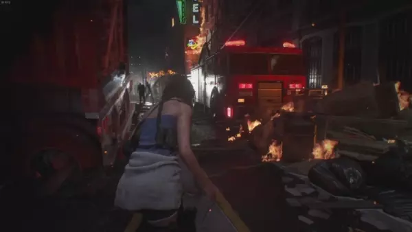
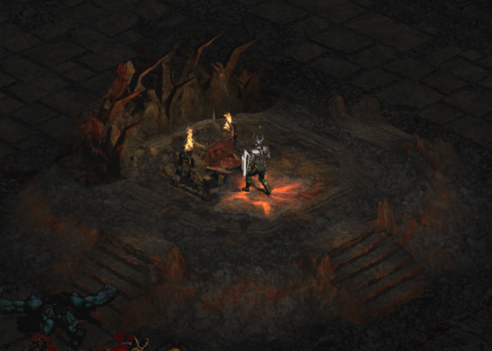
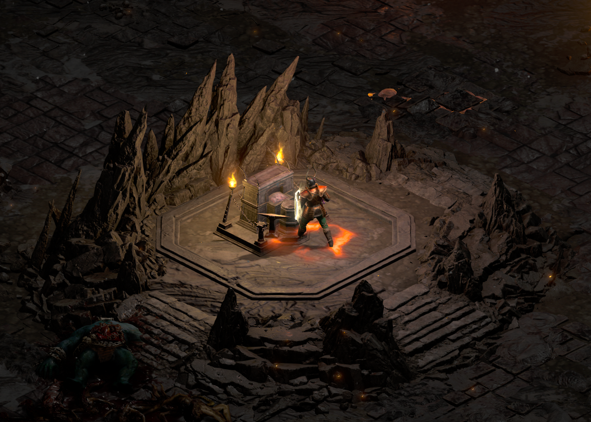
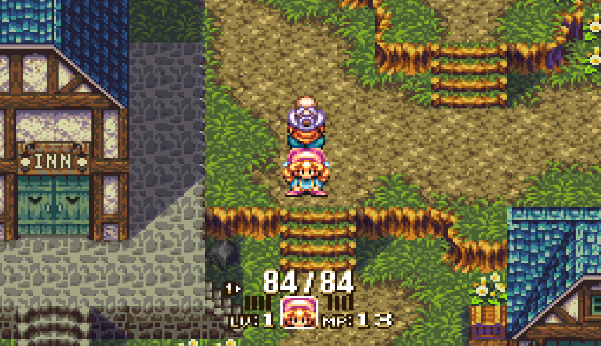
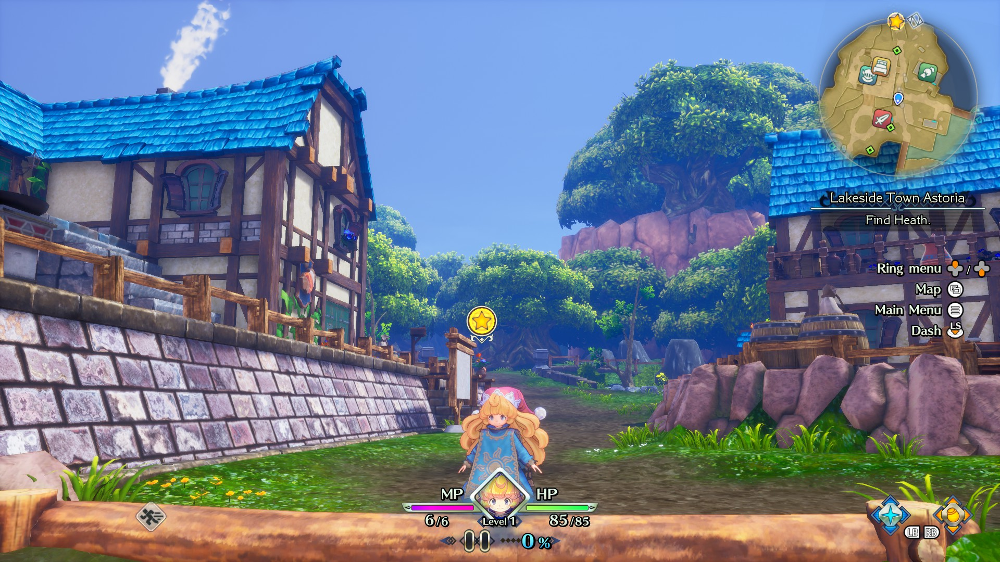
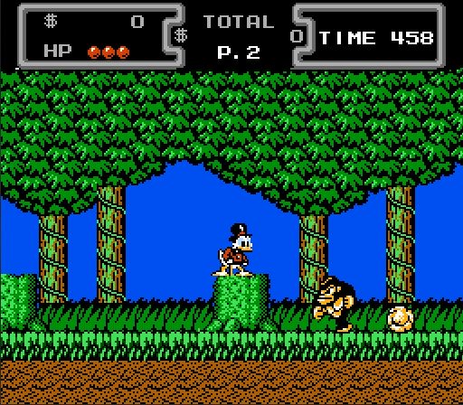
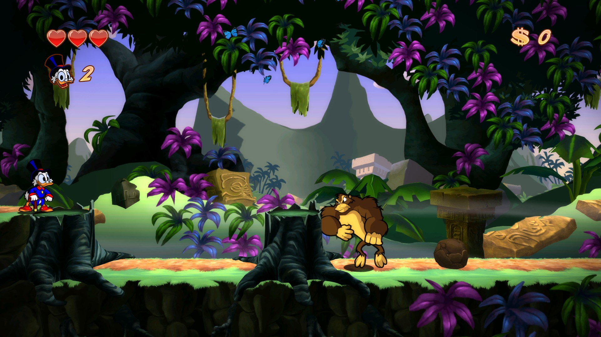

# Why video game remasters and remakes are awesome

## Introduction

There is a popular trend in the video game industry where old games (either a previous iteration or a stale series/franchise) are picked up once again and modernized in various ways. Currently, there are two approaches to the modernization of video games:

In the remake approach, the old game obtains updated mechanics to align with the more recent titles, along with updated visuals and sounds. For example, Resident Evil 2 and 3 remakes have now adopted to be 3rd person shooters, a mechanic introduced in Resident Evil 4\. Originally Resident Evil had a fixed camera and tank controls.

Fixed camera, as the name suggests, the camera angle of a specific area is already predetermined and cannot be moved. Tank control is a type of design in player control where players control movement relative to the character's position rather than the perspective of the camera.

Although a clever approach to solve a hardware problem at the time, one must admit that for newer players, there is a certain degree of a learning curve; one must learn to be able to play the game under this design in contrast with the 3rd person's perspective.

Some fans hate the 3rd person and want the game to return to its roots, while some prefer embracing the new change; either way, I prefer the 3rd person perspective over the other.

- [ ] *Resident Evil 3 Remake on the left and the original on the right* 
- [ ] 
- [ ] 

The other one is the remastered approach, where the old game still retains its core gameplay mechanic while obtaining a set of enhancements. Mostly done to make the game run on newer hardware but with some added quality\-of\-life improvements, while some also get updated visuals and sound.

For example, Diablo 2 Resurrected is essentially the Diablo II and Lord of Destruction expansion combined into one. For more parts is the same game aside from the updated visuals and sounds, and now some improvements such as crossplay, gamepad support, and shared storage where items are sharable across other characters compared to the original, where mules (throwaway characters) are used to share items across different characters.

- [ ] *Diablo 2 Resurrected on the left, original on the right* 
- [ ] 
- [ ] 

Resident Evil and Diablo are not the only franchises that received this treatment. Other examples include Crash Bandicoot, Spyro, the Mana series (Trials of Mana is a remake of a Japan exclusive while Secret of Mana is a 3d remake while Legend of Mana is a remaster), Other Blizzard games (Starcraft 1 and Warcraft 3\), etc.

Both remakes and remasters are an enhanced form of re\-releases for older game projects. Although it has become more popular recently, remakes and remasters have been introduced previously. It has been a practice since the early 80s and 90s; example examples include Super Mario Allstars from the SNES, where older Super Mario games (Mario 1, 2, and 3\) are remastered with updated visuals and sounds to showcase SNES capabilities, and Dragon Quest V: Hand of the Heavenly Bride a PS2 game that is a 3d remake of Dragon Quest V from the SNES.

So why do video game companies do it, why do gamers pick it, and why do fans love it? Let us discuss below:

## Brings new life to a classic

Unlike a re\-release, it is the same game running on more modern or newer hardware. Remasters and remakes help bring life and gain traction to new players alike with quality\-of\-life improvements, updated visuals, sound, and/or story parity/retcon to align with the newer iteration of a franchise.

For example, I have got this buddy I have been itching to team up with in Diablo II, but he's never been into those old\-school pixelated vibes. Then, when Resurrected dropped, I didn't even have to twist his arm – the updated graphics did all the talking and now we were able to game together in Diablo II!

I also got a bunch of buddies who are essentially Diablo II veterans. They gave Resurrected a spin and now they're hooked, saying they can't revert because we're all spoiled by the polished graphics. This is a big deal considering Diablo II classic saves are not carried over, so they had to start all over.

It's the same deal with some of my Starcraft I pals. It's like the visuals are these super\-refined upgrades of the originals. Going back feels like a letdown, you know? It's like trying to watch a video in 480p after getting used to 1080p.

## A way to replay the game in a fresh paint and/or perspective

For fans of the original, it's a way to revisit the game with a different experience in mind. For example, when I first played Trials of Mana, I was super excited because, for the longest time, the only way to play the game was via emulation and unofficial translated ROMs, but then I, thanks to the remake, I was able to enjoy the same story with an update, fun yet modern mechanics of platforming and combat.

- [ ]  *Trials of Mana remake on the left, the original on the right* 
- [ ] 
- [ ] 

When I tried the remastered version of Duck Tales, even though I already knew most of the secrets, it made me feel like I felt when I was a kid playing the game. But this time, it feels more authentic because the graphics look on par with the tv series I use to watch as a kid.

- [ ] *Ducktales remastered on the left, the original on the right* 
- [ ] 
- [ ] 

So yes, being able to replay these games in a new experience yet being familiar is englamouring for many gamers. There is something to it that feels magical in a way that brings out that joy you had when you first played and enjoyed the game, yet it is a modern rendition of old stuff you once enjoyed.

## Not everything is perfect

A proper remaster or remake can bring up the joy that old fans once have, but not every remaster or remake can pull it off properly. For example, I had played Fable Anniversary before, and although the remastered visuals look great compared to the original, I cannot get off something/odd about it. Although, honestly, it is still a great remaster

Another one and this one is a better example, is XIII. In case you are not aware, XIII was one of those quirky games in the PS2 era known for its comic\-styled cutscenes and timeless cell\-shaded graphics. Unfortunately, the 2021 version (remastered) is a failure of sorts.

For starters, they replace the comic\-styled cutscenes with generic\-looking cutscenes. The remastered models are certainly better, but the cell\-shaded style is mostly gone, which is crazy considering that was one of the things the fans loved about the game. In other words, the game lost its identity. Then the final nail in the coffin is the performance issues

There are plenty of other examples, like the botched Warcraft 3 Reforged and Silent Hill HD Collection. So no, it does not mean that game remakes/remasters is an instant success. If the teams working on it do not understand what made the game successful in the first place, then it is bound to fail.

## Conclusion

The reason game remasters, and remakes are awesome is because it has the potential to revive (either out of sheer nostalgia or updates) the fan's interest, which is a completely different feeling from trying out and loving a new game that just came out.

It is like falling in love again with something you already fell in love with. I am sure I am not the only one with this sentiment. Millions of gamers across the globe that have enjoyed the remakes and remasters will probably say the same thing.

* **Resident Evil 3 Remake on the left and the original on the right**
* **Diablo 2 Resurrected on the left, original on the right**
* **Trials of Mana remake on the left, the original on the right**
* **Ducktales remastered on the left, the original on the right**
