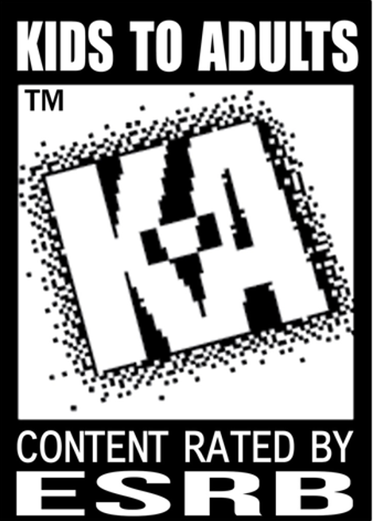
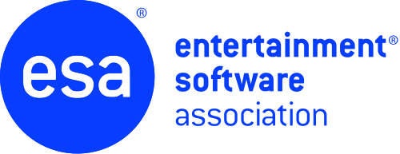

# Private and Community Servers are "Illegal"? The Irony of the ESA

## Introduction

The date is June 29th, 2026. A California Senate hearing is underway, ostensibly discussing piracy, but in reality, it's about something much more important: **game preservation**. The ESA (Not the European Space Agency, but the Entertainment Software Association, though they might as well be called the Electronic Shills Association) is once again spreading their usual brand of corporate bullshit.

During the hearing, an ESA lobbyist looked California lawmakers in the eye and claimed that community-hosted servers are "illegal" and constitute "piracy." Today in this article, I am going to dissect, slice by slice, the absolute stupidity they are spreading.

## What is the Entertainment Software Association?

A wise man once said that the ESA has been out of touch from the very moment they were established. And honestly? That is incredibly accurate. 

For those who are unfamiliar, the history of the ESA runs deep. They are the ones who established the ESRB rating system in 1994, which categorizes video games by content and age suitability (Kids, Teens, Adults Only). 

- [ ]  
- [ ]  Figure 1. The classic "Kids to Adults" (K-A) ESRB rating logo used in the 90s, later rebranded to "Everyone" (E).

The ESA's **greatest achievement** was basically a self-policing sticker system, and even that couldn't keep irresponsible parents and politicians out of the industry's hair.

So if their historical highlight is a useless shield from thirty years ago, it certainly doesn't give them much weight in the gaming industry right now nor give them a free-pass to spew anti-consumer garbage they pull today.

The truth is, the ESA’s actual job is not to protect the gamers. Their sole purpose is to run defense for their corporate overlords, the massive publishers who want to maximize profit at all costs.

If that means making sure a game you paid $70 for becomes completely unplayable two years later so you are forced to buy the sequel, the ESA will happily stand on Capitol Hill and lie through their teeth to make it happen.

- [ ]  
- [ ]  Figure 2. The official logo of the Entertainment Software Association.

## The Protect Our Games Act (AB 1921)

So, what got the ESA’s suits sweating in the first place? Enter California Assembly Bill **AB 1921**, also known as the **Protect Our Games Act**, introduced by Assembly member Chris Ward. 

For all intents and purposes, this is California's own version of the European "Stop Killing Games" initiative. But compared to the European version, this bill is a bit more mellow. Instead of strictly mandating that all games be preserved, it only applies to games released after 2028 and gives publishers an easy out: if they don't want to preserve the game, they can just issue refunds.

It simply says that for paid, server-dependent digital games released or sold on or after January 1, 2028, publishers must provide at least 60 days' notice before shutting down the servers. And when they do shut them down, they have to provide gamers with a way to keep playing, which could be:
* An offline-playable version of the game or patch.
* Server software so players can host their own servers.
* Documentation on how to run a community server.

If the publisher fails to provide any of those continued-use options, they must issue a full refund to the purchasers.

The bill even excludes free-to-play games, subscription-only services, and games that already have a permanent offline mode. 

In other words, the bill tells publishers: *"If you sell a product that depends on your servers to work, you must plan for what happens when you turn those servers off. You cannot just steal the customer's money and leave them with a useless file."*

It's a common-sense bill that passed the State Assembly with a solid 43–16 vote in May 2026. But once it reached the Senate Committee on Business, Professions and Economic Development on June 29, 2026, the ESA's state-level shills went into overdrive. They successfully choked the bill by lobbying committee members to sit on their hands: even though the bill got more "yes" votes than "no" votes (4 to 3), the four abstentions from the 11-member committee meant it failed to reach the required majority to pass. 

How did the ESA justify this behind-the-scenes choking of a consumer bill? In public, they claimed it would force developers to rebuild old systems, destroy resources, and bleed companies dry. But their most desperate, mind-boggling lie came when they were asked about community-hosted servers as a preservation method.

## "They're Illegal" - The Stupidity of the Claim

During the hearing before the California Senate Committee on Business, Professions and Economic Development, Senator Caroline Menjivar asked about the bill's community-hosting option. 

Jennifer Gibbons, the ESA's vice president of state government affairs, interrupted to declare:
> "They're illegal and they are not in any way affiliated with Microsoft."

She then added that community servers don't have the same safety standards as Microsoft-controlled servers. When asked if community servers are essentially a black market for video games, she replied:
> "Yes. In fact, we consider it piracy."

Let that sink in. To the ESA, if you and your friends host a private server to play an old game that the publisher abandoned, you are no different from someone hosting a black-market piracy ring. 

It is a level of bad-faith manipulation that is hard to overstate. It’s like pointing to a store selling bootleg DVDs and arguing that the concept of a DVD player itself is illegal. 

## The Minecraft Irony: The Ultimate Self-Own

What makes this claim truly hilarious is the example they chose. Gibbons specifically targeted Minecraft community servers. 

Minecraft is literally the worst possible game they could have picked to argue that community servers are "illegal piracy." 

If you go to the official Minecraft website right now, Mojang and Microsoft **literally distribute official server software downloads** for anyone to host their own Java or Bedrock servers. Microsoft's own platforms actively direct players toward third-party community servers, and they maintain guidelines explaining exactly how players can monetize and run their own communities. 

Are Microsoft and Mojang hosting an illegal piracy operation on their own website? According to the ESA's logic, yes! The ESA’s representatives are so out of touch with the actual medium they lobby for that they don't even know how their own member companies' games function. 

## Trying to Cripple the "Stop Killing Games" Movement

This isn't just a silly mistake. It is active, malicious bullshitry aimed at crushing consumer advocacy.

Globally, gamers are fighting back through initiatives like the **Stop Killing Games (SKG)** campaign. Led by advocates like Ross Scott, the movement is pushing for legal rights to keep purchased games functional after publishers pull the plug. 

- [ ]  
- [ ]  Figure 3. The official logo of the Stop Killing Games campaign. 

The ESA is absolutely terrified of the SKG movement. They know that if governments start passing laws protecting digital ownership, publishers won't be able to easily discard games and force players onto the next yearly microtransaction-riddled sequel. 

To cripple this momentum, the ESA is playing dirty. They go to hearings and feed blatant lies to old politicians who don't know the difference between a TCP port and a toaster. By labeling all community hosting as "illegal piracy" and a "safety risk," they attempt to scare lawmakers into killing consumer protection bills before they can gain traction.

## The Walkback: "Additional Clarity"

Unsurprisingly, the internet did not let this slide. Gaming publications and gamers immediately called out the absurdity of the ESA's testimony. 

Realizing they had made a complete mockery of themselves, the ESA quietly issued a statement to PC Gamer to offer "additional clarity." 

The revised statement adjusted their claim to specify private servers that host or distribute copyrighted game content *without authorization*. In other words, "private servers are illegal piracy" turned into *"private servers that violate copyright without permission might infringe intellectual property."* 

No shit, Sherlock. 

That is a massive walkback disguised as "clarity." They admitted that the legality of a private server depends entirely on the implementation and whether the publisher allows it, which is exactly what the bill's community-hosting option was designed to coordinate! They lied to legislators to kill a bill, got caught, and then pretended they were just being "misunderstood."

## Conclusion

The ESA had plenty of room to make actual, technical arguments about AB 1921. They could have talked about the complexity of server architecture, licensing challenges, or security issues. Instead, they resorted to fear-mongering, calling community servers illegal and comparing game preservation to a black market.

The bill itself failed the committee vote on June 29th by a 4-3 margin, but it was granted reconsideration and remains active. The fight is far from over.

But the whole fiasco has exposed a depressing truth. The ESA is so deeply out of touch with the culture and community of gaming (as they have mockingly said before).

As lobbyists, they aren't helping developers, they aren't helping games, and they certainly aren't helping gamers. They exist solely to protect the right of massive publishers to sell us digital smoke and mirrors, collect our money, and delete the product whenever it suits their balance sheet.

In the end, they aren't helping anyone but themselves and their corporate overlords. And if it takes lying to lawmakers to keep their scam going, they'll do it with a smile.

## Edit: July 12, 2026

I have reviewed the article again and noticed an editorial error. I noticed that I incorrectly stated that Stop Killing Games requires games to be online forever; what I meant was, it enforces a policy for online games to provide an offline route after the service shuts down.