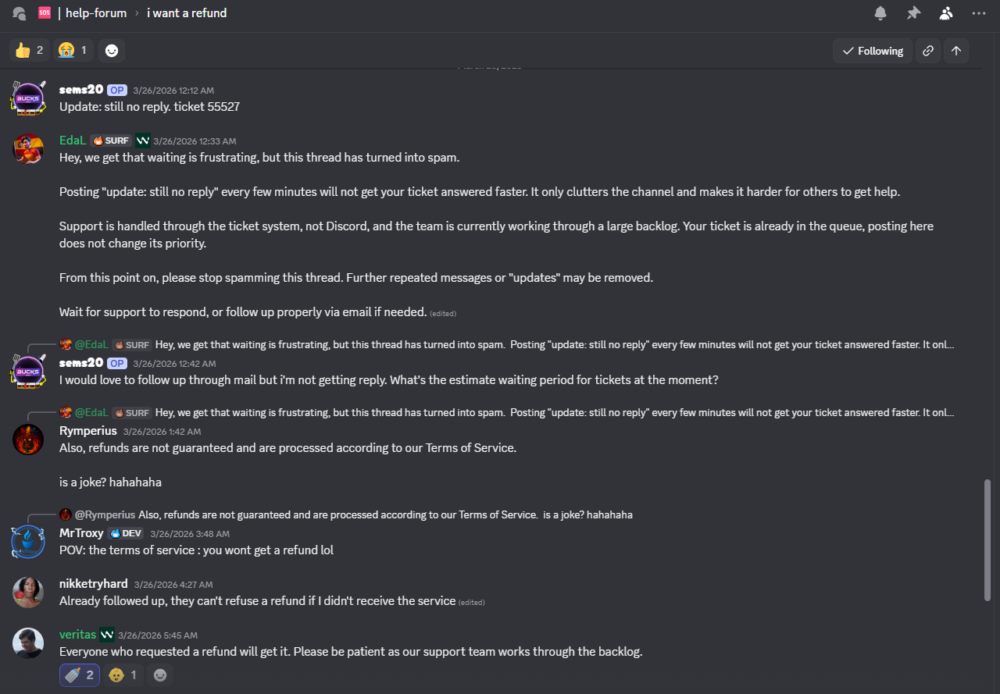
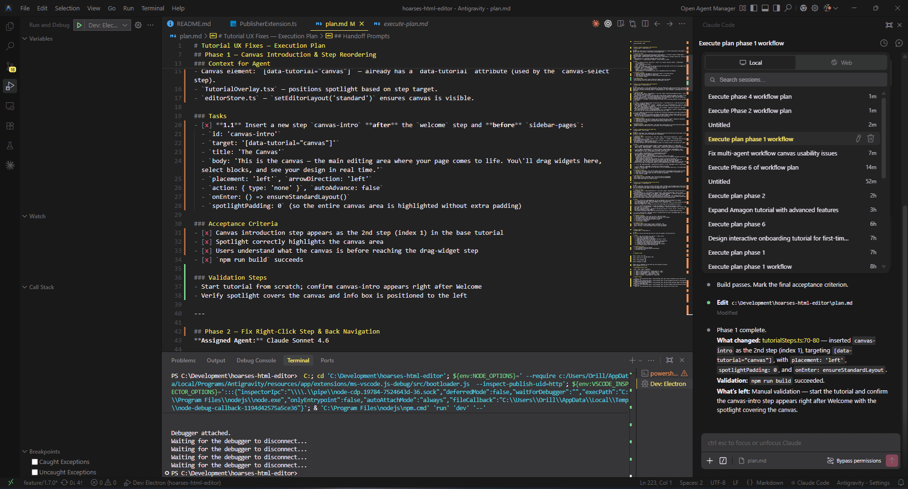

# The Tragedy of Windsurf

## Introduction

A few months back I wrote about [vibe coding an offline HTML editor with four AI agents](https://www.richardorilla.website/vibe-coding-an-html-editor.html#how_windsurf_came_into_the_mix). The short version: I used Windsurf as the shell for a multi-agent workflow, switching between Claude, GPT, Gemini, and Kimi to build [Amagon](https://amagon.app/) — a fully offline visual HTML editor — across two weekends. The whole thing worked because Windsurf let me swap between models without leaving the editor, and each agent had full access to the project context: file tree, plan document, research notes, everything the previous agents had touched.

That article ended on a high note. But this one is the follow-up nobody asked for.

## The Pricing Switch

Windsurf changed how they charge. The old model was credit-based per prompt, predictable and easy to budget around. The new model is per token. That by itself isn't the problem. Per-token billing is the norm across most AI tools. The problem was the lack of transparency around the change. There was no clear upfront communication about what the shift would mean in practice for existing users, and the actual impact only became obvious after the fact.

When I raised it, the response was: if you're not happy, you can get a refund. So I requested one.

That was a while ago. I'm still waiting. And based on what I've seen in community threads, with other users asking the same question and staff responses that amount to "refunds are processed according to our Terms of Service," I'm not holding my breath.

[](images/the-tragedy-of-windsurf-discord.png)

*Figure 1. Community reaction to Windsurf's refund handling*

## The Budget Math

Before all of this, my AI spend looked like this: a $20/month Windsurf subscription, plus $40 in credits I'd loaded separately when my usage spiked, not counting Gemini Pro, which I was already paying for independently.

After the switch I still have $40 in Windsurf credit sitting there, unspent, which I'm not realistically going to get back. But here's the thing: to replace Windsurf I spent $40 total on Claude Pro and GPT Plus combined. That's $20 less than what I was paying for Windsurf's subscription alone. The forced pivot accidentally made the math work out better.

## Already Had the Pieces

I've had Gemini Pro for a while. I use it a lot, mainly for NotebookLM, but also for Antigravity, which is my current editor of choice for Gemini-assisted coding. Before the Windsurf situation, I wasn't using Antigravity heavily because Windsurf was already my primary editor and using both felt redundant. There were also quota considerations: Antigravity has limits, and with Windsurf covering most of my coding sessions it didn't make sense to burn through Antigravity's quota when I didn't need to.

That calculus changed when Windsurf stopped being reliable.

## Antigravity as the New Primary Editor

Moving back to Antigravity full-time turned out to be less of a downgrade than I expected. I'd used it on and off before, but relying on it as my primary workspace for projects like [Amagon](https://amagon.app/) forced me to actually dial in the settings to suit how I work.

One of the highlights for me is how it segments models. I use Gemini Flash for basic autocomplete and documentation, but I can pull in Claude or Gemini Pro for the heavy lifting without having to jump between tabs. It also plugs into Google's AI credit system, giving me 1000 credits that I can spend across coding, image generation, or whatever else my current project needs.

[](images/antigravity_setup.png)

*Figure 2. My local Antigravity configuration for multi-agent workflows*

This shift wasn't just about the features, though. It was about **having a deep bench of supporting models**. After my experience with Windsurf, I realized that for tools I depend on for multi-day builds, I need powerful backups for whenever things get complex. That's a big part of why I added GPT Plus (for Codex) and Claude Pro back into my stack. Sometimes you're not just paying for a single tool. You're paying for those heavy-hitting models to support you during the high-complexity reasoning.

It isn't as "all-you-can-eat" as Windsurf's old model felt at its peak, but for a hobbyist workflow, the 1000-credit quota is surprisingly resilient. Having the freedom to use those credits for more than just code actually fits my day-to-day usage better than a code-only subscription ever did.

## GPT Plus and Codex

I'd subscribed to GPT Plus before, but the company I work at has GPT Enterprise, which made a personal Plus subscription feel redundant. So I let it lapse. This time, I came back specifically for Codex, OpenAI's coding agent, which isn't accessible without a personal subscription. What made it worth it: Codex runs as a plugin in VS Code forks and in JetBrains. That's a real advantage for anyone who works across both ecosystems, and it fills the agentic coding gap that Windsurf used to cover on the OpenAI side of my workflow.

## Claude Pro

The final piece was Claude Pro. The reason is straightforward: using Claude models through Antigravity burns AI credits fast. Claude is the model I reach for most often for complex tasks, and at that rate, 1000 credits doesn't last long if Claude is your primary.

Claude Pro gives me a better baseline without having to ration. It also unlocks Claude Code, both the web interface and the cloud agent. That combination turned out to be more useful than I expected. The web agent means I can hand off a task, give it a solid outline, and let it run while I'm away from my desk with limited internet. This article's draft was written that way: I gave Claude Code the outline and let it work.

The Codex cloud agent does the same thing on the OpenAI side. I used it to make PRs in other projects, including [DosboxStagingReplacerForGOGGalaxy#38](https://github.com/Shin-Aska/DosboxStagingReplacerForGOGGalaxy/pull/38), which took a few iterations but held up well.

## The New Workflow

With three AI subscriptions in play instead of one, I needed a way to keep the multi-agent approach coherent. What I landed on is a direct evolution of the Windsurf workflow, same structure, different tooling.

The key difference: because Codex and Claude Code extensions don't support calling workflows directly, I split the multi-agent system into two separate invocable workflows that you call explicitly.

**Step 1: Plan the task**
```
@.agents/workflows/planner.md I want to [task description here]
```
This invokes Claude Opus 4.6 with your task and project context. It outputs a Markdown checkbox plan to **plan.md** with phases assigned to the appropriate agents (Claude Pro, GPT-5/Codex, or Gemini).

**Step 2: Execute each phase**
```
@.agents/workflows/execute-plan.md Phase 1
```
Or just call it without specifying a phase to execute the next incomplete phase:
```
@.agents/workflows/execute-plan.md
```
The execute workflow reads **plan.md**, identifies which phase to run, hands off to the assigned agent, and updates checkboxes as tasks are completed. Each call executes exactly one phase, then stops — ready for the next.


This split-workflow pattern is less elegant than Windsurf's unified interface, but it's more resilient. Codex agents, Claude Code, and web-based Claude Pro all get the same multi-agent coordination, no special integration required.

Here's the full workflow specification:

```markdown
---
description: multi-agent planning via claude opus 4.6 with claude pro, gpt-5/codex executors, and optional gemini
auto_execution_mode: 0
---

## Overview
Use this workflow when you want Claude Opus 4.6 to design the overall plan, then hand off each task to the agent best suited for it.

The primary executor pool is **Claude Pro** and **GPT-5 / Codex**. Gemini agents are available as an opt-in via the `Enable Gemini` setting flag.

The key requirement: **Claude must output a Markdown checkbox plan** (not prose) that you can execute phase-by-phase with other agents.

This workflow is **plan-only**: it must end after writing the plan to `plan.md`. Execution happens in a separate workflow.

## Settings / State Flags

Include a `Setting:` line at the top of your task prompt to activate optional behaviours. Multiple flags can be combined:

\`\`\`
Setting: Enable Gemini, Almost Limit[OpenAI, Claude]
\`\`\`

### `Enable Gemini`
Unlocks Gemini agents (3.1 Pro High, 3.1 Pro Low, 3 Flash). Without this flag, Gemini agents must not be assigned to any phase.

### `Almost Limit[OpenAI]`
Signals that OpenAI API usage is approaching ~80% of quota.
- Prefer mini/small OpenAI models (`GPT-5.4-mini`, `GPT-5.1-Codex-Mini`) over full-size ones.
- If a phase would normally use a large OpenAI model, downgrade to the nearest mini equivalent or reassign to a Claude model.


### `Almost Limit[Claude]`
Signals that Claude API usage is approaching ~80% of quota.
- If `Almost Limit[OpenAI]` is **not** active: shift as much work as possible to OpenAI models (implementation AND QA).
- QA reassignment under this flag:
  - Simple QA → GPT-5.1-Codex-Mini
  - Standard QA → GPT-5.3-Codex or GPT-5.2-Codex
  - Complex QA → GPT-5.4
- If **both** limits are active: use mini models only — Claude Haiku 4.5 for Claude-side, GPT-5.4-mini / GPT-5.1-Codex-Mini for OpenAI-side.

---

## Steps
1. **Collect current context**
   - Summarize the problem, repo state, constraints, and desired deliverables.
   - Note any active Settings flags, deadlines, or testing requirements.
2. **Open a planning session with Claude Opus 4.6**
   - Feed the context above plus the agent roster below.
   - Use the **copy/paste prompt template** below.
   - Do not accept Claude's answer unless it matches the required checkbox format.
3. **Review and finalize the plan**
   - Sanity-check scope, ordering, and dependencies.
   - If adjustments are needed, iterate with Claude until the plan is actionable.
   - Lock the plan before delegating work.
4. **Write the plan to `plan.md` (repo root)**
   - Save Claude's output verbatim into `plan.md`.
   - Ensure the plan is Markdown with checkboxes.
5. **Stop**
   - Do not execute any phases in this workflow.
   - Next: run the `/execute-plan` workflow to execute the next phase (or a user-specified phase).

## Claude Opus prompt template (forces checkbox plan)
Copy/paste the following into Claude Opus 4.6. Replace the bracketed sections.

\`\`\`text
You are the PLANNER. Produce an EXECUTION PLAN that will be carried out by multiple specialized agents.

Hard requirements (must follow exactly):
1) Output MUST be Markdown.
2) Output MUST be a checkbox plan, with tasks using literal "- [ ]" checkboxes (no bullets without checkboxes).
3) Plan MUST be split into numbered Phases (Phase 1, Phase 2, ...).
4) Every Phase MUST specify exactly one assigned agent from the roster.
4a) Distribute execution across multiple agents (use at least 2 different executor agents across the phases).
4b) Apply the active Settings flags before assigning any agent:
    - Almost Limit[OpenAI]: prefer mini/small OpenAI models; downgrade or reassign large OpenAI models.
    - Almost Limit[Claude]: shift implementation and QA to OpenAI models if OpenAI is not also at limit.
    - If both limits active: mini models only on both sides.
4c) QA escalation path (default — overridden by limit flags above):
    - Simple QA (running test suites, build verification, manual smoke testing): Claude Haiku 4.5
    - Standard QA (integration testing, regression checks, code review): Claude Sonnet 4.6
    - Complex QA (architectural validation, security review, cross-cutting concerns): Claude Opus 4.6
5) Every Phase MUST include:
   - Goal (1-2 sentences)
   - Context for Agent (what to read / what invariants to respect)
   - Tasks section with checklist items using the format: "- [ ] **N.M** ..." and each item being concrete and verifiable
   - Acceptance Criteria section as a checklist
   - Validation steps (tests to run, manual verification)
6) Include a Dependency Graph section and a Recommended Execution Order table.
7) Include a Handoff Prompts section: for each Phase, provide a one-line message I can paste into the assigned agent, e.g. "Run /execute-plan Phase 3". Each handoff prompt must also echo the active Settings flags.
8) Keep it actionable: no vague tasks like "improve" or "polish". Prefer file paths, components, and APIs.
9) Every phase must only be assigned to one agent. You cannot have multiple agents working on the same phase.

Active settings: [PASTE ACTIVE FLAGS HERE, e.g. "Enable Gemini, Almost Limit[OpenAI]" — or "None"]

Project context:
[PASTE CONTEXT HERE]

Agent roster — always available (choose from these unless limit flags apply):

Claude Pro:
- Claude Opus 4.6 (Planner & Complex QA — architectural validation, security review, cross-cutting concerns)
- Claude Sonnet 4.6 (Standard QA, complex architecture, algorithms, critical code paths)
- Claude Haiku 4.5 (Simple QA, quick tasks, boilerplate, simple fixes, documentation)

GPT-5 / Codex (OpenAI):
- GPT-5.4 (High-complexity reasoning, cross-cutting analysis, large refactors)
- GPT-5.4-mini (Balanced general-purpose tasks, mid-complexity implementation)
- GPT-5.2 (General implementation, feature development)
- GPT-5.3-Codex (Coding specialist — complex multi-file implementation, agentic coding)
- GPT-5.2-Codex (Coding specialist — targeted edits, moderate-scope refactoring)
- GPT-5.1-Codex-Max (Deep code generation, large-scale coding tasks)
- GPT-5.1-Codex-Mini (Fast code fixes, simple targeted implementation)

[IF "Enable Gemini" was specified, also available:]
- Gemini 3.1 Pro High (Simple QA — test suites, build verification; deep reasoning, large-scale refactoring, thorough analysis)
- Gemini 3.1 Pro Low (UI generation, component volume, styling, well-scoped implementation)
- Gemini 3 Flash (quick tasks, boilerplate, simple fixes, documentation)

Now produce the plan.
\`\`\`

## Agent roster & expertise

### Claude Pro (always available)
- **Claude Opus 4.6 (Planner & Complex QA)**: High-level strategy, risk analysis, coordination, architectural validation, security review, and final review for complex concerns.
- **Claude Sonnet 4.6 (Standard QA)**: Complex architecture, algorithm design, critical code paths, nuanced implementation, integration testing, regression checks, and code review.
- **Claude Haiku 4.5 (Simple QA)**: Running test suites, build verification, manual smoke testing, quick tasks, boilerplate, simple bug fixes, and documentation.

### GPT-5 / Codex — OpenAI (always available)
- **GPT-5.4**: Highest-capability OpenAI model. Best for high-complexity reasoning, cross-cutting analysis, and large-scale refactors. Use as Complex QA substitute when Claude is at limit.
- **GPT-5.4-mini**: Balanced model for general-purpose tasks and mid-complexity implementation. Preferred when `Almost Limit[OpenAI]` is active instead of GPT-5.4.
- **GPT-5.2**: Solid general-purpose model for feature development and standard implementation work.
- **GPT-5.3-Codex**: Coding specialist. Best for complex multi-file implementation and agentic coding tasks.
- **GPT-5.2-Codex**: Coding specialist for targeted edits and moderate-scope refactoring.
- **GPT-5.1-Codex-Max**: Deep code generation and large-scale coding tasks requiring maximum Codex capability.
- **GPT-5.1-Codex-Mini**: Fast, lightweight Codex model. Preferred when `Almost Limit[OpenAI]` is active.

### Gemini (opt-in via `Enable Gemini` setting)
- **Gemini 3.1 Pro High**: Deep reasoning, large-scale refactoring, thorough code analysis, and Simple QA (test suites, build verification).
- **Gemini 3.1 Pro Low**: UI/UX component generation, widget libraries, styling/theming, and well-scoped implementation.
- **Gemini 3 Flash**: Quick tasks, boilerplate generation, simple bug fixes, and documentation.

---

## Handoff tips
- Keep a running checklist of completed subtasks and outstanding ones.
- Include links to PRs, commits, or files when briefing agents.
- Always echo active Settings flags at the top of each handoff prompt.
- Note blocking issues immediately so Claude can replan if necessary.

## Completion criteria
- Every plan step has an assigned agent, recorded outcome, and validation notes.
- Code/tests/docs are merged or staged per plan.
- Outstanding risks are documented for the next planning cycle.
```

#### Plan Executor (execute-plan.md)
```markdown
---
description: execute next (or specified) phase from plan.md
auto_execution_mode: 3
---

## Overview
Use this workflow to execute **exactly one phase** from `plan.md`.

- If the user specifies a phase (e.g. "Phase 3"), execute that phase.
- Otherwise, execute the **next incomplete** phase in sequential order.

This workflow assumes the plan is sequential and uses Markdown checkboxes.

## Inputs
- **Optional:** a phase identifier from the user (examples: `Phase 3`, `3`).

## Steps
1. **Load the plan**
   - Open `plan.md` at the repo root.
   - If `plan.md` does not exist, stop and ask the user to run `/multi-agent-plan` first (or provide the plan content).

2. **Sanity-check the plan format**
   - Ensure `plan.md` contains at least one clearly labeled phase header (for example: `Phase 1`, `Phase 2`, ...).
   - Ensure at least one checkbox exists in the plan using Markdown checkbox syntax (`- [ ]` or `- [x]`).
   - If the user requested a specific phase, ensure that phase exists.
   - If the plan is missing phases, has no checkboxes, or the requested phase can't be found, stop and ask the user to:
     - Fix `plan.md`, OR
     - Re-run `/multi-agent-plan` and re-save the output into `plan.md`.

3. **Select the phase to execute**
   - If the user provided a phase number, select that phase.
   - Else, pick the **first phase** (Phase 1, Phase 2, ...) that is incomplete.

   A phase is considered **incomplete** if any checkbox inside that phase is unchecked (`- [ ]`).
   - If all checkboxes in all phases are checked, stop and report that the plan is fully complete.

4. **Read the selected phase carefully**
   - Identify:
     - The assigned agent (if specified)
     - Context / invariants
     - Tasks checklist
     - Acceptance Criteria checklist
     - Validation steps

5. **Execute the phase**
   - Implement the tasks in code.
   - As each task is completed, update `plan.md` by checking off the corresponding item (`- [x]`).
   - Do not execute tasks from other phases.
   - If you discover missing information or blockers:
     - Add a new unchecked checkbox item under the selected phase describing the required investigation/work.
     - Stop and report the blocker.

6. **Validate**
   - Follow the phase's Validation steps.
   - If validation fails, leave the relevant items unchecked and record a brief note under that phase (as a checkbox item) describing what failed.

7. **Close out (for this phase only)**
   - Ensure:
     - All completed tasks are checked off
     - Acceptance Criteria items are checked off only if truly satisfied
   - Summarize:
     - What changed (key files)
     - What's left (any remaining unchecked items)
     - How to run validation again
```

The structure is the same as before: Claude Opus 4.6 as the planner, Claude Pro and GPT-5/Codex as the primary executors, Gemini as an optional third pool gated behind the **Enable Gemini** flag. The flag exists because Antigravity has quotas, and unlocking Gemini agents is a deliberate choice rather than the default. I don't want to accidentally burn through credits on a task that Claude or Codex can handle just as well.

The **Almost Limit** flags are the other key addition. When I'm approaching quota on one side, the workflow automatically downgrades or reassigns: prefer mini models, shift work to whichever pool still has headroom, fall back to mini-only if both are near limit. It's less elegant than Windsurf's unified credit pool was at its best, but it's more resilient. No single provider going dark takes the whole workflow down.

## Conclusion

There's an irony buried in all of this. Windsurf's pricing change pushed me off a single-tool setup and onto three separate subscriptions, and the result is arguably better than what I had before. The workflow is more fault-tolerant, the cost came out lower, and I have access to Codex on JetBrains, which wasn't part of the picture before.

The tragedy isn't that I lost a good tool. It's that it didn't have to go this way. A transparent pricing change and a refund that actually came through would have been enough to keep my trust. Instead I'm here writing an article called "The Tragedy of Windsurf" and routing my coding sessions through two cloud agents that, between them, wrote most of this draft while I was away from my desk.

That's the real punchline: Windsurf's exit pushed me to Claude Code and Codex, cloud agents that do the kind of async, go-do-it-while-I'm-on-a-commute work that Windsurf never really offered in the first place. Maybe the tragedy isn't that tragic after all.