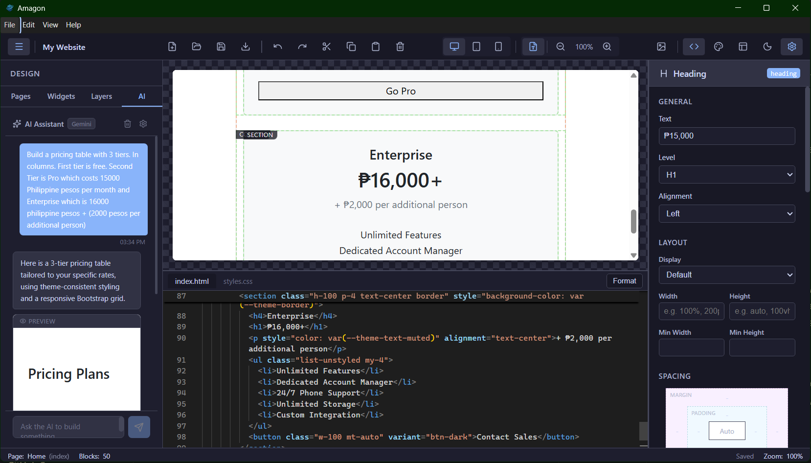

# Vibe coding an offline HTML editor with four AI agents

## Introduction

I've been wanting an offline visual HTML editor for a while now. Tools like Pingendo, Mobirise, and Bootstrap Studio exist, but they all have friction points that bug me: some are cloud-dependent, some are Windows/Mac-only, some lock you into their ecosystem, and most of them are closed-source. I wanted something where I open an HTML page, see it rendered visually, drag widgets around, tweak properties in a sidebar, and flip to the raw code whenever I need to, all without an internet connection.

So I built one. It's called **[Amagon](https://github.com/Shin-Aska/amagon-html-editor)**, and the entire thing was vibe coded across multiple AI agents in Windsurf.

This article is about how that process worked: the planning, the multi-agent workflow, the outcome, and the security considerations that come with letting AI write most of your code.

## The vision

My ideal layout was simple in concept but large in scope:

- **Left sidebar**: a library of draggable widgets (headings, images, navbars, hero sections, forms, etc.)
- **Center canvas**: the rendered page in an isolated iframe, with a collapsible code editor at the bottom (Monaco, the same engine behind VS Code)
- **Right sidebar**: a property inspector that dynamically shows controls for whatever block you've selected

On top of that, I wanted bidirectional sync between the visual canvas and the code editor, undo/redo with a 50-step history, multi-page project management, a theme system with CSS variables, export to clean standalone HTML, and (because why not) a built-in AI assistant that understands the block structure and can generate components from natural language.

The stack I settled on: **Electron + Vite + React + TypeScript + Zustand + Monaco Editor + dnd-kit**. The app needed to work offline and ship as a Linux desktop app (AppImage and .deb), with macOS and Windows builds as a bonus.

## Planning: the multi-agent approach

I knew from the start that this project was too large for a single prompt-and-pray session. A visual HTML editor touches everything: state management, iframe isolation, cross-iframe drag-and-drop, AST parsing, bidirectional code sync, a component registry with 50+ block types, a property inspector with dynamic form generation, file I/O, asset management, export pipelines, theming, keyboard shortcuts, accessibility. The list goes on.

So I used a multi-agent planning workflow. The idea is straightforward: use one AI model as the planner (Claude Opus 4.6), then distribute the actual implementation work across multiple specialized agents. The agents can't run in parallel within Windsurf, so I switch between them manually, but each one gets assigned phases that play to its strengths.

Here's the prompt I started with:

> I want to create a Pingendo / Mobirise alternative that is fully offline from the get go. I want where I open an HTML page and is able to render it and then there is drag and drop design with built in widgets and such like in Pingendo or Mobirise or Bootstrap Studio and have capabilities similar to WYSIWYG image editor but for HTML.

I also fed it a research document I'd compiled with input from Gemini, covering architecture patterns, iframe isolation strategies, drag-and-drop techniques across iframe boundaries, and how tools like Pingendo and Mobirise structure their block systems internally.

Claude Opus 4.6 produced a 12-phase master plan with checkbox tasks, acceptance criteria, and agent assignments. The plan covered everything from project scaffolding to final QA. Each phase was assigned to a specific agent based on what it's good at:

| Agent | Strengths | Assigned Work |
|---|---|---|
| **Claude Opus 4.6** | Architectural scaffolding, multi-file coherence, IPC design, complex state patterns | Foundation, state management, Electron integration |
| **GPT 5.2 High Thinking** | Deep algorithmic reasoning, AST parsing, bidirectional sync, coordinate math | Canvas engine, drag-and-drop, Monaco sync, export engine |
| **Gemini 3 Pro** | Broad UI/UX component generation, widget libraries, CSS framework integration | Widget library (50+ blocks), property inspector, editor UI/theming |
| **Kimi K2** | Well-scoped implementation, test writing, accessibility | UX polish, keyboard shortcuts, testing, documentation |

The workflow was: switch to the assigned agent in Windsurf, tell it "Execute Phase N of plan.md", and let it read the plan and relevant source files for context. Check off tasks as they're completed, then move to the next phase.

## How Windsurf came into the mix

The multi-agent planning approach was heavily inspired by **[Oh my Open Code](https://github.com/code-yeongyu/oh-my-opencode)**, which orchestrates multiple AI models to tackle complex coding tasks. I liked the core idea (different models have different strengths, so let a planner assign work to specialists) but I wanted a more hands-on workflow. Instead of fully automated orchestration, I used Windsurf's model selector to manually switch between agents. That gave me a natural checkpoint between each phase to review what was done before moving on.

Windsurf made this practical because I can switch between Claude, GPT, Gemini, and Kimi without leaving the editor, and each agent has access to the full project context: the file tree, the plan document, the research notes, and everything the previous agents produced.

In practice, the different models did have noticeably different strengths. GPT 5.2 was strongest on the canvas engine (iframe isolation, postMessage protocols, coordinate translation for cross-iframe drag-and-drop), which needed deep algorithmic reasoning. Gemini 3 Pro handled the volume work well: 50+ widget definitions with their JSON schemas, default props, and HTML templates. Kimi K2 was solid at focused, well-scoped tasks like wiring up keyboard shortcuts and clipboard operations.

The planning document itself served as the single source of truth. Every agent could read `plan.md` and understand what had been done, what was in progress, and what was coming next. When an agent finished a phase, I'd mark the checkboxes as complete and move on.

### Pivots and revisions

That hands-on approach paid off immediately. During Phase 1, we hit a real problem: Electron's built-in module resolution (`require('electron')`) was broken on my Linux environment. It resolved to the npm package path string instead of the actual Electron API module. Every Electron version I tested had the same issue.

Because the agent stops after each phase, I caught this before any downstream work depended on Electron actually working. I decided to pivot: develop everything as a **pure Vite + React web app** with a mock API layer that uses browser APIs (localStorage, File API, download links) to simulate Electron IPC. All the visual editor work (canvas, drag-drop, Monaco, widgets, inspector) is pure web code and doesn't care about Electron at all. The Electron integration got deferred to a later phase, and when we got there, the mock was swapped for real IPC.

After the initial 12 phases were done, I used the same multi-agent planning approach for revisions. Revision 1, for example, addressed six UX issues I found during testing: CSS variable mismatches causing invisible borders, offline placeholder images (the defaults used `via.placeholder.com`, which obviously doesn't work offline), invisible blocks that had no default content, and a missing block tree / layers panel. Each bug got its own root-cause analysis in the revision plan, and the fixes were assigned to the agent best suited for the work.

## The outcome

- [ ] 
- [ ] Figure 1\. Amagon HTML Editor in action

The finished product is called **Amagon** (from the Cebuano word *Amag*, meaning "to glow"). It's a fully functional offline visual HTML editor with more features than I originally planned for.

**Visual editing** is the core experience. You drag blocks from a sidebar library of 50+ pre-built components (headers, heroes, grids, forms, navbars, footers, code blocks, and more) onto an isolated iframe canvas. Double-click any text block to edit it in place. A floating toolbar appears on hover with quick actions for edit, duplicate, delete, and move. You can switch between desktop, tablet, and mobile viewports for responsive preview.

**Code integration** runs through Monaco Editor (the same engine behind VS Code) with full syntax highlighting and IntelliSense. Changes in code reflect in the visual canvas and vice versa. Code blocks in the canvas get syntax coloring via highlight.js. Export produces clean standalone HTML with no editor artifacts.

**The inspector panel** auto-generates editing controls based on the selected block's schema: text, number, boolean, select, color picker, image selector, and measurement inputs. Dedicated sub-panels cover layout (display/flexbox), spacing (margin/padding), typography, background, and border. You can add responsive CSS class overrides per breakpoint, fine-tune Bootstrap or custom classes on any block, and do block actions like duplicate, delete, move, wrap in container, or save as a reusable user component.

**The theme system** has a visual editor with tabs for colors, typography, spacing, borders, and custom CSS. Theme changes compile to CSS custom properties (`--theme-primary`, `--theme-bg`, `--theme-font-family`, etc.) that cascade through all blocks. Built-in presets let you quickly set a cohesive style, and you can import/export theme JSON files across projects.

**The AI assistant** connects to OpenAI, Anthropic, Google, or Ollama for fully local inference. It receives your project's block schema and theme variables as context, so generated components stay consistent with your design. You describe what you want ("Build a pricing table with 3 tiers"), get a live preview, and insert it with one click. API keys are encrypted via the OS keychain and never leave the main process.

**Project management** includes a new project wizard (choose a name and CSS framework: Bootstrap 5, Tailwind CSS, or Vanilla HTML/CSS), multi-page support, save/load, a built-in asset manager, auto-save, and a welcome screen with recent projects.

**The rest of the feature list**: undo/redo with 50-step history, keyboard shortcuts for everything, a command palette (Ctrl+K), clipboard operations across pages, a block tree panel showing the page hierarchy, dark/light editor themes, flexible layout modes (standard, no-sidebar, no-inspector, canvas-only, code-focus, and zen mode), export options (multi-file or single self-contained HTML, with optional minification), one-click preview in the default browser, and lazy loading for fast startup.

The tech stack: Electron, Vite, React 18, TypeScript (strict), Zustand, Monaco Editor, highlight.js, dnd-kit, Lucide React, react-resizable-panels, parse5, and Bootstrap 5 as the default framework for generated pages.

## Security considerations

Here's the thing about vibe coding at this scale: I'm not writing individual functions or classes anymore. The AI agents are producing entire modules, wiring up IPC channels, registering protocol handlers, parsing user-supplied HTML, and pulling in npm packages I didn't personally vet. That changes the threat model.

### Development in a VM

My first mitigation was simple: **do all the development inside a virtual machine**. In previous projects where I used AI assistance, the scope was limited. Generate a utility function here, scaffold a component there. I was still the one making architectural decisions and reviewing every line. With this project, the agents are doing most of the work, including choosing how to structure IPC, how to handle file paths, and what packages to install. Running that in a VM means that even if something goes wrong (a malicious dependency, an accidental `rm -rf`, a rogue script in `postinstall`), the blast radius is contained to a disposable environment.

### Package verification with socket.dev

After the project was functional, I ran the dependency tree through **[socket.dev](https://socket.dev/)**. Socket analyzes npm packages for supply-chain risks: typosquatting, install scripts that phone home, obfuscated code, unexpected network access, and other red flags. When AI agents are the ones choosing and installing packages (via `npm install` commands in the plan), you can't rely on the same gut-check you'd do when manually adding a dependency. Socket gives you a second pair of eyes on the entire tree.

### npm audit

I also ran `npm audit` to check for known vulnerabilities in the dependency tree. This catches the "known-bad" cases: published CVEs, deprecated packages with security issues, and transitive dependencies that have been flagged.

### Immutable releases and GitHub CI/CD

I also leaned heavily on **immutable releases** and **GitHub CI/CD** for the build and distribution pipeline. Every release is built from a tagged commit through GitHub Actions, so the artifact you download is reproducible and tied to a specific source state. This makes it much easier to trust the output compared to building locally on a machine where AI agents have been running commands. If something looks off in a release, I can trace it back to the exact commit and diff it against the previous one.

These layers (VM isolation, socket.dev, npm audit, immutable CI/CD releases) don't make vibe-coded projects bulletproof, but they bring the risk profile closer to what you'd expect from a manually written project. The key shift is that when AI writes most of the code, you need to treat the output more like third-party code than your own: verify, isolate, audit.

## Conclusion

By my estimate, building Amagon from scratch would have taken 3 to 5 months of solo work. I did it in 4 days, spread across 2 weekends. By the end of day 2, I already had a solid working prototype with the canvas, drag-and-drop, and most of the block library functional. And this was while doing other things in real life, not locked in a room coding for 16 hours straight.

That's the real pitch for multi-agent vibe coding: it compresses months of work into days, as long as you have a good plan. The planning document was the backbone of the whole project. Without a structured, checkbox-driven plan that every agent could read, the project would have turned into inconsistent code, duplicated work, and architectural drift. The plan also made pivots painless. When Electron broke on Linux, we revised the plan and kept going without losing progress.

The security side is the part I'd stress most for anyone trying this. Vibe coding shifts you from author to reviewer, and you need tooling to match that shift. A VM keeps the dev environment disposable, socket.dev catches supply-chain risks, npm audit handles known vulnerabilities, and immutable CI/CD releases give you reproducible builds. It's not paranoia, it's just the hygiene that this workflow needs.

If you want to try the multi-agent approach yourself: write a detailed plan with one planner model, assign phases to specialized agents, keep a shared plan document as the source of truth, and switch agents manually as you move through phases. The manual switching is actually a feature. It gives you a natural checkpoint to review what was done before moving on.

One last thing I learned the hard way: each LLM has its own strengths and weaknesses. Claude has been the most consistent for me overall, but I don't think you can just throw a project like this at Claude Code alone and expect it to nail everything end-to-end. The whole reason the multi-agent setup works is because each agent covers a different kind of work, and switching models is how I keep momentum when one gets stuck or starts producing questionable output.

Right now I'm experimenting on a new workflow that uses ultra-budget LLMs (the mostly-free models available in Windsurf) to see how solid my findings are. If the process still holds up with cheaper models, that tells me the plan and checkpoints matter more than having the single "best" model selected all the time. If it falls apart, that's useful too, because it gives me a clearer boundary for when I should pay for stronger models and when I can get away with the budget ones.
