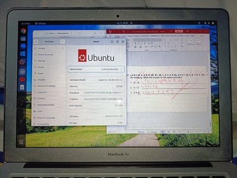

# Switching someone to Linux

## Introduction

 Recently, my mother encountered a problem with her Surface Go, where the tablet's battery became bloated.
 While
 it's not overly significant yet, I suggested she stop using it immediately and offered her my spare, unused
 2015
 MacBook Air as an alternative. However, as I tried to reset the MacBook Air, I encountered an issue.
 

 For some reason, the installer consistently fails, displaying an error message, and I have to keep clicking
 "retry." I suspect there might be an issue with the drive, but to be certain, I decided to install Linux on
 it.
 

 I successfully installed Ubuntu 22\.04 on the machine, and now I'm faced with a decision. One option is to
 continue
 trying to figure out where the macOS installer went wrong, or I can stick with Linux and find a suitable
 workflow
 for my mother to use.
 

 A crucial requirement for her is the ability to use Microsoft Office. Unfortunately, I can't install Windows
 on
 this machine because it's challenging to get Windows 11 on a 2015 device. While Windows 10 is an option, I
 believe it might be too bloated for such an old machine, and it could struggle to perform well.
 

 Additionally, she relies on statistical software such as Minitab, IBM SPSS, and Jamovi. Luckily, Jamovi has
 a
 Linux version available. However, Minitab is only compatible with Windows (specifically Vista and 7\), so I
 had
 to set up VirtualBox on her Surface Go with a customized Windows Vista to ensure she could use Minitab
 securely.
 As for IBM SPSS, they recently dropped Linux support, and her license only allows for the latest version.
 

Figure 1 Macbook 2015 running Ubuntu 22\.04 with Microsoft Office via Winapps
 

 I've considered various options, including using Wine, Winapps, or a type 2 hypervisor like VMWare. Let's
 discuss these options further below.
 

## Using Wine to run her software

 Wine has made significant advancements in recent years, particularly concerning gaming. However, when it
 comes
 to non\-gaming software, the progress is somewhat hit or miss. While most of the reports on WineHQ regarding
 IBM
 SPSS and Minitab may be outdated, the real issue lies with Microsoft Office.
 

 The problem arises from her Office 365 Business license, as installing it can be a real pain (PITA). Even if
 you
 manage to get it to work, there's a risk that it might break in the future. So, while there's a possibility
 that
 IBM SPSS and Minitab could function with Linux via Wine, the compatibility roadblock for Microsoft Office
 365
 pushes me to explore other options.
 

## Virtual Machines

 Running Microsoft Office on Linux via virtual machines has been one of the most hardcore solutions that one
 can
 ever face. It is guaranteed to work but is the most expensive option because it requires decent hardware and
 an
 extra license.
 

 In my case, the extra license is not a problem because I already have extra licenses. However, the hardware
 is a
 bit of a different story.
 

 This is because the hardware of the MacBook Air 2015 model is not decent enough to run Windows 10
 virtualized
 (which is why I did not bother just installing Windows 10\). BUT the existence of minimized Windows 10 and 11
 images has been found on the web.
 

 Although these images, such as Tiny11 and ReviOS, are questionable to be used in an actual hardware setting
 because of stability concerns, they might even have bundled malware.
 

 If they are run on a virtual machine with snapshots enabled and completely cut off internet access, the
 risks
 are lowered significantly.
 

 So running on a virtual machine with a minimal Windows image is a viable option; the only problem is the
 learning curve of managing the VMs.
 

## Seamless Integration

The last one is an idea I had when theorizing the second option. With the use of Virtual machines running
 minimal
 version of Windows, how can I make it seamless in such a way that it does the following:

1. Run the VM automatically after the machine boots
2. Make the software available on Ubuntu's application (without interacting with VMWare Workstation at all)
3. Make the VM suspend before shutting down

Concerns 1 and 3 are doable via Systemd. For concern \#1, there is a systemd template for starting virtual
 machines on Vmware ([Github \- VMware Autostart \[1]](https://github.com/shovon8/vmware-autostart) ),
 and for concern \#3, we create a root\-level systemd script that interacts with vmrun (vmrun suspend
 /path/to/virtual\_machine\_file.vmx).

For concern \#2, I know that VMWare has dropped seamless mode support for non\-Windows guests. However, the
 other
 alternative is Winapps ([Github \- Winapps \[2]](https://github.com/Fmstrat/winapps)).
 Using Winapps, I could allow streaming the Windows application to the Linux host and make it look seamless
 as
 seen below:

Figure 2\. The successful Winapps setup
 

## Conclusions

 Only problem is, at the moment, Winapps is buggy and awkward to use. So, I ended up training my mother on
 how to
 use VMWare properly while also setting up post\-shutdown scripts to suspend the Virtual machine in case she
 forgets about suspending it.
 

 That being said, making someone switch to Linux requires a two\-way effort. It involves you making an effort
 to
 create a workflow that works for the end\-user, and it also requires the end\-user to make an effort to learn
 the new workflow.
 

 Having a universal workflow on a Linux desktop is unfortunately difficult due to the various options
 available
 to end\-users. For example, someone setting up a workflow for you might prefer something different than my
 setup,
 which could result in different steps. While those steps might work for that specific user, they might not
 work
 as well for others who would need to invest time in learning the different workflow setup.
 

 If we want Linux to succeed in the desktop space we need to solve that problem. Fortunately the other
 problems
 such as lack of apps and sources where to install these apps are becoming less and less of a problem because
 of
 the existence of Snap, Flatpak, Appimages and more.
 

 That being said, that was a problem in the past and I am sure someone will invent a way to solve the
 workflow
 problem that Linux has right now.
 

 Finally, it has been 2 weeks now as of this writing and she is happy with her current setup. That until she
 has
 enough spare money to buy another Surface device (the reason why she badly wants Surface is the Windows ink
 support which she uses alot) and unfortunately Pen support is limited on Linux (and in MacOS) and the spare
 hardware for her is not capable of supporting such feature.
 

**PS:** I have only limited screenshots to provide with the setup because I never had the time to took
 more
 and I cannot access the device now because she is using it on a day to day basis.
 

