# Why Indie Games Are Better and is the Future of Gaming

## Introduction

When most people hear "indie games," they think of small teams, shoestring budgets, and probably even pixel art aesthetics. However, for this article, I’m going back to what indie actually means: independent.

As I believe, ownership and creative freedom define indie, not headcount or budget.

- [ ] [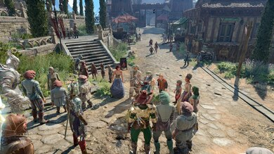](images/bg3_id.jpeg)
- [ ] Figure 1. Baldur's Gate 3: showcasing detailed graphics, high replayability and very expansive gameplay

By that definition, [Baldur’s Gate 3[1]](https://store.steampowered.com/app/1086940/Baldurs_Gate_3/) is one of the greatest indie successes in gaming history. Larian Studios delivered a polished, expansive RPG that embarrassed many traditional AAA releases, and they did it without a corporate parent pulling the strings.

Then we have a fresh example: [Clair Obscur: Expedition 33[2]](https://store.steampowered.com/app/1903340/Clair_Obscur_Expedition_33/) by Sandfall Interactive.

- [ ] [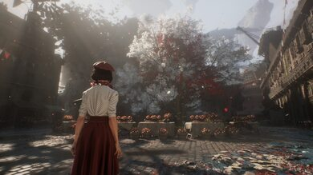](images/co_id.jpeg)
- [ ] Figure 2. Clair Obscur: Expedition 33 showcasing detailed visuals despite being develop by an indie studio

Founded by ex-Ubisoft developers tired of corporate creative decay, Sandfall represents a new generation of indie ambition. They partnered with Kepler Interactive to help publish the game, but crucially, they kept their independence intact.

*Clair Obscur* isn’t just another indie project. It’s a statement that stunning, AAA-quality experiences can come from studios that refuse to sell out.

True, these two are what the industry calls unicorns. But they are not alone. There is also [No Rest for the Wicked[3]](https://store.steampowered.com/app/1371980/No_Rest_for_the_Wicked/) by Moon Studios, an upcoming isometric hack-and-slash game currently in Early Access on Steam.

- [ ] [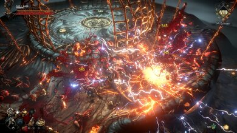](images/nrftw_id.jpeg)
- [ ] Figure 3. No Rest for the Wicked showing very flashy effects

Another, from the Souls-like genre, is *AI Limit*, an anime-style game that follows a similar aesthetic to *Code Vein*.

- [ ] 
- [ ] Figure 4. AI Limit showcasing impressive anime visuals

I could go on and on, and these are just on the premium side of the indie spectrum. There are also those that help define entire genres, like [Vampire Survivors[4]](https://store.steampowered.com/app/1794680/Vampire_Survivors/), [Hades[5]](https://store.steampowered.com/app/1145360/Hades/)

- [ ] [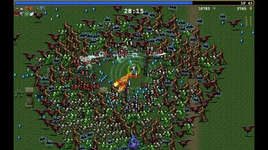](images/vs_id.jpeg)
- [ ] Figure 5. Vampire Survivors gameplay

What is my point here? The point is that even though there are notable AAA games, if we look back over the last decade, the indie scene is where the real innovation is happening.

- [ ] [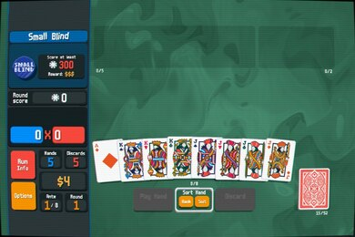](images/bltr_id.jpeg)
- [ ] Figure 6. Balatro gameplay

## The Rise of Indie Games

Indie games are not a new phenomenon. They have been around for decades, always a part of the gaming landscape. Their presence grew alongside the rise of the internet and the democratization of game development tools.

Flash games are a perfect example of how indie games rose to prominence, reaching millions of players worldwide and proving that anyone with creativity and a keyboard could make an impact.

For example, tower defense games originally emerged as custom maps in RTS titles like [*Starcraft*[7]](https://starcraft.blizzard.com/en-us/).

- [ ] [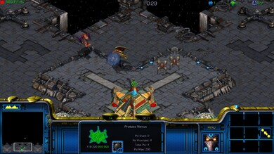](images/sctw_id.jpg)
- [ ] Figure 7. StarCraft Defense of the Galaxy tower defense, a bundled UMS (Use multiplayer settings) map

Then with the expanded map editor in [*Warcraft III*[8]](https://warcraft3.blizzard.com/en-us/), have even expanded the mechanics in the tower defense mechanic later.

- [ ] [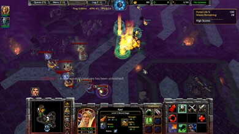](images/w3td_id.jpg)
- [ ] Figure 8. Warcraft III The Frozen Throne - The crossing bonus/secret campaign, adding a tower defense twist in this RTS game

However, the tower defense genre, was only considered as a sort of mini-game.

- [ ] [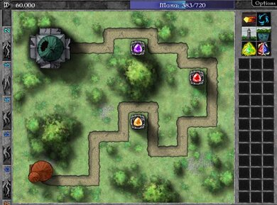](images/gemcraft_td.jpg)
- [ ] Figure 9. Gemcraft - One of the first games that streamlined a dedicated tower defense formula

Flash games such as [*GemCraft*[9]](https://armorgames.com/play/1716/gemcraft), [*Bloons*[10]](https://armorgames.com/play/795/bloons-tower-defense), and many others took the genre to a whole new level, making it more accessible, casual, and addicting for a global audience.

- [ ] [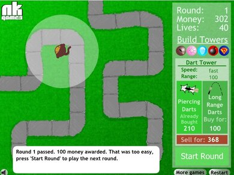](images/bloonstd_id.jpg)
- [ ] Figure 10. Bloonds TD - Another ogames that streamlined a dedicated tower defense formula

Another key example is [*Dino Run*[11]](https://www.pixeljam.com/dinorun/), a game created in just one week for a game jam.

- [ ] [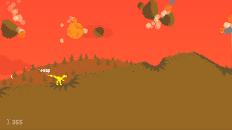](images/dr_id.png)
- [ ] Figure 11. Dino Run having a left/right only runner / platform game paving the way for endless runners

Of course, the real breakthrough came with [*Canabalt*[12]](https://flashmuseum.org/canabalt/), which crystallized the endless runner genre. Its success sparked an entire wave of games like [*Temple Run*[13]](https://play.google.com/store/apps/details?id=com.imangi.templerun&hl=en-US), [*Subway Surfers*[14]](https://play.google.com/store/apps/details?id=com.kiloo.subwaysurf&hl=en-US), and many others.

- [ ] [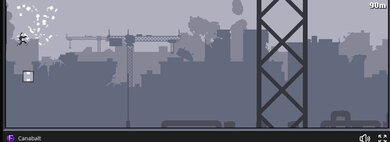](images/canabalt_id.jpg)
- [ ] Figure 12. Temple Run gameplay

Flash wasn’t the only platform that fueled the rise of indie games. Java also played a major role, most notably with [*Minecraft*[15]](https://www.minecraft.net/en-us).

- [ ] [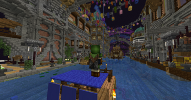](images/mc_id.png)
- [ ] Figure 13. Minecraft gameplay

Unity, too, became a critical tool for indie developers. Many indie games today are built on Unity, and interestingly, Unity once had its own browser plugin called **Unity Web Player**. This plugin allowed players to run Unity games directly in their browsers before it was discontinued in 2015, yet many games created during that era are still played today.

- [ ] [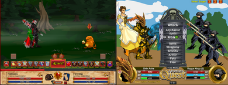](images/aqdf.png)
- [ ] Figure 14. Adventure Quest and Dragonfable Gameplay

For Flash, studios like Artix Entertainment who created [*AdventureQuest*[16]](https://www.battleon.com/) and [*DragonFable*[17]](https://www.dragonfable.com/) are perfect examples of how Flash games continued to thrive long after Adobe officially ended Flash support.

- [ ] [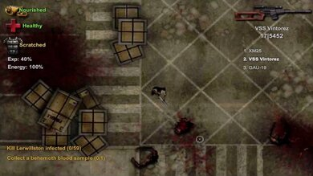](images/dff.jpg)
- [ ] Figure 15. Dead Frontier Gameplay

As for Unity Web Player, a great example is [*Dead Frontier*[18]](https://www.deadfrontier.com/) a zombie MMO that remains more popular today than its own sequel.

Meanwhile, Java took a different path, favoring standalone applications. Although browser-based Java games became rare, technologies like **Java Web Start** kept browser-launchable Java applications alive for a time. This approach eventually paved the way for projects like [**CheerpJ**[19]](https://cheerpj.com/), which allows Java applications to run in modern browsers via HTML5.

Similarly, there’s [**Ruffle**[20]](https://ruffle.rs/), a Flash Player emulator that enables classic Flash games to run on modern browsers. As an open-source project, Ruffle has gained significant traction, making it possible for players to continue enjoying Flash games without relying on the now-defunct Adobe Flash Player.

So while Flash and its browser plugin counterparts may be dead, their legacy and the indie games they inspired lives on.

## The Indie Games Scene Today

Even though Flash is gone, the indie game scene is thriving. If we take an introspective look at why Flash became such a powerful tool for indie developers, it all boils down to one key factor: accessibility.

Flash allowed developers to publish their games online without the need for a publisher, a console, or expensive distribution channels. This democratization of game development only accelerated in recent years with the rise of platforms like Steam.

During Flash’s heyday, many AAA studios thought that PC gaming was dead. They were wrong. The rise of Steam and the explosion of indie games proved it.

Originally, Steam was intended as a platform for Valve’s own titles. But it quickly evolved into a haven for indie developers. It gave them the ability to publish directly to consumers and bypass the traditional publisher model entirely.

This shift in distribution led to a surge of creativity and innovation in the gaming industry. Indie developers, no longer constrained by big publishing, were free to take risks that larger studios often avoided.

As a result, the gaming landscape became more diverse. From narrative-driven experiences like *Life is Strange* to experimental titles like *Journey*, indie games have consistently pushed the boundaries of what gaming can be.

But Steam isn’t the only platform that helped indie developers. Mobile platforms like **iOS** and **Android** also played a significant role in the rise of indie games.

The App Store and Google Play Store made it easier than ever for developers to reach a global audience, and many indie games found massive success through mobile. Innovation was no longer tied to consoles or PCs alone.

Speaking of mobile games, you don't often see AAA games dominate the space. Meaning that a world can live without AAA games existing at all.

## The Future of Gaming and Conclusions

This is more of a prediction than a fact, but I believe the future of gaming lies in the hands of indie developers.

Right now, most AAA games are being developed by studios owned by large corporations. These corporations prioritize profit over creativity, which has led to a growing homogenization of game design.

Many of these studios have also shifted to free-to-play models, a trend that is becoming more common across the AAA space. While it makes financial sense, this model is often criticized for putting monetization ahead of player experience, leading to a lack of innovation and creativity.

This is where indie developers come in. They aren’t beholden to shareholders or corporate interests. They can take risks, experiment with new ideas, and create unique gaming experiences that truly resonate with players.

*Baldur's Gate 3* may be a unicorn, but then there’s *Clair Obscur: Expedition 33*, a game that’s not only visually stunning but also offers a fresh gameplay experience.

And it’s not just about vision. The tools needed to make games are more accessible than ever. Game engines like **Unity** and **Unreal Engine** have made it possible for small teams or even individuals to create high-quality games without the need for massive budgets.

On top of that, AI tools are starting to help with game design, art, and even music. This means indie developers now have the ability to create games that can rival AAA titles in quality, without needing the enormous manpower that used to be required.

What do you think? Are indie games the future of gaming, or will AAA games always have a place in the industry? Only time will tell. But one thing is for sure: the indie game scene is thriving, and it’s not going anywhere.

The future of gaming is bright, and it’s being shaped by the creativity and innovation of indie developers. So the next time you play an indie game, remember — you’re not just playing a game. You’re supporting a movement that values creativity, independence, and the spirit of gaming itself.
