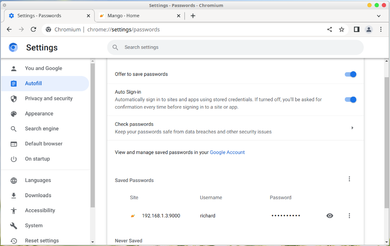
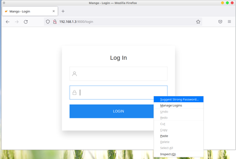
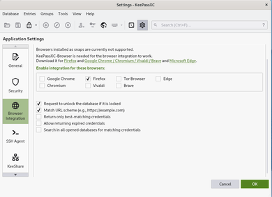
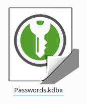
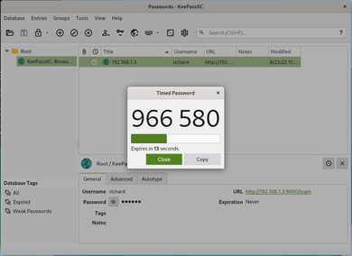
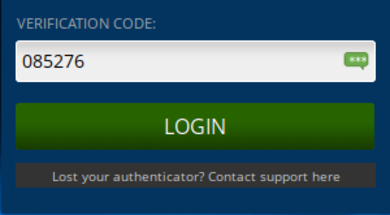

# What is the appeal of standalone password managers

## Introduction

Figure 1\. Chromium built\-in password manager

 Password managers have become a common norm for day to day use. They come in variety of forms, from standalone applications to features
 bundled inside an existing application. Most browsers, specially the top 3 (Edge, Chrome and Firefox) offer some sort of password management 
 system built within the browser. Where if the user signs up on a website, the browser often offers to save the credentials so that it can be 
 autofill or remember when the user encounters a login screen on that website in the future.
 

Figure 2\. Password generator

 In addition, these built in password managers have often go up and beyond and started offering built\-in password generation to ensure that the passwords
 used on signup are secure enough from common password guessing bruteforce attacks.
 

 On top of this, these browsers often offer sync services where they can login on the service on their browser and ensure that the passwords
 save on that device will be synced on other devices. Saving the hassle of exporting and importing the saved passwords from one computer to another. 
 This also means that the user only has to remember a single password to be able to access list of accounts they have signup across the years

 This is great because before this, users had to remember their passwords. Oftentimes they resort in password reuse because it is difficult for
 many to memorize five or more passwords on different websites.
 

 Now I can understand if the common folk will conclude that everyone must be using the browser's built in password manager. For starters, it is solidly
 integrated to the browser. Input with type password are often recognize and basic authentication are often taken note. Actually to be fair for a common
 user, using the browser built\-in password manager is often enough.

 But there has been a steady rise of password managers. Specifically standalone password managers such as 1Password, Bitwarden, Keepass and Lastpass. Now unlike 
 the browser built in one, with standalone password managers, one must manually input and register each account one by one and also manually copy and paste
 username and password from the app.
 

Figure 3\. KeepassXC browser integration \- aside the need to configure, it also needs KeepassXC plugin installed for that browser

 However most of these standalone password managers offer plugins so that it can integrate itself into the browser and offer similar features compare to the built\-in 
 password manager of the browser such as autosave, autofill and password generation. Now the question is, why people going out of their way to install and use these
 when the built\-in password managers of the browser is perfectly fine? Let us discuss

## Security

 In the past, saved passwords from the browser side are often unencrypted. Although it is no longer the case, it has still been the common attack vector for many 
 hackers [where they develop malware in 
 an effort of downloading and decrypting stored browser passwords\[1]](https://www.bleepingcomputer.com/news/security/redline-malware-shows-why-passwords-shouldnt-be-saved-in-browsers/) from the victim's machines.
 

 Most standalone password managers do not store their credentials in the browser (even with the integration plugin installed). Furthermore they use different encryption
 compare to the browser's built one, thus these malware attacks are not compatible with the password manager thus adding an additional security layer as often times
 these malware are often design to attack browsers instead of the password managers. 

Figure 4\. KDBX Database file \- Where keepassXC credentials are stored

 For example, the one I use is [KeepassXC\[2]](https://en.wikipedia.org/wiki/KeePassXC). Unlike Bitwarden, 1password or Lastpass, KeepassXC stores
 its password locally in a database file with encryption, master password and an optional key file as requirement for accessing the database file. For a malware to steal credentials
 on the system, either one has to outright break the encryption in the database file or find a flaw or vulnerability with KeepassXC itself (assuming it is running in the first place)

 If a system has already been compromised, I could just go and take the easy way out by just getting the database and keyfile and store them on a clean device and run KeepassXC from there.

 I am assuming Bitwarden, 1password and lastpass are the same case, the only difference is KeepassXC is local, it does not require an internet connection, contrast to the previously mentioned 
 three services (but it does work offline, I just do no like making an account).
 

 Finally aside from seperate encryption, standalone password managers tend to utilize the best options they have on the operating systems they support. For KeepassXC's case, 
 it utilizes Window's data protection API but some others also uses other things such as storing credentials on OS level keyvaults.
 

## Features

 Another reason why there are many that switch to standalone password managers is because of the extended set of features that it covers. For example in KeepassXC's case, there is
 built in time\-based one\-time password (TOTP) support. Meaning I do not need to open my phone's authenticator or a standalone authenticator such as authy to obtain my 2fa code. It can easily be autofilled to me 
 on login.
 

Figure 5\. KeepassXC showing the OTP code to be use to fill in on non\-integrated applications

Figure 6\. KeepassXC autofilling OTP code on the website login page

 In my case I usually put my phone away from me. I also do not like using Authy because Authy is an online service (I am not saying it is bad, I just do not like it as I consider it 
 risky in my threat model). I much prefer KeepassXC telling me my TOTP codes as I do not need to standup and get my phone to login.
 

 Aside from built\-in TOTP support, standalone password managers have built in health checks (to check weak passwords or reused passwords), check if your password or service has been a victim 
 of a data breach and leak (some browsers already support this), Automatically fill HTTP Basic Auth dialogues and etc.
 

 Not to mention that these standalone password managers often have better means of backing up data in an event that someone decides to hack a compromized device and 
 delete all your credentials with it.
 

## Privacy

 The other final piece that people often consider moving to standalone password managers is because of privacy reasons. Some users just do not simply trust a service unless they themselves
 have complete control over the data transmitted. Bitwarden for example offers a self\-hosting option. Keepass uses a local database file (which can be synced manually, or using a sync service such 
 as syncthing or even a cloud storage provider such as a self hosted Nextcloud).
 

## Conclusion

 For most people, the built\-in password manager that a browser offers is good enough. However as discussed on the points given above. If you find the features discuss attractive, then
 trying out standalone password managers is a good venture to do. If you prefer an offline/internet independent service, I recommend KeepassXC. Otherwise if you prefer an online/internet dependent service, I
 recommend Bitwarden, self\-hosted or not.
 

## Update: January 13, 2023

 I have heard of the Lastpass incident and some reports regarding to Lastpass not really encrypting every metadata it has claimed to be. This alone should be a sign that for applications like these, its much better
 to use something that is fully opensource such as Bitwarden, or my personal recommendation, KeepassXC.
 

